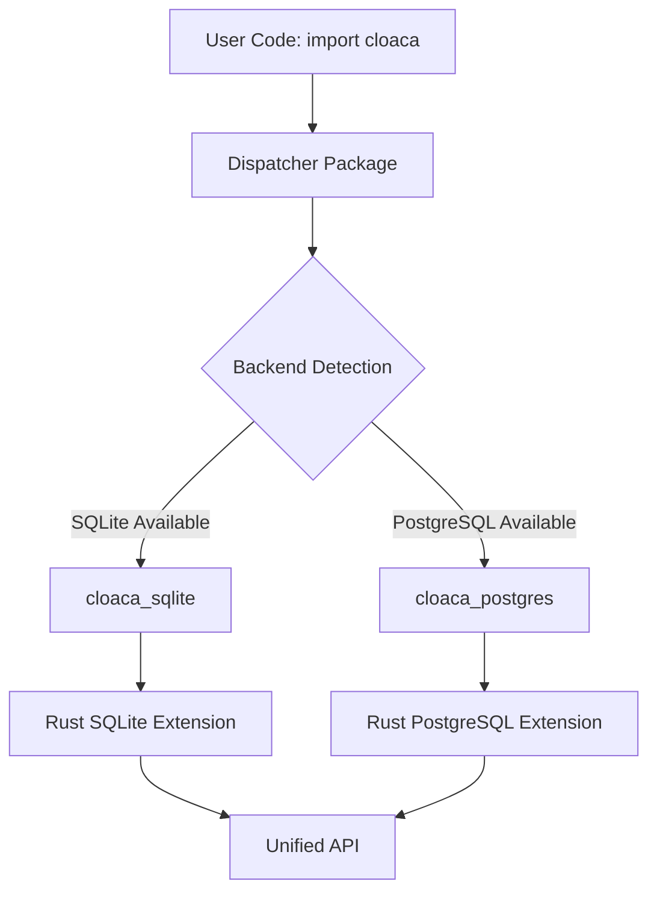

This guide provides the complete workflow for adding new symbols (classes, functions, constants, enums) to the Python bindings and understanding the dispatcher architecture.

## Overview

The Python bindings use a sophisticated **dispatcher pattern** that requires updating multiple locations for every new symbol:

1. **Rust implementation** - Define the symbol with PyO3 attributes
2. **Python wrapper template** - Import and export the symbol
3. **Dispatcher package** - Re-export for unified API
4. **Tests** - Verify end-to-end functionality


**Critical requirement**: Missing ANY of these steps will result in the symbol not being available to Python users, even if the Rust code compiles successfully.


## Adding New Symbols to Python Bindings

### Step 1: Rust Implementation

**File**: `./cloaca-backend/src/lib.rs`

Add your new symbol with appropriate PyO3 attributes:

```rust
// Class example
#[pyclass]
pub struct YourClass {
    // fields
}

// Function example
#[pyfunction]
fn your_function() -> String {
    "result".to_string()
}

// Enum example
#[pyenum]
enum YourEnum {
    Variant1,
    Variant2
}
```

**Then add to BOTH backend modules** (around lines 60 & 76):

```rust
#[pymodule]
#[cfg(feature = "postgres")]
fn cloaca_postgres(m: &Bound<'_, PyModule>) -> PyResult<()> {
    m.add_class::<YourClass>()?;        // Classes
    m.add_function(wrap_pyfunction!(your_function, m)?)?;  // Functions
    m.add("YOUR_CONSTANT", 42)?;       // Constants
    // ... rest
}

#[pymodule]
#[cfg(feature = "sqlite")]
fn cloaca_sqlite(m: &Bound<'_, PyModule>) -> PyResult<()> {
    m.add_class::<YourClass>()?;        // Classes
    m.add_function(wrap_pyfunction!(your_function, m)?)?;  // Functions
    m.add("YOUR_CONSTANT", 42)?;       // Constants
    // ... rest
}
```

### Step 2: Python Backend Wrapper Template

**File**: `./cloaca-backend/python/cloaca_{{backend}}/__init__.py`

Add imports from the extension module (around line 6):

```python
# Import from the extension module built by maturin
from .cloaca_{{backend}} import (
    hello_world,
    get_backend,
    YourClass,      # <- ADD classes
    your_function,  # <- ADD functions
    YOUR_CONSTANT,  # <- ADD constants
    __backend__
)

# Add to __all__ exports (around line 10-15)
__all__ = [
    "hello_world",
    "get_backend",
    "YourClass",      # <- ADD classes
    "your_function",  # <- ADD functions
    "YOUR_CONSTANT",  # <- ADD constants
    "__backend__",
]
```

### Step 3: Dispatcher Package

**File**: `./cloaca/src/cloaca/__init__.py`

Add conditional re-exports (around line 86-92):

```python
# Re-export commonly used symbols directly
if hasattr(_backend_module, "hello_world"):
    hello_world = _backend_module.hello_world
if hasattr(_backend_module, "get_backend"):
    get_backend = _backend_module.get_backend
if hasattr(_backend_module, "YourClass"):      # <- ADD classes
    YourClass = _backend_module.YourClass
if hasattr(_backend_module, "your_function"):  # <- ADD functions
    your_function = _backend_module.your_function
if hasattr(_backend_module, "YOUR_CONSTANT"):  # <- ADD constants
    YOUR_CONSTANT = _backend_module.YOUR_CONSTANT
```

### Step 4: Add Tests

**File**: `./python-tests/test_basic.py`

Add test cases to the `TestBackendFunctionality` class:

```python
def test_your_symbol_basic(self):
    """Test basic functionality of your new symbol."""
    import cloaca

    # Test class
    obj = cloaca.YourClass()
    assert obj is not None

    # Test function
    result = cloaca.your_function()
    assert result == "result"

    # Test constant
    assert cloaca.YOUR_CONSTANT == 42
```

## Critical Template Configuration

### Cargo.toml Template

**File**: `./.angreal/templates/backend_cargo.toml.j2`

Ensure the library name matches (around line 8-10):

```toml
[lib]
name = "cloaca_{{backend}}"  # <- MUST match pyproject.toml module-name
crate-type = ["cdylib"]
```

### PyProject.toml Template

**File**: `./.angreal/templates/backend_pyproject.toml.j2`

Ensure the module name matches (around line 38-42):

```toml
[tool.maturin]
features = ["{{backend}}"]
module-name = "cloaca_{{backend}}"  # <- MUST match Cargo.toml lib name
python-source = "python"
```

## Build Script Configuration

### Wheel Location

**File**: `./.angreal/task_cloaca.py`

Verify the correct wheel location (around line 159-161):

```python
# In _build_and_install_cloaca_backend()
wheel_pattern = f"cloaca_{backend_name}-*.whl"
wheel_dir = backend_dir / "target" / "wheels"  # <- NOT project_root / "target" / "wheels"
```

## Testing Your Changes

Always test through the full angreal pipeline to verify all layers work:

```bash
# Generate files for your target backend
angreal cloaca generate --backend sqlite

# Run targeted tests
angreal cloaca test --backend sqlite -k "your_symbol"

# Test both backends
angreal cloaca test

# Clean up
angreal cloaca scrub
```

This ensures:
- ✅ Template generation works
- ✅ Rust compilation works
- ✅ Python wrapper imports work
- ✅ Dispatcher re-exports work
- ✅ End-to-end functionality works

## Common Failure Modes

### 1. Class compiles but not available in Python
**Symptoms**: Rust compiles successfully, but `import cloaca; cloaca.YourClass` fails

**Solution**:
- Check backend wrapper template imports the class
- Check dispatcher re-exports the class

### 2. Import errors during build
**Symptoms**: Build fails with module import errors

**Solution**:
- Verify Cargo.toml `lib.name` matches pyproject.toml `module-name`
- Both should be `cloaca_{{backend}}`

### 3. Wheel not found during tests
**Symptoms**: Test setup fails with "No wheel found" error

**Solution**:
- Check build script looks in `backend_dir / "target" / "wheels"`
- NOT `project_root / "target" / "wheels"`

### 4. Functions work but classes don't
**Symptoms**: Simple functions import correctly but classes fail

**Solution**:
- This is always a Python import layer issue, never Rust compilation
- Check Steps 2 and 3 above carefully

## Understanding the Dispatcher Architecture

The Python bindings use a **dispatcher pattern** for multi-backend support:



### Architecture Components

1. **Templates generate backend-specific packages** (`cloaca_sqlite`, `cloaca_postgres`)
2. **Each package has Rust extension + Python wrapper** for that backend
3. **Main `cloaca` package imports from whichever backend is installed**
4. **User imports from `cloaca` and gets the right backend automatically**

### Why This Complexity

This architecture provides:
- **Single installation command** - `pip install cloaca[sqlite]` or `cloaca[postgres]`
- **Unified API** - Same Python code works with both backends
- **Optimized wheels** - Only required database drivers included
- **Development flexibility** - Work with either backend during development


**Key insight**: Every symbol needs to traverse the full pipeline from Rust → Python wrapper → Dispatcher → User code. Missing any step breaks the chain.


## Development Workflow

1. **Plan your symbol** - Determine if it's a class, function, constant, or enum
2. **Implement in Rust** - Add PyO3 attributes and module exports
3. **Update templates** - Add to Python wrapper template
4. **Update dispatcher** - Add conditional re-exports
5. **Write tests** - Verify end-to-end functionality
6. **Test pipeline** - Use `angreal cloaca test` to verify full integration
7. **Document** - Add to API reference documentation

This systematic approach ensures reliable Python bindings that work consistently across both database backends.
