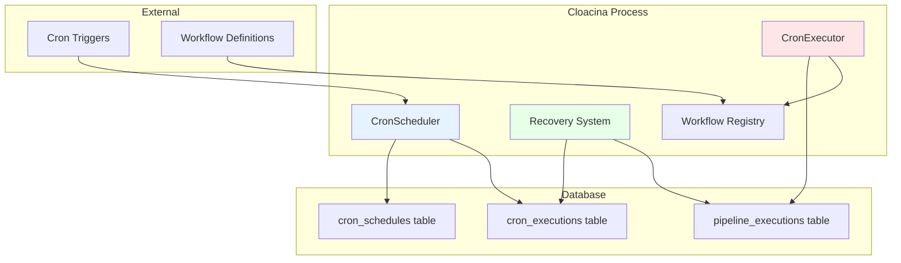
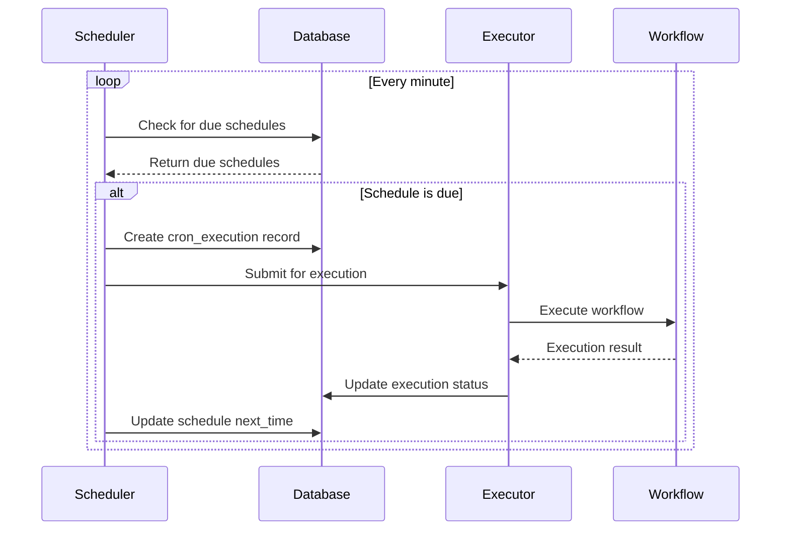

# Cron Scheduling Architecture

Cloacina provides a robust cron scheduling system built on PostgreSQL with automatic recovery, distributed execution support, and strong consistency guarantees.

## Overview

The cron scheduling system consists of several key components:

- **CronScheduler** - Manages schedule parsing and next execution calculation
- **CronExecutor** - Handles actual workflow execution from schedules
- **Recovery System** - Automatically recovers from failures and missed executions
- **Database Integration** - Persistent storage with transaction safety

## Architecture Components



## Scheduling Process

### 1. Schedule Registration

```rust
// Register a cron schedule
let schedule = CronSchedule {
    id: "backup_daily".to_string(),
    workflow_name: "daily_backup".to_string(),
    cron_expression: "0 2 * * *".to_string(), // 2 AM daily
    timezone: "UTC".to_string(),
    enabled: true,
    context: Context::new(),
};

runner.add_cron_schedule(schedule).await?;
```

**What happens internally:**

1. **Validation** - Cron expression is parsed and validated
2. **Storage** - Schedule is persisted to `cron_schedules` table
3. **Next Calculation** - Next execution time is calculated and stored
4. **Activation** - Schedule becomes active for execution

### 2. Schedule Evaluation

```rust
impl CronScheduler {
    async fn evaluate_schedules(&self) -> Result<Vec<DueExecution>, CronError> {
        let now = Utc::now();

        // Find all schedules due for execution
        let due_schedules = self.dal
            .find_due_schedules(now)
            .await?;

        let mut executions = Vec::new();
        for schedule in due_schedules {
            // Calculate next execution time
            let next_time = self.calculate_next_execution(&schedule)?;

            // Create execution record
            let execution = DueExecution {
                schedule_id: schedule.id,
                workflow_name: schedule.workflow_name,
                scheduled_time: now,
                next_time,
                context: schedule.context,
            };

            executions.push(execution);
        }

        Ok(executions)
    }
}
```

### 3. Execution Lifecycle



## Database Schema

### cron_schedules Table

```sql
CREATE TABLE cron_schedules (
    id UUID PRIMARY KEY DEFAULT gen_random_uuid(),
    workflow_name VARCHAR NOT NULL,
    cron_expression VARCHAR NOT NULL,
    timezone VARCHAR NOT NULL DEFAULT 'UTC',
    enabled BOOLEAN NOT NULL DEFAULT true,
    context JSONB NOT NULL DEFAULT '{}',
    next_execution_time TIMESTAMPTZ,
    created_at TIMESTAMPTZ NOT NULL DEFAULT CURRENT_TIMESTAMP,
    updated_at TIMESTAMPTZ NOT NULL DEFAULT CURRENT_TIMESTAMP
);
```

### cron_executions Table

```sql
CREATE TABLE cron_executions (
    id UUID PRIMARY KEY DEFAULT gen_random_uuid(),
    schedule_id UUID NOT NULL REFERENCES cron_schedules(id),
    scheduled_time TIMESTAMPTZ NOT NULL,
    actual_start_time TIMESTAMPTZ,
    completion_time TIMESTAMPTZ,
    status VARCHAR NOT NULL, -- 'scheduled', 'running', 'completed', 'failed'
    pipeline_execution_id UUID REFERENCES pipeline_executions(id),
    error_message TEXT,
    created_at TIMESTAMPTZ NOT NULL DEFAULT CURRENT_TIMESTAMP
);
```

## Execution Guarantees

### At-Least-Once Execution

Cloacina guarantees **at-least-once execution** for all scheduled workflows:

```rust
impl CronExecutor {
    async fn execute_schedule(&self, execution: CronExecution) -> Result<(), CronError> {
        // Mark as running
        self.dal.update_execution_status(
            &execution.id,
            CronExecutionStatus::Running,
            Some(Utc::now())
        ).await?;

        // Execute workflow
        let result = match self.workflow_executor.execute(
            &execution.workflow_name,
            execution.context
        ).await {
            Ok(result) => {
                // Mark as completed
                self.dal.update_execution_status(
                    &execution.id,
                    CronExecutionStatus::Completed,
                    Some(Utc::now())
                ).await?;
                result
            },
            Err(error) => {
                // Mark as failed with error details
                self.dal.update_execution_failed(
                    &execution.id,
                    &error.to_string(),
                    Some(Utc::now())
                ).await?;
                return Err(error.into());
            }
        };

        Ok(())
    }
}
```

### Exactly-Once Semantics

While execution is at-least-once, Cloacina provides mechanisms for exactly-once semantics:

```rust
@cloaca.task()
def idempotent_backup(context):
    """Example of idempotent task design."""

    backup_date = context.get("backup_date")
    backup_id = f"backup_{backup_date}"

    # Check if backup already exists
    if backup_exists(backup_id):
        print(f"Backup {backup_id} already exists, skipping")
        context.set("backup_status", "already_exists")
        return context

    # Perform backup
    result = perform_backup(backup_id)
    context.set("backup_status", "created")
    context.set("backup_location", result.location)

    return context
```

## Recovery Mechanisms

### Automatic Recovery

The recovery system automatically handles various failure scenarios:

```rust
impl CronRecovery {
    async fn recover_orphaned_executions(&self) -> Result<u32, CronError> {
        let recovery_threshold = Utc::now() - Duration::minutes(30);

        // Find executions that started but never completed
        let orphaned = self.dal
            .find_orphaned_executions(recovery_threshold)
            .await?;

        let mut recovered_count = 0;
        for execution in orphaned {
            match self.attempt_recovery(&execution).await {
                Ok(_) => {
                    recovered_count += 1;
                    info!("Recovered orphaned execution: {}", execution.id);
                },
                Err(e) => {
                    error!("Failed to recover execution {}: {}", execution.id, e);
                }
            }
        }

        Ok(recovered_count)
    }

    async fn attempt_recovery(&self, execution: &CronExecution) -> Result<(), CronError> {
        // Check if the associated pipeline execution exists and its status
        if let Some(pipeline_id) = &execution.pipeline_execution_id {
            let pipeline_status = self.dal
                .get_pipeline_execution_status(pipeline_id)
                .await?;

            match pipeline_status {
                WorkflowStatus::Failed => {
                    // Mark cron execution as failed
                    self.dal.update_execution_status(
                        &execution.id,
                        CronExecutionStatus::Failed,
                        Some(Utc::now())
                    ).await?;
                },
                WorkflowStatus::Completed => {
                    // Mark cron execution as completed
                    self.dal.update_execution_status(
                        &execution.id,
                        CronExecutionStatus::Completed,
                        Some(Utc::now())
                    ).await?;
                },
                _ => {
                    // Re-submit for execution
                    self.resubmit_execution(execution).await?;
                }
            }
        } else {
            // No pipeline execution found, re-submit
            self.resubmit_execution(execution).await?;
        }

        Ok(())
    }
}
```

### Missed Execution Handling

When a scheduler starts after downtime and finds firings whose `next_execution_at` has already passed, the per-schedule `catchup_policy` column on `cron_schedules` decides what happens. Two values are defined in `crates/cloacina/src/models/schedule.rs`:

| `CatchupPolicy` | Behavior |
|---|---|
| `Skip` | Roll `next_execution_at` forward to the next future firing; the missed firings are dropped. Default for newly-registered schedules — appropriate when a missed firing has no value (e.g., dashboard refresh, hourly aggregation whose inputs have already advanced). |
| `RunAll` | Replay every missed firing in order, bounded by `cron_max_catchup_executions` on `DefaultRunnerConfig`. Appropriate when each firing is independently durable work (e.g., per-hour reports that must each emit). |

The cron recovery service (`crates/cloacina/src/cron_recovery.rs`) inspects `last_executed_at` against the cron expression and applies the policy on each recovery tick (cadence: `cron_recovery_interval`, default 5min). Set the policy at schedule-registration time via the DAL — the field is not currently exposed on `register_cron_workflow` and is set during direct row insert.

See [Configuration Reference]() for the related knobs:
`cron_max_catchup_executions` (default unbounded), `cron_recovery_interval` (default 5min), `cron_max_recovery_age` (default 24h), `cron_max_recovery_attempts` (default 3).


## Cron Expression Parsing

### Supported Format

Cloacina uses the standard cron format with timezone support:

```
┌───────────── minute (0 - 59)
│ ┌───────────── hour (0 - 23)
│ │ ┌───────────── day of month (1 - 31)
│ │ │ ┌───────────── month (1 - 12)
│ │ │ │ ┌───────────── day of week (0 - 6) (Sunday to Saturday)
│ │ │ │ │
* * * * *
```

### Expression Examples

```rust
// Valid cron expressions
let expressions = vec![
    "0 2 * * *",        // Daily at 2 AM
    "*/15 * * * *",     // Every 15 minutes
    "0 9 * * MON-FRI",  // Weekdays at 9 AM
    "0 0 1 * *",        // First day of each month
    "0 */6 * * *",      // Every 6 hours
    "30 2 * * SUN",     // Sundays at 2:30 AM
];

// Expression validation
impl CronScheduler {
    fn validate_expression(&self, expr: &str) -> Result<Schedule, CronError> {
        Schedule::from_str(expr)
            .map_err(|e| CronError::InvalidExpression(e.to_string()))
    }

    fn calculate_next_execution(
        &self,
        schedule: &CronSchedule
    ) -> Result<DateTime<Utc>, CronError> {
        let cron_schedule = self.validate_expression(&schedule.cron_expression)?;
        let timezone = schedule.timezone.parse::<Tz>()
            .map_err(|e| CronError::InvalidTimezone(e.to_string()))?;

        let now = Utc::now().with_timezone(&timezone);
        let next = cron_schedule.upcoming(timezone)
            .next()
            .ok_or(CronError::NoFutureExecution)?;

        Ok(next.with_timezone(&Utc))
    }
}
```

## Timezone Handling

### Timezone Support

```rust
impl CronSchedule {
    pub fn new_with_timezone(
        workflow_name: String,
        cron_expression: String,
        timezone: &str,
    ) -> Result<Self, CronError> {
        // Validate timezone
        let tz = timezone.parse::<Tz>()
            .map_err(|_| CronError::InvalidTimezone(timezone.to_string()))?;

        Ok(CronSchedule {
            workflow_name,
            cron_expression,
            timezone: timezone.to_string(),
            enabled: true,
            context: Context::new(),
            // ... other fields
        })
    }
}
```

### Daylight Saving Time

```rust
// DST transition handling
fn calculate_next_with_dst_awareness(
    expr: &str,
    timezone: &Tz,
    from: DateTime<Utc>
) -> Result<DateTime<Utc>, CronError> {
    let schedule = Schedule::from_str(expr)?;
    let local_time = from.with_timezone(timezone);

    // Handle DST transitions
    match schedule.upcoming(timezone).next() {
        Some(next) => {
            // Verify the next execution isn't in a DST gap
            if is_dst_gap(&next, timezone) {
                // Skip forward to avoid the gap
                let adjusted = next + Duration::hours(1);
                Ok(adjusted.with_timezone(&Utc))
            } else {
                Ok(next.with_timezone(&Utc))
            }
        },
        None => Err(CronError::NoFutureExecution)
    }
}
```

## Distributed Execution

Multiple `cloacina-server` instances can run against the same database with no coordinator and no leader election. The mechanism is the same database-as-coordination pattern used elsewhere in Cloacina: each scheduler tick attempts an **atomic `claim_and_update` UPDATE** on `cron_schedules` rows whose `next_execution_at` has passed. Postgres `FOR UPDATE SKIP LOCKED` (and SQLite's transactional equivalent) ensures exactly one scheduler wins the row per firing — the winner advances `next_execution_at` and dispatches the workflow; losers move on without contention.

Because there's no lease and no leader, **failover is trivial**: if a scheduler crashes mid-firing, the row's `last_claim_at` ages past `stale_claim_threshold` and the next scheduler tick reclaims it. The two-phase commit pattern (see [Guaranteed Execution Architecture]()) ensures the dispatch is idempotent — a re-claim re-issues the firing without duplicating downstream work.

Scaling shape: add or remove `cloacina-server` replicas at will. Each replica polls independently; the atomic claim is the only coordination primitive. There is no membership protocol, no quorum, no broker.

See `crates/cloacina/src/cron_trigger_scheduler.rs` for the claim implementation and [Horizontal Scaling]() for the analogous task-level mechanism.


## Performance Considerations

### Efficient Polling

```rust
impl CronScheduler {
    async fn optimized_schedule_check(&self) -> Result<(), CronError> {
        // Use database-level filtering to minimize data transfer
        let current_time = Utc::now();
        let check_window = current_time + Duration::minutes(2);

        // Only fetch schedules due within the next 2 minutes
        let due_schedules = self.dal
            .find_schedules_due_within(current_time, check_window)
            .await?;

        // Process in batches to avoid overwhelming the system
        for batch in due_schedules.chunks(10) {
            self.process_schedule_batch(batch).await?;
        }

        Ok(())
    }
}
```

### Index Optimization

```sql
-- Optimized indexes for cron scheduling
CREATE INDEX CONCURRENTLY idx_cron_schedules_next_execution
ON cron_schedules(next_execution_time)
WHERE enabled = true;

CREATE INDEX CONCURRENTLY idx_cron_executions_status_scheduled
ON cron_executions(scheduled_time, status);

CREATE INDEX CONCURRENTLY idx_cron_executions_orphaned
ON cron_executions(actual_start_time)
WHERE status = 'running' AND completion_time IS NULL;
```

## Monitoring and Observability

Cron observability rides the same `cloacina_*` Prometheus metric namespace as the rest of the system (CLOACI-I-0099). There is no separate `CronMetrics` struct; cron firings are workflow executions, so the workflow-level counters cover them naturally.

Operationally relevant metrics for cron:

- **`cloacina_workflows_total{status, reason}`** — workflow executions, including those triggered by cron. Compare cron-driven volume to expected cadence to detect missed firings.
- **`cloacina_active_workflows`** — SQL-derived gauge (CLOACI-I-0108) showing workflows in `Pending` or `Running` state right now. A persistently-high value alongside high cron cadence indicates the executor is falling behind.
- **`cloacina_scheduler_claim_attempts_total{outcome=claimed|contended|empty}`** — diagnostic for multi-scheduler deployments. Sustained `contended` ≫ 0 means multiple schedulers are racing for the same rows (expected at low scale; tune `cron_poll_interval` down if it becomes load).
- **`cloacina_scheduler_stale_claims_swept_total`** — non-zero rate indicates a scheduler crashed mid-firing and the sweep reclaimed its row. Investigate scheduler logs for the affected window.

For the full namespace + PromQL recipes, see [Metrics Catalog](). For the rationale behind the SQL-derived gauge model (why `cloacina_active_workflows` is leak-proof across crashes), see [Observability]().


## Best Practices

### Schedule Design

```rust
// Good: Idempotent with clear failure handling
@cloaca.task()
def robust_backup(context):
    backup_id = context.get("backup_id")

    try:
        # Check if already done
        if backup_exists(backup_id):
            return context

        # Perform backup
        result = create_backup(backup_id)
        context.set("backup_success", True)
        context.set("backup_location", result.path)

    except Exception as e:
        context.set("backup_success", False)
        context.set("error", str(e))
        # Don't re-raise - let cron handle retry policy

    return context

// Avoid: Non-idempotent operations
@cloaca.task()
def bad_counter(context):
    # This will cause issues if executed multiple times
    current = get_counter()
    set_counter(current + 1)  # Race condition!
    return context
```

### Error Handling

```rust
impl CronExecutor {
    async fn execute_with_retry(
        &self,
        execution: &CronExecution,
        max_retries: u32
    ) -> Result<(), CronError> {
        let mut attempt = 0;

        while attempt < max_retries {
            match self.execute_once(execution).await {
                Ok(_) => return Ok(()),
                Err(e) if attempt == max_retries - 1 => {
                    // Final attempt failed
                    error!("Cron execution failed after {} attempts: {}", max_retries, e);
                    return Err(e);
                },
                Err(e) => {
                    attempt += 1;
                    warn!("Cron execution attempt {} failed: {}", attempt, e);

                    // Exponential backoff
                    let delay = Duration::seconds(2_i64.pow(attempt));
                    tokio::time::sleep(delay.to_std().unwrap()).await;
                }
            }
        }

        unreachable!()
    }
}
```

## See Also

- [Cron Scheduling Tutorial]() - Practical implementation guide
- [Python Cron Tutorial]() - Python-specific examples
- [Multi-Tenant Setup Guide]() - Deployment best practices
- [Guaranteed Execution Architecture]() - Overall execution guarantees
