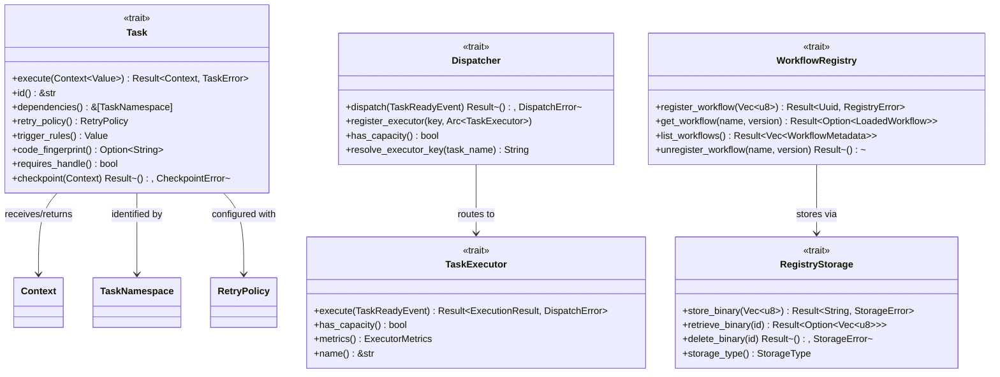

# C4 Level 4 — Code Contracts

This page documents Cloacina's core trait hierarchies and type contracts — the interfaces that define the system's extension points and behavioral guarantees. These are the contracts that all implementations must satisfy.

## Trait Hierarchy Overview



## Workflow Authoring Types (cloacina-workflow crate)

### Task Trait

The fundamental interface for all task implementations. Generated by the `#[task]` macro or implemented manually.

```rust
#[async_trait]
pub trait Task: Send + Sync {
    /// Execute the task with the given context. Returns modified context on success.
    async fn execute(
        &self,
        context: Context<serde_json::Value>,
    ) -> Result<Context<serde_json::Value>, TaskError>;

    /// Unique task identifier within the workflow.
    fn id(&self) -> &str;

    /// Tasks that must complete before this task can execute.
    fn dependencies(&self) -> &[TaskNamespace];

    /// Optional checkpoint for resumable execution. Default: no-op.
    fn checkpoint(&self, _context: &Context<serde_json::Value>) -> Result<(), CheckpointError> {
        Ok(())
    }

    /// Retry configuration. Default: 3 attempts, exponential backoff, 1s initial delay.
    fn retry_policy(&self) -> RetryPolicy {
        RetryPolicy::default()
    }

    /// Composable execution conditions (Always, All, Any, None). Default: Always.
    fn trigger_rules(&self) -> serde_json::Value {
        serde_json::json!({"type": "Always"})
    }

    /// Content-based hash of the task implementation for versioning.
    fn code_fingerprint(&self) -> Option<String> {
        None
    }

    /// Whether this task needs a TaskHandle for deferred execution.
    fn requires_handle(&self) -> bool {
        false
    }
}
```

**Location:** `crates/cloacina-workflow/src/task.rs`

### Context\<T\>

Generic data container passed between tasks. `T` is typically `serde_json::Value`.

```rust
pub struct Context<T>
where
    T: Serialize + for<'de> Deserialize<'de> + Debug,
{
    data: HashMap<String, T>,
}
```

**Key methods:**

| Method | Description |
|--------|-------------|
| `insert(key, value)` | Add new key (errors if key exists) |
| `update(key, value)` | Update existing key (errors if key missing) |
| `get(key) → Option<&T>` | Read value by key |
| `remove(key) → Option<T>` | Remove and return value |
| `to_json() / from_json()` | Serialize/deserialize |
| `data() → &HashMap` | Access underlying data |

**Merge semantics** (when multiple dependencies): later values override earlier ones. Arrays are concatenated and deduplicated. Objects are merged recursively.

**Location:** `crates/cloacina-workflow/src/context.rs`

### TaskError

Error type for task failures, used by the executor to determine retry behavior:

```rust
#[derive(Debug, Error)]
pub enum TaskError {
    ExecutionFailed { message: String, task_id: String, timestamp: DateTime<Utc> },
    DependencyNotSatisfied { dependency: String, task_id: String },
    Timeout { task_id: String, timeout_seconds: u64 },
    ContextError { task_id: String, error: ContextError },
    ValidationFailed { message: String },
    Unknown { task_id: String, message: String },
    ReadinessCheckFailed { task_id: String },
    TriggerRuleFailed { task_id: String },
}
```

**Location:** `crates/cloacina-workflow/src/error.rs`

### RetryPolicy

Configures automatic retry behavior:

```rust
pub struct RetryPolicy {
    pub max_attempts: i32,              // Default: 3
    pub backoff_strategy: BackoffStrategy,  // Default: Exponential(base=2, mult=1)
    pub initial_delay: Duration,        // Default: 1s
    pub max_delay: Duration,            // Default: 60s
    pub jitter: bool,                   // Default: true
    pub retry_conditions: Vec<RetryCondition>,  // Default: [AllErrors]
}
```

**BackoffStrategy variants:**

| Variant | Formula | Description |
|---------|---------|-------------|
| `Fixed` | `initial_delay` | Same delay every time |
| `Linear { multiplier }` | `initial_delay * attempt * multiplier` | Linear increase |
| `Exponential { base, multiplier }` | `initial_delay * base^attempt * multiplier` | Exponential increase |

**RetryCondition variants:** `AllErrors`, `Never`, `TransientOnly`, `ErrorPattern { patterns }`

**Key methods:** `calculate_delay(attempt)`, `should_retry(error, attempt)`, `calculate_retry_at(attempt, now)`

**Location:** `crates/cloacina-workflow/src/retry.rs`

### TaskNamespace

Hierarchical addressing for multi-tenant task identification:

```rust
pub struct TaskNamespace {
    pub tenant_id: String,      // e.g., "public"
    pub package_name: String,   // e.g., "embedded" or package name
    pub workflow_id: String,    // Workflow name
    pub task_id: String,        // Task ID from #[task(id="...")]
}
```

**Format:** `tenant_id::package_name::workflow_id::task_id`

**Convenience checks:** `is_public()` (tenant = "public"), `is_embedded()` (package = "embedded")

**Location:** `crates/cloacina-workflow/src/namespace.rs`

## Runtime Types (cloacina crate)

### DAL (Data Access Layer Facade)

Composes all domain repositories. Each accessor returns an ephemeral repository struct borrowing from the DAL:

```rust
impl DAL {
    pub fn context(&self) -> ContextDAL<'_>;
    pub fn pipeline_execution(&self) -> PipelineExecutionDAL<'_>;
    pub fn task_execution(&self) -> TaskExecutionDAL<'_>;
    pub fn task_execution_metadata(&self) -> TaskExecutionMetadataDAL<'_>;
    pub fn task_outbox(&self) -> TaskOutboxDAL<'_>;
    pub fn execution_event(&self) -> ExecutionEventDAL<'_>;
    pub fn recovery_event(&self) -> RecoveryEventDAL<'_>;
    pub fn cron_schedule(&self) -> CronScheduleDAL<'_>;
    pub fn cron_execution(&self) -> CronExecutionDAL<'_>;
    pub fn trigger_schedule(&self) -> TriggerScheduleDAL<'_>;
    pub fn trigger_execution(&self) -> TriggerExecutionDAL<'_>;
    pub fn workflow_packages(&self) -> WorkflowPackagesDAL<'_>;
}
```

**Location:** `crates/cloacina/src/dal/unified/mod.rs`

### RegistryStorage Trait

Pluggable binary storage for workflow packages:

```rust
#[async_trait]
pub trait RegistryStorage: Send + Sync {
    async fn store_binary(&mut self, data: Vec<u8>) -> Result<String, StorageError>;
    async fn retrieve_binary(&self, id: &str) -> Result<Option<Vec<u8>>, StorageError>;
    async fn delete_binary(&mut self, id: &str) -> Result<(), StorageError>;
    fn storage_type(&self) -> StorageType;
}
```

**Implementations:** `UnifiedRegistryStorage` (database-backed), `FilesystemRegistryStorage` (filesystem-backed)

**Location:** `crates/cloacina/src/registry/traits.rs`

### Dispatcher / TaskExecutor Traits

Push-based task execution interface:

```rust
#[async_trait]
pub trait Dispatcher: Send + Sync {
    async fn dispatch(&self, event: TaskReadyEvent) -> Result<(), DispatchError>;
    fn register_executor(&self, key: &str, executor: Arc<dyn TaskExecutor>);
    fn has_capacity(&self) -> bool;
    fn resolve_executor_key(&self, task_name: &str) -> String;
}

#[async_trait]
pub trait TaskExecutor: Send + Sync {
    async fn execute(&self, event: TaskReadyEvent) -> Result<ExecutionResult, DispatchError>;
    fn has_capacity(&self) -> bool;
    fn metrics(&self) -> ExecutorMetrics;
    fn name(&self) -> &str;
}
```

**Key types:**

```rust
pub struct TaskReadyEvent {
    pub task_execution_id: UniversalUuid,
    pub pipeline_execution_id: UniversalUuid,
    pub task_name: String,
    pub attempt: i32,
}

pub struct ExecutionResult {
    pub task_execution_id: UniversalUuid,
    pub status: ExecutionStatus,  // Completed | Failed | Retry
    pub error: Option<String>,
    pub duration: Duration,
}

pub struct ExecutorMetrics {
    pub active_tasks: usize,
    pub max_concurrent: usize,
    pub total_executed: u64,
    pub total_failed: u64,
    pub avg_duration_ms: u64,
}
```

**Location:** `crates/cloacina/src/dispatcher/traits.rs`, `types.rs`

### ExecutorConfig

```rust
pub struct ExecutorConfig {
    pub max_concurrent_tasks: usize,        // Default: 4
    pub task_timeout: std::time::Duration,  // Default: 5 minutes
}
```

**Location:** `crates/cloacina/src/executor/types.rs`

## Design Principles

All core traits follow these conventions:

- **`Send + Sync` bounds** — all traits are safe for concurrent use across threads
- **`#[async_trait]`** — all I/O operations are async (tokio-based)
- **`thiserror::Error`** — all error types derive `Error` with `#[error(...)]` messages
- **Namespaced identity** — all tasks are identified by `TaskNamespace` (tenant::package::workflow::task)
- **Serde compatibility** — all data types serialize/deserialize via `serde_json`
- **Default implementations** — traits provide sensible defaults where possible (`retry_policy`, `trigger_rules`, `requires_handle`, `checkpoint`)
