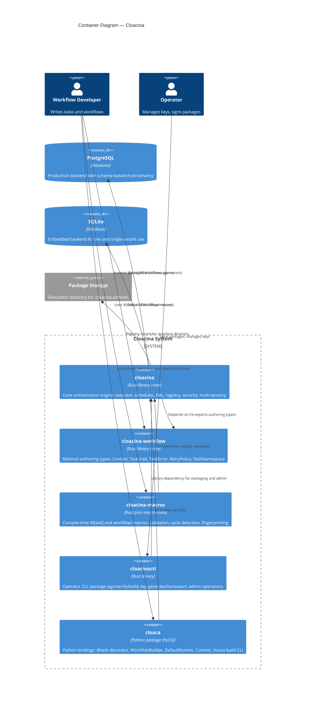

# C4 Level 2 — Container Diagram

The Container diagram zooms into the Cloacina system box from the [System Context]() and shows its major deployable/buildable units. In C4 terminology, a "container" is a separately runnable/deployable unit — here that maps to Rust crates, the Python package, and database backends.

## Container Diagram



## Containers

### cloacina (Core Library)

| | |
|---|---|
| **Type** | Rust library crate |
| **Location** | `crates/cloacina/` |
| **Technology** | Rust, Tokio, Diesel ORM, Ed25519, AES-256-GCM |

The core engine containing all runtime functionality:

- **Executor** — `ThreadTaskExecutor` with semaphore-based concurrency, `TaskHandle` for deferred execution
- **Scheduler** — `CronScheduler` for time-based triggers, `TriggerScheduler` for event-based triggers
- **DAL** — Data Access Layer abstracting PostgreSQL and SQLite via Diesel, composed of domain-specific repositories
- **Registry** — Package loading, validation, reconciliation, Python/Rust runtime support
- **Security** — Ed25519 signing, AES-256-GCM key encryption, online/offline verification
- **Multi-tenancy** — PostgreSQL schema isolation, SQLite file isolation via `TaskNamespace`

**Dependencies:** `cloacina-workflow` (re-exported), `cloacina-macros` (optional, via `macros` feature)

### cloacina-workflow (Authoring Types)

| | |
|---|---|
| **Type** | Rust library crate |
| **Location** | `crates/cloacina-workflow/` |
| **Technology** | Rust (minimal dependencies) |

A deliberately minimal crate containing only the types needed to author workflows for packaging:

- `Task` trait — the interface all tasks implement
- `Context<T>` — generic data container passed between tasks
- `TaskError` — error type for task failures
- `RetryPolicy` / `BackoffStrategy` — retry configuration
- `TaskNamespace` — hierarchical addressing (`tenant.package.workflow.task_id`)

This crate exists so that packaged workflows can compile quickly without pulling in database drivers, executor logic, or runtime dependencies. It is re-exported by the `cloacina` crate.

### cloacina-macros (Proc Macros)

| | |
|---|---|
| **Type** | Rust proc-macro crate |
| **Location** | `crates/cloacina-macros/` |
| **Technology** | Rust, syn, quote, proc-macro2 |

Provides two macros:

- **`#[task]`** — Transforms an async function into a `Task` trait implementation. Generates struct, registry integration via `ctor`, handle detection, and code fingerprinting.
- **`workflow!`** — Validates task references, performs topological sorting and cycle detection, calculates content-based version hash.

The macro crate uses a compile-time registry (global singleton with `once_cell` + `Mutex`) to track task registrations and validate dependencies across the crate.

### cloacinactl (Operator CLI)

| | |
|---|---|
| **Type** | Rust binary |
| **Location** | `crates/cloacinactl/` |
| **Technology** | Rust, clap |

Command groups:

| Command | Subcommands | Purpose |
|---------|------------|---------|
| `package` | `build`, `sign`, `verify`, `inspect` | Package lifecycle management |
| `key` | `generate`, `list`, `export`, `import`, `trust`, `revoke` | Signing key management |
| `admin` | Database migrations, operational tasks | System administration |

Depends on `cloacina` as a library for access to the DAL, security module, and packaging logic.

### cloaca (Python Bindings)

| | |
|---|---|
| **Type** | Python package (with Rust extension via PyO3/maturin) |
| **Location** | `bindings/cloaca-backend/` |
| **Technology** | Python, PyO3, maturin |

Exposes Cloacina's functionality to Python developers:

- `@cloaca.task` — Decorator for defining tasks (supports async, callbacks, handle detection)
- `cloaca.WorkflowBuilder` — Fluent API for composing tasks into workflows
- `cloaca.DefaultRunner` — Executes workflows with backend selection (SQLite/PostgreSQL)
- `cloaca.Context` — Python wrapper around Cloacina's `Context<Value>`
- `cloaca build` — CLI for packaging Python workflows into `.cloacina` archives with vendored dependencies

The PyO3 bridge converts between Python objects and Rust types at the FFI boundary.

## Database Backends

Both backends implement the same DAL interface via Diesel ORM:

| Backend | Multi-Tenancy | Use Case |
|---------|--------------|----------|
| **PostgreSQL** | Schema-per-tenant isolation | Production, multi-tenant deployments |
| **SQLite** | File-per-tenant isolation | Development, embedded, single-tenant |

The backend is selected at compile time via Cargo features (`postgres`, `sqlite`) and at runtime via connection string.

## Dependency Graph

```
cloacina-workflow  ←── cloacina ←── cloacinactl
                        ↑    ↑
        cloacina-macros ─┘    └── cloaca (PyO3)
```

- **cloacina** depends on **cloacina-workflow** (always) and **cloacina-macros** (optional `macros` feature)
- **cloacinactl** depends on **cloacina** for library access
- **cloaca** depends on **cloacina** via PyO3 FFI
- **cloacina-workflow** has no internal dependencies — it's the leaf crate

## Next Level

For component-level views of individual subsystems, see:

- C4 Level 3 — Execution Engine Components
- C4 Level 3 — Data Access Layer Components
- C4 Level 3 — Registry & Packaging Components
- C4 Level 3 — Security Components
- C4 Level 3 — Scheduling Components
- C4 Level 3 — Macro Subsystem Components
