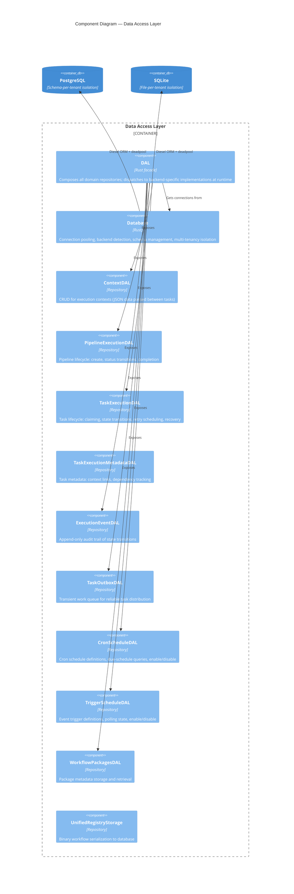
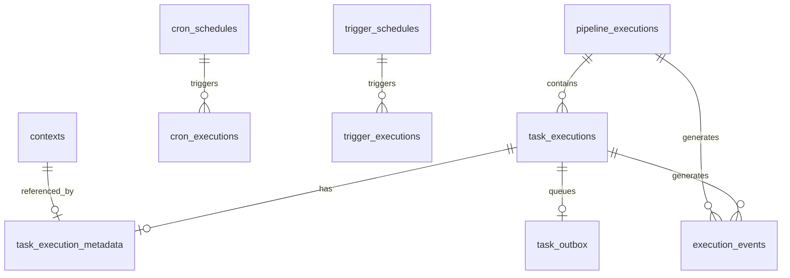

# C4 Level 3 — Data Access Layer Components

This diagram zooms into the DAL portion of the `cloacina` core library from the [Container Diagram](). The DAL provides a unified interface over PostgreSQL and SQLite backends using a facade/repository pattern.

## Component Diagram

## Components

### DAL (Facade)

| | |
|---|---|
| **Location** | `crates/cloacina/src/dal/unified/mod.rs` |
| **Pattern** | Facade + runtime backend dispatch |

The `DAL` struct is the single entry point for all database operations. It composes domain-specific repository DALs and dispatches to PostgreSQL or SQLite implementations at runtime via `backend_dispatch!` and `connection_match!` macros.

Repository DALs are ephemeral — they borrow from the `DAL` instance and are created on each access.

### Database (Connection Management)

| | |
|---|---|
| **Location** | `crates/cloacina/src/database/connection/mod.rs` |
| **Technology** | `deadpool-diesel` for async connection pooling |

**Backend detection** from connection string:
- `postgres://` or `postgresql://` → PostgreSQL (configurable pool size, default 10)
- `sqlite://`, file paths, `:memory:` → SQLite (pool size 1)

**Multi-tenancy:**
- PostgreSQL: `new_with_schema()` sets `search_path` per connection, `setup_schema()` creates schema + runs migrations
- SQLite: file-per-tenant isolation (separate `.db` file per tenant)
- Schema validation prevents SQL injection (alphanumeric + underscores only)

### Universal Types

| | |
|---|---|
| **Location** | `crates/cloacina/src/database/universal_types.rs` |

Cross-backend domain types with Diesel SQL type mappings:

| Domain Type | PostgreSQL | SQLite |
|------------|-----------|--------|
| `UniversalUuid` | Native UUID | BLOB (16 bytes) |
| `UniversalTimestamp` | TIMESTAMP | TEXT (RFC3339) |
| `UniversalBool` | BOOL | INTEGER (0/1) |
| `UniversalBinary` | BYTEA | BLOB |

## Domain Repositories

### TaskExecutionDAL

| | |
|---|---|
| **Location** | `crates/cloacina/src/dal/unified/task_execution/` |
| **Sub-modules** | `crud.rs`, `queries.rs`, `state.rs`, `claiming.rs`, `recovery.rs` |

The most complex repository. Key operations:

- **State transitions** — `mark_ready()`, `mark_completed()`, `mark_failed()` are all transactional: they update status, insert an `ExecutionEvent`, and (for ready) insert an outbox entry in a single transaction
- **Atomic claiming** — `claim_ready_task()` for distributed worker scenarios
- **Retry scheduling** — `schedule_retry()` with backoff delay
- **Recovery** — `get_orphaned_tasks()` detects tasks stuck in Running state

### PipelineExecutionDAL

| | |
|---|---|
| **Location** | `crates/cloacina/src/dal/unified/pipeline_execution.rs` |

Pipeline lifecycle management. Status transitions are transactional (status update + execution event). Provides `get_active_pipelines()` for the scheduler loop.

### ContextDAL

| | |
|---|---|
| **Location** | `crates/cloacina/src/dal/unified/context.rs` |

Stores execution contexts as JSON. `create()` skips empty contexts and returns the UUID for linking to task executions.

### ExecutionEventDAL (Audit Trail)

| | |
|---|---|
| **Location** | `crates/cloacina/src/dal/unified/execution_event.rs` |

**Append-only** — events are never updated or deleted. Provides a complete audit trail of all state transitions for pipelines and tasks.

### TaskOutboxDAL (Work Distribution)

| | |
|---|---|
| **Location** | `crates/cloacina/src/dal/unified/task_outbox.rs` |

Transient work queue. Entries are created atomically with task status transitions and deleted immediately upon claiming. On PostgreSQL, `LISTEN/NOTIFY` enables push-based notification; SQLite uses polling.

### CronScheduleDAL / CronExecutionDAL

| | |
|---|---|
| **Location** | `crates/cloacina/src/dal/unified/cron_schedule/`, `cron_execution/` |

Cron schedule definitions and execution history. `get_due_schedules(now)` returns schedules ready to fire. The execution DAL tracks statistics and supports recovery of lost executions.

### TriggerScheduleDAL / TriggerExecutionDAL

| | |
|---|---|
| **Location** | `crates/cloacina/src/dal/unified/trigger_schedule/`, `trigger_execution/` |

Event trigger definitions and execution tracking. `has_active_execution()` provides deduplication — prevents re-triggering for the same event context.

### WorkflowPackagesDAL / UnifiedRegistryStorage

| | |
|---|---|
| **Location** | `crates/cloacina/src/dal/unified/workflow_packages.rs`, `workflow_registry_storage.rs` |

Package metadata and binary workflow storage. `UnifiedRegistryStorage` implements the `RegistryStorage` trait for serializing/deserializing workflow binaries to the database.

## Database Schema

## Key Patterns

| Pattern | Where | Purpose |
|---------|-------|---------|
| **Transactional Outbox** | `TaskExecutionDAL::mark_ready()` | Status + event + outbox in one transaction |
| **Append-Only Audit** | `ExecutionEventDAL` | Never update/delete — full history |
| **Backend Dispatch** | `backend_dispatch!` macro | Runtime PostgreSQL/SQLite selection |
| **Universal Types** | `UniversalUuid`, etc. | Type-safe cross-backend compatibility |
| **Schema Isolation** | `Database::new_with_schema()` | PostgreSQL multi-tenancy |
