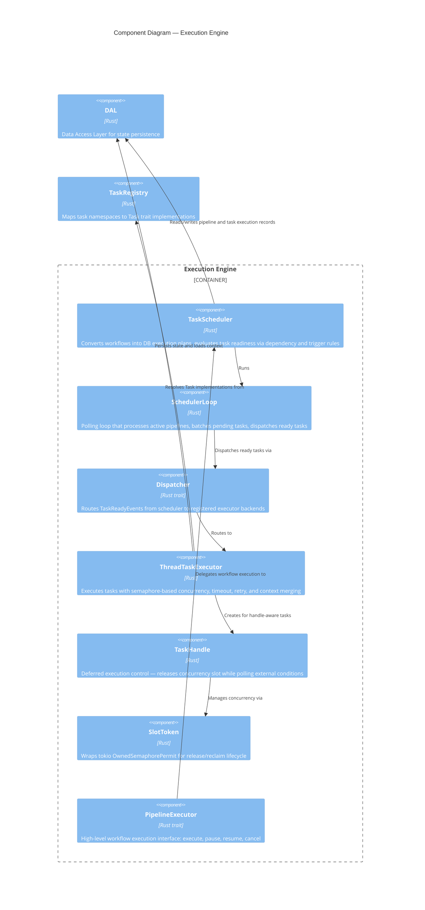

# C4 Level 3 — Execution Engine Components

This diagram zooms into the `cloacina` core library container from the [Container Diagram]() and shows the components responsible for executing workflows.

## Component Diagram



## Components

### TaskScheduler

| | |
|---|---|
| **Location** | `crates/cloacina/src/task_scheduler/mod.rs` |
| **Role** | Converts workflows into persistent execution plans and drives task readiness |

When a workflow is submitted for execution, the scheduler:

1. Creates a `PipelineExecution` record and `TaskExecution` records for every task (atomic transaction)
2. Runs a polling loop (`SchedulerLoop`) that evaluates task readiness
3. Dispatches ready tasks to the `Dispatcher`

**Key methods:**
- `schedule_workflow_execution()` — creates all DB records atomically
- `run_scheduling_loop()` — runs indefinitely, polling at configurable interval (default 100ms)

### SchedulerLoop

| | |
|---|---|
| **Location** | `crates/cloacina/src/task_scheduler/scheduler_loop.rs` |
| **Role** | Core scheduling algorithm — one iteration per poll interval |

Each iteration:
1. Loads all active pipeline executions
2. Batch-loads all pending tasks (single query, grouped by pipeline)
3. Evaluates trigger rules and dependency completion for each task
4. Marks ready tasks and dispatches them
5. Detects completed pipelines and finalizes context

**Task state transitions:**

```
NotStarted → Pending → Ready → Running → Completed
                                      ↘ Failed → Ready (retry)
                                      ↘ Skipped
```

### Dispatcher

| | |
|---|---|
| **Location** | `crates/cloacina/src/dispatcher/traits.rs` |
| **Role** | Routes `TaskReadyEvent` messages from scheduler to executor backends |

The `Dispatcher` trait provides:
- `dispatch(event)` — send a task to the appropriate executor
- `register_executor(key, executor)` — register named executor backends
- `has_capacity()` — check if any executor has available slots

Routing rules support glob patterns for specialized executors (e.g., `ml::*` → GPU executor).

### ThreadTaskExecutor

| | |
|---|---|
| **Location** | `crates/cloacina/src/executor/thread_task_executor.rs` |
| **Role** | Default executor — runs tasks with concurrency control, timeout, and retry |

Execution flow for each task:

1. **Acquire** a concurrency slot via `Semaphore` (configurable `max_concurrent_tasks`, default 4)
2. **Resolve** the `Task` implementation from the `TaskRegistry`
3. **Build context** — lazy-loads dependency contexts and merges them ("latest wins" for conflicts)
4. **Create TaskHandle** if the task declared `requires_handle() = true`
5. **Execute** the task with timeout protection (default 5 minutes)
6. **Handle result:**
   - Success: save context + mark completed (atomic transaction)
   - Retryable failure: schedule retry with backoff delay
   - Terminal failure: mark failed
7. **Release** the semaphore slot

**Transient error detection:** Timeouts, database errors, connection pool errors, and messages containing "timeout", "connection", "network", "temporary", or "unavailable" are classified as retryable.

**Context merging strategy:**
- Single dependency: inherit directly
- Multiple dependencies: batch load, merge with "latest wins"
- Arrays: concatenate and deduplicate
- Objects: merge recursively

### TaskHandle

| | |
|---|---|
| **Location** | `crates/cloacina/src/executor/task_handle.rs` |
| **Role** | Gives tasks the ability to release their concurrency slot while waiting |

The `defer_until(condition, poll_interval)` method:

1. Updates `sub_status` to "Deferred" in the database
2. **Releases** the concurrency slot (other tasks can now use it)
3. Polls the condition function at the specified interval
4. When condition returns `true`, **reclaims** a slot (may wait if all slots are busy)
5. Updates `sub_status` back to "Active"

Task-local storage functions (`with_task_handle`, `take_task_handle`, `return_task_handle`) allow the macro-generated code to inject and retrieve handles without changing the `Task::execute()` signature.

### SlotToken

| | |
|---|---|
| **Location** | `crates/cloacina/src/executor/slot_token.rs` |
| **Role** | Wraps a `tokio::OwnedSemaphorePermit` with explicit release/reclaim |

- `release()` — drops the permit, freeing a concurrency slot
- `reclaim()` — re-acquires a permit (waits if at capacity)
- `is_held()` — checks current state
- Auto-drops permit when the `SlotToken` is dropped

### PipelineExecutor (Trait)

| | |
|---|---|
| **Location** | `crates/cloacina/src/executor/pipeline_executor.rs` |
| **Role** | High-level interface for workflow execution lifecycle |

Methods: `execute()`, `execute_async()`, `get_execution_status()`, `cancel_execution()`, `pause_execution()`, `resume_execution()`, `list_executions()`, `shutdown()`

## Execution Flow

```mermaid
sequenceDiagram
    participant App as Host Application
    participant Sched as TaskScheduler
    participant Loop as SchedulerLoop
    participant Disp as Dispatcher
    participant Exec as ThreadTaskExecutor
    participant DAL as DAL
    participant Task as Task impl

    App->>Sched: schedule_workflow_execution(workflow)
    Sched->>DAL: Create PipelineExecution + TaskExecution records

    loop Every poll_interval (100ms)
        Loop->>DAL: Load active pipelines + pending tasks
        Loop->>Loop: Evaluate trigger rules & dependencies
        Loop->>Disp: dispatch(TaskReadyEvent)
        Disp->>Exec: execute(event)
        Exec->>Exec: Acquire semaphore slot
        Exec->>DAL: Load dependency contexts
        Exec->>Task: execute(context)
        Task-->>Exec: Result
        Exec->>DAL: Save context + mark completed
        Exec->>Exec: Release semaphore slot
    end

    Loop->>DAL: Finalize pipeline context + mark completed
```

## Configuration

| Parameter | Default | Description |
|-----------|---------|-------------|
| `max_concurrent_tasks` | 4 | Semaphore permits for `ThreadTaskExecutor` |
| `task_timeout` | 5 minutes | Per-task execution timeout |
| `poll_interval` | 100ms | `SchedulerLoop` polling frequency |
