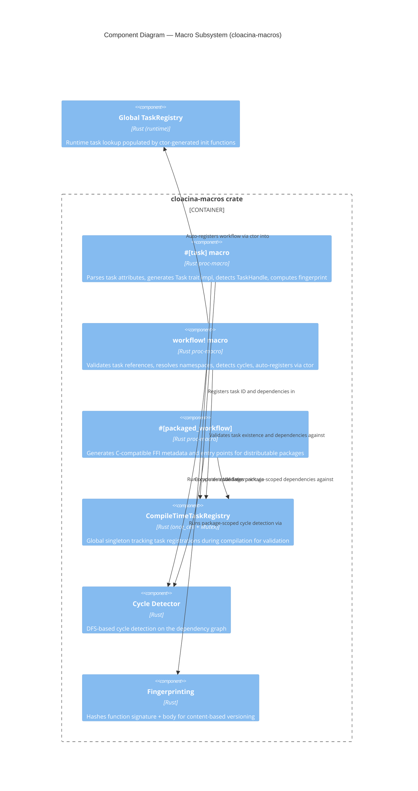
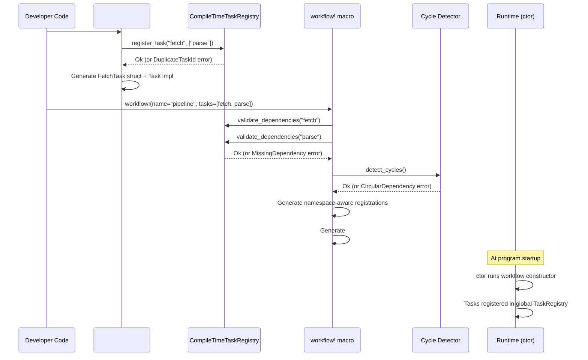

# C4 Level 3 — Macro Subsystem Components

This diagram zooms into the `cloacina-macros` container from the [Container Diagram](). The macro subsystem provides compile-time validation, code generation, and task orchestration.

## Component Diagram

## Components

### #[task] Macro

| | |
|---|---|
| **Location** | `crates/cloacina-macros/src/tasks.rs` |

Transforms an async function into a full `Task` trait implementation. The macro operates in three phases:

1. **Parse** — extracts `TaskAttributes` (id, dependencies, retry config, trigger rules, callbacks)
2. **Register** — adds task to `CompileTimeTaskRegistry` with duplicate detection
3. **Generate** — produces a task struct with `Task` trait implementation

**Generated struct** (named `{PascalCase}Task`):
- `execute()` — wraps the user function, handles TaskHandle injection and callbacks
- `id()` — returns the task ID string
- `dependencies()` — returns dependency namespaces
- `retry_policy()` — returns configured `RetryPolicy`
- `trigger_rules()` — returns JSON trigger rules
- `code_fingerprint()` — returns 16-char hex hash of function signature + body
- `requires_handle()` — returns `true` if function has a `handle` or `task_handle` parameter

**TaskHandle detection:** The macro scans the function's parameter list for a second parameter named `handle` or `task_handle`. If found, the generated `execute()` calls `take_task_handle()` before invoking the user function and `return_task_handle()` after.

**Callback isolation:** `on_success` and `on_failure` callbacks are called after execution. Errors in callbacks are logged but never fail the task.

### workflow! Macro

| | |
|---|---|
| **Location** | `crates/cloacina-macros/src/workflow.rs` |

Assembles tasks into a validated workflow with two-phase validation:

1. **Validate existence** — checks every referenced task exists in the `CompileTimeTaskRegistry`
2. **Detect cycles** — runs DFS-based cycle detection on the dependency graph

Then generates:
- `TaskNamespace` instances for each task (`tenant::package::workflow::task_id`)
- Trigger rules rewriting — converts simple task names to fully qualified namespaces
- `Workflow` struct with all tasks, metadata, description, and auto-computed version
- `#[ctor::ctor]` registration — workflow constructor auto-registers in the global runtime registry when the library loads

### #[packaged_workflow] Macro

| | |
|---|---|
| **Location** | `crates/cloacina-macros/src/packaged_workflow.rs` |

Applied to a module containing `#[task]` functions, generates everything needed for a distributable `.cloacina` package:

**Three-pass processing:**
1. **Scan** — finds all functions with `#[task]` attribute, extracts metadata
2. **Validate** — checks dependencies exist (local package scope + global registry)
3. **Cycle detect** — runs package-scoped cycle detection

**Generated FFI entry points:**
- `cloacina_get_task_metadata()` → returns `#[repr(C)]` `TaskMetadataCollection` struct with task definitions
- `cloacina_execute_task()` → dispatches to task function by name, handles JSON context serialization

**Package graph:** Serialized as JSON with nodes (tasks), edges (dependencies), metadata (depth levels, root/leaf tasks).

### CompileTimeTaskRegistry

| | |
|---|---|
| **Location** | `crates/cloacina-macros/src/registry.rs` |
| **Type** | `Lazy<Mutex<CompileTimeTaskRegistry>>` (global singleton) |

Tracks task registrations during compilation:

- `register_task(id, dependencies, file_path)` — stores task info, detects duplicate IDs
- `validate_dependencies(task_id)` — verifies all dependencies are registered
- `detect_cycles()` — runs DFS cycle detection across all registered tasks
- `get_all_task_ids()` — returns all registered IDs (used for error suggestions)

**Error handling** includes Levenshtein distance-based suggestions for misspelled task names (up to 3 suggestions, distance ≤ 2).

**Test mode:** When `CARGO_CRATE_NAME` or `CARGO_PKG_NAME` contains "test" or equals "cloacina", validation is lenient — missing dependencies and cycles are allowed to support distributed test definitions.

### Cycle Detector

| | |
|---|---|
| **Location** | `crates/cloacina-macros/src/registry.rs` (lines 170-242) |
| **Algorithm** | DFS with recursion stack |

Detects circular dependencies in the task dependency graph:

1. Initialize `visited` and `rec_stack` maps
2. For each unvisited task, run DFS
3. If a dependency is already in the recursion stack → cycle found
4. Reconstruct cycle path for error message


The implementation uses standard DFS with a recursion stack for cycle detection, not Tarjan's strongly connected components algorithm. The approach is functionally correct for detecting cycles in the dependency DAG.


### Fingerprinting

| | |
|---|---|
| **Location** | `crates/cloacina-macros/src/tasks.rs` (function `calculate_function_fingerprint`) |

Computes a content-based hash of each task function for versioning:

- Hashes function parameters (signature)
- Hashes return type
- Hashes function body
- Includes async/sync flag
- Returns a 16-character hexadecimal string

This fingerprint is used by the `workflow!` macro to compute content-based workflow versions — if any task's code changes, the workflow version changes automatically.

## Compilation Flow

## Macro Attributes Reference

### #[task] Attributes

| Attribute | Type | Required | Description |
|-----------|------|----------|-------------|
| `id` | string | Yes | Unique task identifier |
| `dependencies` | array | No | Task IDs this depends on |
| `retry_attempts` | int | No | Max retries (default: 3) |
| `retry_backoff` | string | No | "fixed", "linear", or "exponential" |
| `retry_delay_ms` | int | No | Initial retry delay |
| `retry_max_delay_ms` | int | No | Maximum retry delay |
| `retry_condition` | string | No | "never", "all", or "transient" |
| `retry_jitter` | bool | No | Add random jitter (default: true) |
| `trigger_rules` | expr | No | Composable execution conditions |
| `on_success` | expr | No | Async callback on success |
| `on_failure` | expr | No | Async callback on failure |

### workflow! Attributes

| Attribute | Type | Required | Description |
|-----------|------|----------|-------------|
| `name` | string | Yes | Workflow identifier |
| `tenant` | string | No | Tenant namespace (default: "public") |
| `package` | string | No | Package namespace (default: "embedded") |
| `description` | string | No | Human-readable description |
| `tasks` | array | Yes | List of task function identifiers |
