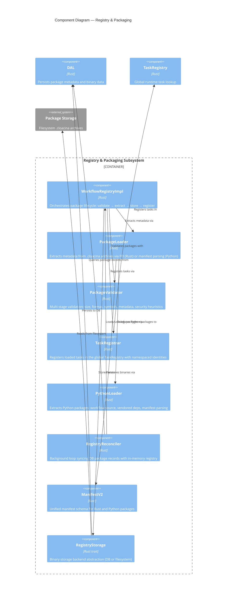
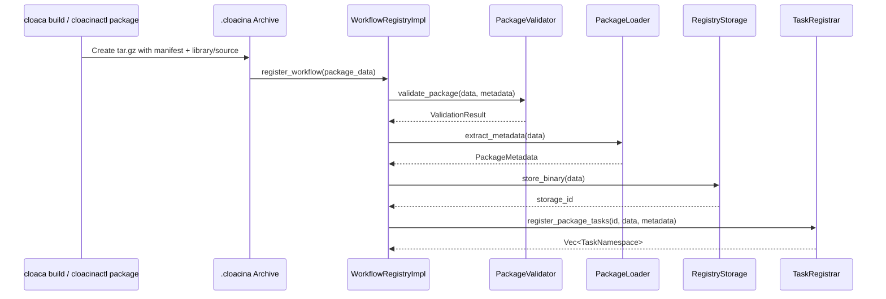

# C4 Level 3 — Registry & Packaging Components

This diagram zooms into the registry and packaging portion of the `cloacina` core library from the [Container Diagram](). It covers the full package lifecycle: build, validate, load, register, and reconcile.

## Component Diagram



## Components

### WorkflowRegistryImpl

| | |
|---|---|
| **Location** | `crates/cloacina/src/registry/workflow_registry/mod.rs` |
| **Generic** | `WorkflowRegistryImpl<S: RegistryStorage>` |

Orchestrates the full package registration lifecycle:

1. **Validate** — run `PackageValidator` checks
2. **Extract metadata** — use `PackageLoader` to read manifest and task definitions
3. **Store binary** — persist via `RegistryStorage`
4. **Store metadata** — persist via `WorkflowPackagesDAL`
5. **Register tasks** — use `TaskRegistrar` to add tasks to global registry

Also supports `unregister_workflow()` which reverses the process: unregister tasks, delete binary, delete metadata.

### PackageLoader

| | |
|---|---|
| **Location** | `crates/cloacina/src/registry/loader/package_loader.rs` |

Extracts package metadata from `.cloacina` archives:

- **Rust packages** — loads the dynamic library via `libloading`, calls the `cloacina_get_task_metadata()` FFI symbol to extract task definitions as C structs, then converts to Rust types
- **Python packages** — delegates to `PythonLoader` which reads `manifest.json` directly (no code execution)
- **Detection** — determines package kind by checking if the archive is a gzip tar.gz or a raw `.so` file

### PackageValidator

| | |
|---|---|
| **Location** | `crates/cloacina/src/registry/loader/validator/mod.rs` |
| **Sub-modules** | `size.rs`, `format.rs`, `symbols.rs`, `metadata.rs`, `security.rs` |

Multi-stage validation pipeline:

| Stage | File | Checks |
|-------|------|--------|
| **Size** | `size.rs` | Not empty, under max size (default 100MB) |
| **Format** | `format.rs` | Valid ELF (Linux), Mach-O (macOS), or PE (Windows) headers; 64-bit |
| **Symbols** | `symbols.rs` | Required FFI symbols present (`cloacina_execute_task`, `cloacina_get_task_metadata`) |
| **Metadata** | `metadata.rs` | Valid package name, unique task IDs, valid dependency references |
| **Security** | `security.rs` | Heuristic scan for suspicious patterns (`/bin/sh`, `system()`, `curl`, `wget`, `nc`) |

Returns a `ValidationResult` with errors, warnings, and a `SecurityLevel` (Safe / Warning / Dangerous). Supports strict mode where warnings become errors.

### TaskRegistrar

| | |
|---|---|
| **Location** | `crates/cloacina/src/registry/loader/task_registrar/mod.rs` |

Bridges loaded packages into the global runtime `TaskRegistry`:

1. Extracts task metadata from the library via FFI
2. Creates a `TaskNamespace` for each task: `tenant_id.package_name.workflow_name.task_id`
3. Registers task constructors in the global registry
4. Tracks registrations per package for cleanup on unregister

### PythonLoader

| | |
|---|---|
| **Location** | `crates/cloacina/src/registry/loader/python_loader.rs` |

Handles Python `.cloacina` archives specifically:

- `peek_manifest()` — reads `manifest.json` without full extraction
- `detect_package_kind()` — returns `PackageKind::Python` or `PackageKind::Rust`
- `extract_python_package()` — extracts archive to staging directory, returns `ExtractedPythonPackage` with paths to `workflow/`, `vendor/`, entry module name, and parsed manifest

### RegistryReconciler

| | |
|---|---|
| **Location** | `crates/cloacina/src/registry/reconciler/mod.rs` |

Background service that keeps the in-memory registry in sync with the database:

- Runs a reconciliation loop at configurable interval (default 30 seconds)
- Optional startup reconciliation to load all existing packages on boot
- Each pass: query DB for packages → compare with in-memory set → load new / unload removed
- Continues on individual package errors (configurable)

### ManifestV2

| | |
|---|---|
| **Location** | `crates/cloacina/src/packaging/manifest_v2.rs` |

Unified manifest schema supporting both Rust and Python packages:

```json
{
  "format_version": "2",
  "package": { "name": "...", "version": "...", "fingerprint": "sha256:...", "targets": [...] },
  "language": "python",
  "python": { "requires_python": ">=3.11", "entry_module": "workflow.tasks" },
  "tasks": [
    { "id": "...", "function": "module:func", "dependencies": [...], "retries": 0 }
  ]
}
```

Validation: format version, language/runtime match, target platform validity, task ID uniqueness, dependency integrity, function path format (`module.path:function_name` for Python).

### RegistryStorage (Trait)

| | |
|---|---|
| **Location** | `crates/cloacina/src/registry/traits.rs` |
| **Implementations** | `UnifiedRegistryStorage` (DB), `FilesystemRegistryStorage` (filesystem) |

Abstract interface for binary package storage:

- `store_binary(data) → id` — persist package bytes
- `retrieve_binary(id) → Option<data>` — load by ID
- `delete_binary(id)` — remove (idempotent)
- `storage_type()` — `Database` or `Filesystem`

## Package Lifecycle



## Python Build Pipeline

The `cloaca build` command (in `bindings/cloaca-backend/python/cloaca/cli/build.py`) builds Python workflow packages:

1. **Parse** `pyproject.toml` — extract `[tool.cloaca]` configuration
2. **Discover tasks** — AST-based static analysis of the entry module (no code import)
3. **Build manifest** — create `ManifestV2` with discovered tasks
4. **Stage** — copy workflow source to `workflow/`, write `manifest.json`
5. **Vendor** — resolve and download platform-specific wheels via `uv`, extract to `vendor/`
6. **Archive** — create tar.gz containing manifest, workflow source, and vendored dependencies
7. **Fingerprint** — compute SHA-256 hash of archive contents
