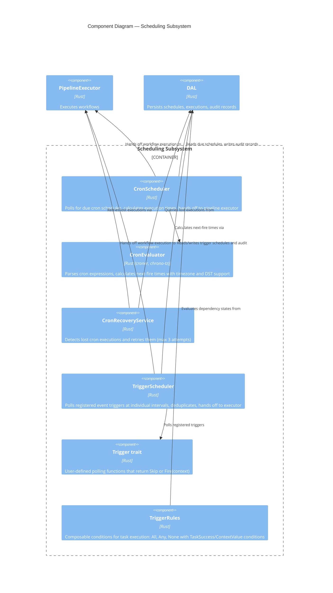
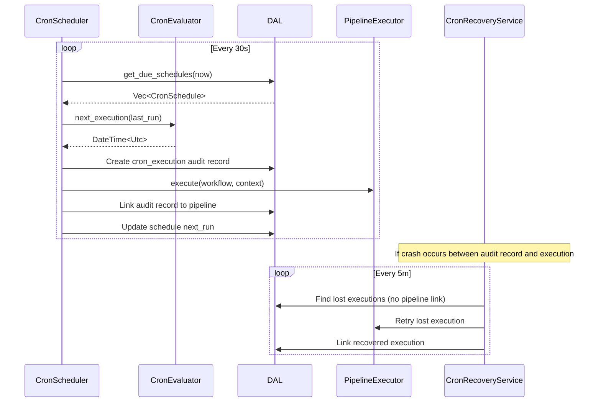
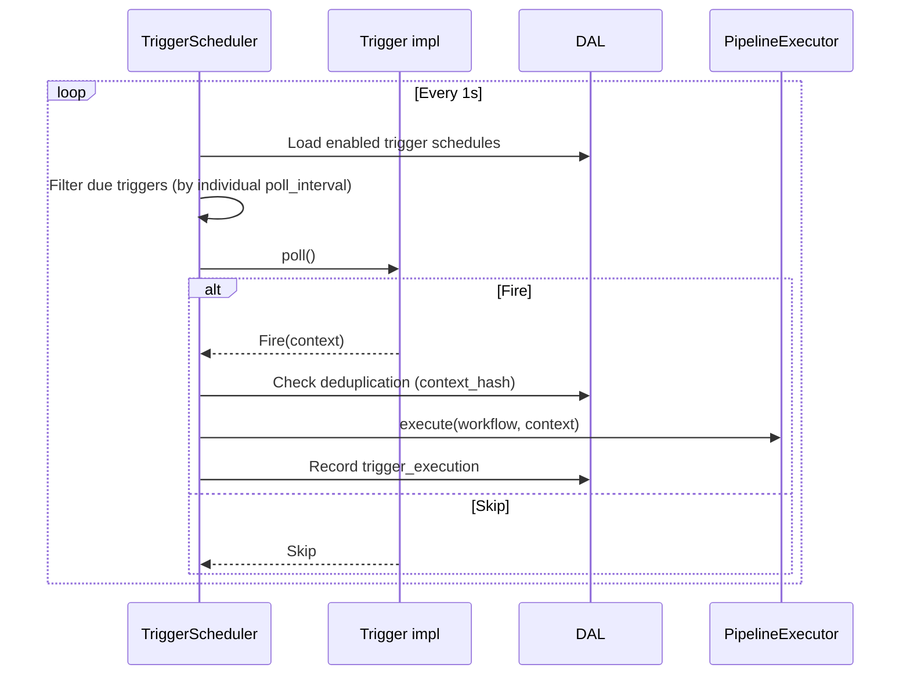

# C4 Level 3 — Scheduling Subsystem Components

This diagram zooms into the scheduling portion of the `cloacina` core library from the [Container Diagram](). It covers both time-based (cron) and event-based (trigger) scheduling.

## Component Diagram



## Components

### CronScheduler

| | |
|---|---|
| **Location** | `crates/cloacina/src/cron_scheduler.rs` |

Polls the database for cron schedules that are due and triggers workflow executions:

1. Query `cron_schedules` for due schedules (`next_run <= now`)
2. Check time window (optional `start_date` / `end_date` boundaries)
3. Calculate execution times using `CronEvaluator`
4. Create audit record **before** handoff (guaranteed execution pattern)
5. Hand off to `PipelineExecutor` without waiting for completion
6. Update `last_run` and `next_run` in the schedule record

**Catchup policies** for missed executions:
- **Skip** — only execute the current scheduled time, ignore missed
- **RunAll** — execute all missed since last run (up to `max_catchup_executions`, default 100)

**Configuration:**

| Parameter | Default | Description |
|-----------|---------|-------------|
| `poll_interval` | 30s | How often to check for due schedules |
| `max_catchup_executions` | 100 | Maximum missed executions to catch up |
| `max_acceptable_delay` | 5 minutes | Grace period before an execution is considered "missed" |

### CronEvaluator

| | |
|---|---|
| **Location** | `crates/cloacina/src/cron_evaluator.rs` |
| **Technology** | `croner` (parsing), `chrono-tz` (timezone) |

Parses 5-field standard cron expressions and calculates execution times:

- `next_execution(after)` — find the next fire time after a given timestamp
- `executions_between(start, end, max)` — find all fire times in a range
- `validate_expression(expr)` / `validate_timezone(tz)` — input validation

**Timezone handling:**
- Accepts IANA timezone names (e.g., `America/New_York`, `Europe/London`, `UTC`)
- Converts UTC timestamps to local timezone for cron field matching
- Handles DST transitions automatically (EST/EDT, etc.)
- Results are always returned as UTC for database storage

### CronRecoveryService

| | |
|---|---|
| **Location** | `crates/cloacina/src/cron_recovery.rs` |

Detects cron executions that were "claimed" (audit record created) but never handed off to the pipeline executor — typically due to process crashes:

- Queries for `cron_executions` records with no corresponding `pipeline_executions`
- Retries up to `max_recovery_attempts` (default 3) per execution
- Skips if schedule is disabled/deleted, execution is too old, or attempts exhausted
- Adds recovery metadata to context (`is_recovery: true`, `recovery_attempt: N`)

**Configuration:**

| Parameter | Default | Description |
|-----------|---------|-------------|
| `check_interval` | 5 minutes | How often to scan for lost executions |
| `lost_threshold_minutes` | 10 | How long before a claimed execution is "lost" |
| `max_recovery_age` | 24 hours | Ignore executions older than this |
| `max_recovery_attempts` | 3 | Give up after this many retries |

### TriggerScheduler

| | |
|---|---|
| **Location** | `crates/cloacina/src/trigger_scheduler.rs` |

Polls registered event triggers at their individual intervals and fires workflow executions:

1. Load enabled trigger schedules from database
2. Check which triggers are due (based on individual `poll_interval`)
3. Call `trigger.poll()` — returns `Skip` or `Fire(context)`
4. **Deduplicate** using `context_hash()` — skip if an active execution with the same hash already exists (unless `allow_concurrent = true`)
5. Hand off to `PipelineExecutor`
6. Record audit trail in `trigger_executions`

**Configuration:**

| Parameter | Default | Description |
|-----------|---------|-------------|
| `base_poll_interval` | 1s | Main loop frequency |
| `poll_timeout` | 30s | Timeout for individual trigger poll calls |

### Trigger Trait

| | |
|---|---|
| **Location** | `crates/cloacina/src/trigger/mod.rs` |

User-defined triggers implement this trait:

```rust
#[async_trait]
pub trait Trigger: Send + Sync {
    fn name(&self) -> &str;
    fn poll_interval(&self) -> Duration;
    fn allow_concurrent(&self) -> bool;
    async fn poll(&self) -> Result<TriggerResult, TriggerError>;
}
```

`TriggerResult::Skip` means "nothing to do", `TriggerResult::Fire(Option<Context>)` means "execute the workflow with this optional context".

A global trigger registry (`trigger/registry.rs`) stores trigger instances, supporting both direct registration and constructor-based registration (used by the `#[trigger]` macro).

### TriggerRules (Task-Level Conditions)

| | |
|---|---|
| **Location** | `crates/cloacina/src/task_scheduler/trigger_rules.rs` |
| **Evaluated by** | `StateManager` in `task_scheduler/state_manager.rs` |

Composable conditions that determine whether an individual task should execute, based on dependency outcomes and context values:

| Rule | Logic | Description |
|------|-------|-------------|
| `Always` | — | Always execute (default) |
| `All { conditions }` | AND | Execute only if **all** conditions are met |
| `Any { conditions }` | OR | Execute if **any** condition is met |
| `None { conditions }` | NOR | Execute only if **no** conditions are met |

**Condition types:**

| Condition | Description |
|-----------|-------------|
| `TaskSuccess { task_name }` | Dependency task completed successfully |
| `TaskFailed { task_name }` | Dependency task failed |
| `TaskSkipped { task_name }` | Dependency task was skipped |
| `ContextValue { key, operator, value }` | Context key matches value using operator |

**Value operators:** `Equals`, `NotEquals`, `GreaterThan`, `LessThan`, `Contains`, `NotContains`, `Exists`, `NotExists`

## Scheduling Flows

### Cron Execution (with Guaranteed Delivery)



### Event Trigger Execution



## Key Design Patterns

| Pattern | Component | Purpose |
|---------|-----------|---------|
| **Guaranteed Execution** | CronScheduler | Audit record created *before* handoff; recovery detects gaps |
| **Saga with Recovery** | CronRecoveryService | Compensates for crashed schedulers |
| **Context Deduplication** | TriggerScheduler | Prevents duplicate executions for the same event |
| **Timezone-Aware Evaluation** | CronEvaluator | Correct behavior across DST transitions |
| **Composable Conditions** | TriggerRules | Flexible task-level execution control |
