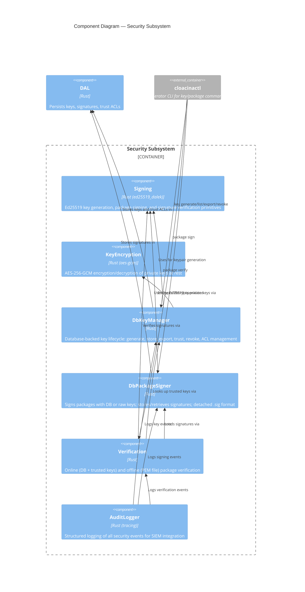
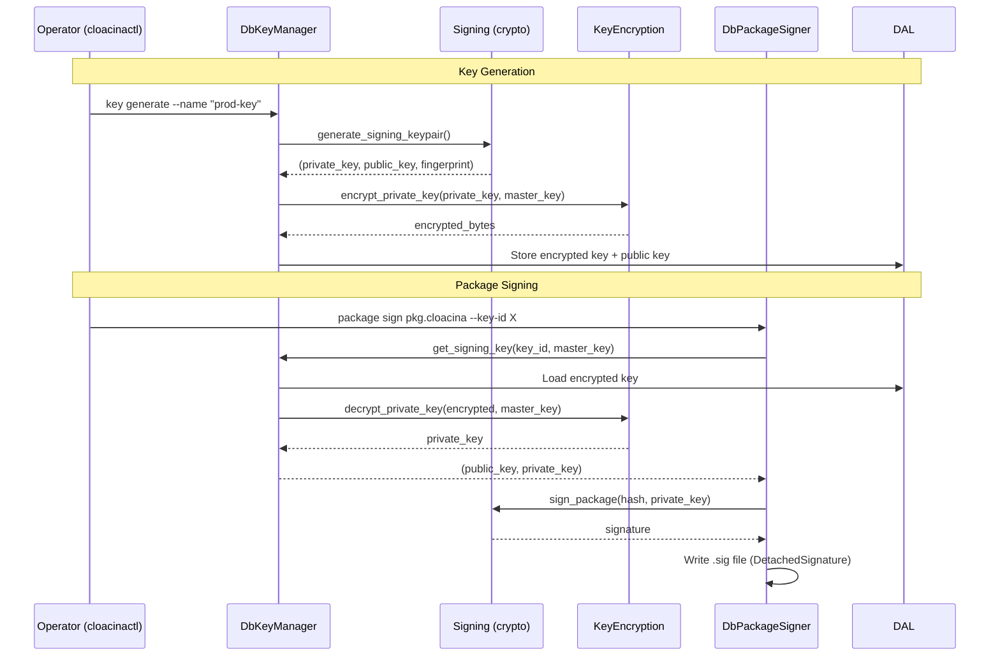
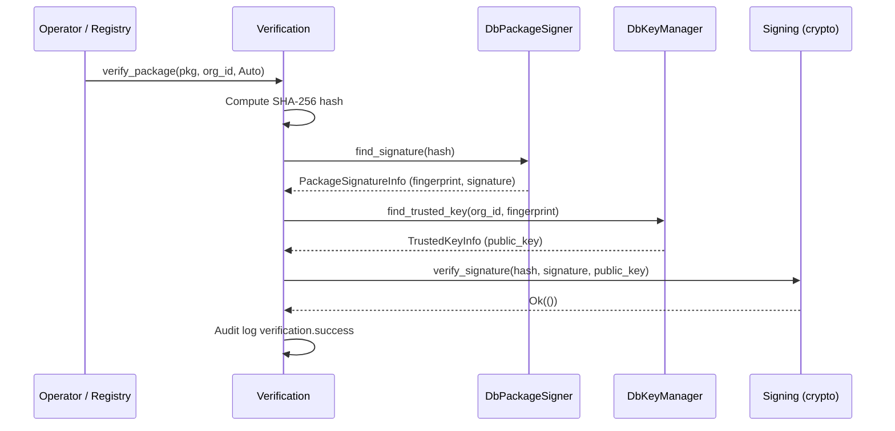

# C4 Level 3 — Security Subsystem Components

This diagram zooms into the security portion of the `cloacina` core library from the [Container Diagram](). It covers cryptographic signing, key management, verification, and audit logging.

## Component Diagram



## Components

### Signing (Crypto Primitives)

| | |
|---|---|
| **Location** | `crates/cloacina/src/crypto/signing.rs` |
| **Technology** | `ed25519_dalek`, `sha2` |

Low-level Ed25519 operations:

- `generate_signing_keypair()` — generates keypair using CSPRNG, returns 32-byte private key, 32-byte public key, and SHA-256 fingerprint
- `sign_package(package_hash, private_key)` — produces Ed25519 signature
- `verify_signature(package_hash, signature, public_key)` — verifies Ed25519 signature
- `compute_key_fingerprint(public_key)` — SHA-256 hex fingerprint for key identification

### KeyEncryption

| | |
|---|---|
| **Location** | `crates/cloacina/src/crypto/key_encryption.rs` |
| **Technology** | `aes-gcm` (AES-256-GCM) |

Encrypts private keys at rest before database storage:

- `encrypt_private_key(private_key, encryption_key)` — encrypts with random 12-byte nonce
- `decrypt_private_key(encrypted_data, encryption_key)` — decrypts using embedded nonce

Storage format: `nonce (12 bytes) || ciphertext || authentication tag (16 bytes)`

The encryption key (master key) is provided externally — typically from an environment variable, HSM, or KMS.

### DbKeyManager

| | |
|---|---|
| **Location** | `crates/cloacina/src/security/db_key_manager.rs` |
| **Trait** | `KeyManager` (defined in `security/key_manager.rs`) |

Full key lifecycle management backed by the database:

| Operation | Method | Description |
|-----------|--------|-------------|
| **Generate** | `create_signing_key()` | Generate Ed25519 keypair, encrypt private key, store both |
| **Retrieve** | `get_signing_key()` | Decrypt and return private + public key |
| **Export** | `export_public_key()` | Export as PEM (SubjectPublicKeyInfo) or raw bytes |
| **Trust** | `trust_public_key()` / `trust_public_key_pem()` | Import external public key as trusted |
| **Revoke** | `revoke_signing_key()` / `revoke_trusted_key()` | Soft-delete (sets `revoked_at`) |
| **ACL** | `grant_trust()` / `revoke_trust()` | Organizational trust: parent org trusts child org's keys |
| **List** | `list_signing_keys()` / `list_trusted_keys()` | List keys (trusted includes inherited via ACLs) |
| **Find** | `find_trusted_key()` | Lookup by fingerprint (searches direct + inherited) |

**Design principle:** No caching — every operation hits the database to ensure immediate revocation effect.

### DbPackageSigner

| | |
|---|---|
| **Location** | `crates/cloacina/src/security/package_signer.rs` |
| **Trait** | `PackageSigner` |

Signs packages and manages signatures:

- **Online signing** — `sign_package_with_db_key()`: retrieves encrypted private key from DB, decrypts, signs package hash, optionally stores signature in DB
- **Offline signing** — `sign_package_with_raw_key()`: signs with provided key material
- **Signature storage** — `store_signature()` / `find_signature()`: persist and query signatures in DB
- **Detached signatures** — `DetachedSignature` struct: JSON-serializable format for `.sig` files containing version, algorithm, base64 signature, fingerprint, and timestamp

### Verification

| | |
|---|---|
| **Location** | `crates/cloacina/src/security/verification.rs` |

Two verification modes:

**Online verification** (`verify_package`):
1. Compute SHA-256 hash of package
2. Load signature (from DB, detached file, or auto-detect)
3. Look up trusted key matching the signer's fingerprint (including inherited trust via ACLs)
4. Verify Ed25519 signature cryptographically
5. Audit log the result

**Offline verification** (`verify_package_offline`):
1. Compute SHA-256 hash of package
2. Load signature from `.sig` file
3. Verify against provided public key (PEM or raw)
4. No database required

**Signature sources:** `SignatureSource::Database`, `SignatureSource::DetachedFile { path }`, `SignatureSource::Auto` (tries `.sig` file first, then database)

### AuditLogger

| | |
|---|---|
| **Location** | `crates/cloacina/src/security/audit.rs` |
| **Technology** | `tracing` crate (structured logging) |

Emits structured log events for all security operations using dot-notation event types:

| Category | Events |
|----------|--------|
| **Key lifecycle** | `key.signing.created`, `key.signing.revoked`, `key.exported` |
| **Trust** | `key.trusted.added`, `key.trusted.revoked`, `key.trust_acl.granted`, `key.trust_acl.revoked` |
| **Signing** | `package.signed`, `package.sign_failure` |
| **Verification** | `verification.success`, `verification.failure` |
| **Package loading** | `package.load.success`, `package.load.failure` |

All events include structured fields (org_id, key_fingerprint, package_hash, etc.) for SIEM integration.

## Key Flows

### Signing Flow



### Verification Flow



## Database Tables

| Table | Purpose |
|-------|---------|
| `signing_keys` | Ed25519 keypairs (private key encrypted with AES-256-GCM) |
| `trusted_keys` | Imported public keys trusted for verification |
| `key_trust_acls` | Organizational trust relationships (parent trusts child) |
| `package_signatures` | Stored package signatures (alternative to detached `.sig` files) |

## Configuration

```rust
pub struct SecurityConfig {
    pub require_signatures: bool,          // Enforce signature verification on load
    pub key_encryption_key: Option<[u8; 32]>, // Master key for private key encryption
}
```

When `require_signatures` is `false` (the default), packages can be loaded without signature verification — suitable for local development.
