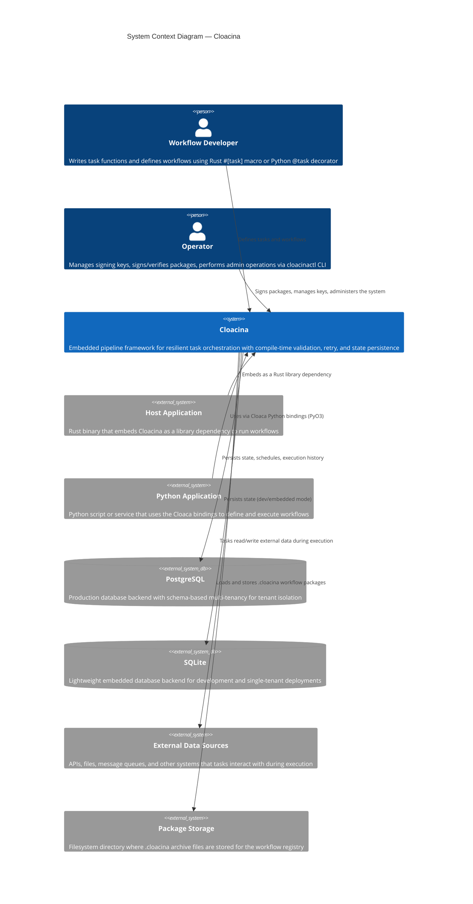

# C4 Level 1 — System Context

The System Context diagram shows Cloacina's position within its broader ecosystem. It answers the question: **who uses Cloacina and what does it connect to?**

## System Context Diagram

## Actors

### Workflow Developer

Writes task functions and composes them into workflows. Developers interact with Cloacina through two language interfaces:

- **Rust** — Uses the `#[task]` attribute macro and `workflow!` macro from the `cloacina` crate (with `features = ["macros"]`). Tasks are compiled into the host application binary. The macro system provides compile-time validation of dependencies, cycle detection, and type safety.
- **Python** — Uses the `@cloaca.task` decorator and `WorkflowBuilder` from the `cloaca` package. Tasks are defined as regular Python functions. The packaging tool (`cloaca build`) bundles workflows into `.cloacina` archives with vendored dependencies.

### Operator

Uses the `cloacinactl` CLI to manage the operational aspects of Cloacina deployments:

- **Key management** — `cloacinactl key generate`, `key list`, `key export` for Ed25519 signing keypairs
- **Package signing** — `cloacinactl package sign` to cryptographically sign `.cloacina` archives
- **Package verification** — `cloacinactl package verify` for online (database) or offline (PEM file) signature checks
- **Administration** — `cloacinactl admin` for database migrations and operational tasks

## External Systems

### Host Application (Rust)

A Rust binary that adds `cloacina` as a dependency in `Cargo.toml`. The host application:

1. Initializes the database connection (PostgreSQL or SQLite)
2. Creates a `DAL` (Data Access Layer) instance
3. Registers workflows (directly or via the package registry)
4. Runs the executor to process tasks

Cloacina is an **embedded library**, not a standalone service. It runs within the host application's process.

### Python Application

A Python script or service that uses the `cloaca` package. The Python bindings provide the same core functionality through PyO3:

1. Define tasks with `@cloaca.task` decorators
2. Build workflows with `cloaca.WorkflowBuilder`
3. Execute with `cloaca.DefaultRunner`

Python workflows can also be packaged into `.cloacina` archives and loaded by a Rust host application's registry.

### PostgreSQL

The production database backend. Cloacina uses PostgreSQL for:

- Task state persistence and execution history
- Cron schedule tracking and missed execution recovery
- Workflow registry metadata
- Signing key storage (encrypted with AES-256-GCM)
- **Multi-tenancy** via PostgreSQL schema isolation — each tenant gets a dedicated schema with identical table structures

### SQLite

The lightweight/embedded database backend, suitable for:

- Local development and testing
- Single-tenant deployments
- Embedded applications where external database dependencies are undesirable

SQLite uses file-based isolation for multi-tenancy (one database file per tenant).

### External Data Sources

Tasks interact with arbitrary external systems during execution. Cloacina does not mediate these connections — tasks are free to call APIs, read files, publish messages, etc. The `Context` object carries data between tasks within a workflow execution.

### Package Storage

A filesystem directory where `.cloacina` archive files are stored. The workflow registry's `RegistryReconciler` monitors this directory for changes and automatically loads/unloads packages. Packages are standard `tar.gz` archives containing a `manifest.json` and either a compiled dynamic library (Rust) or Python source with vendored dependencies.

## Next Level

For a view of Cloacina's internal structure — the crates, bindings, and CLI tools — see the [C4 Level 2 — Container Diagram]().
