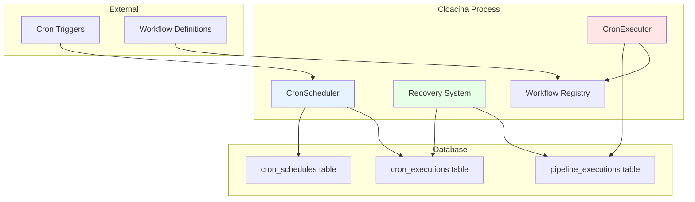
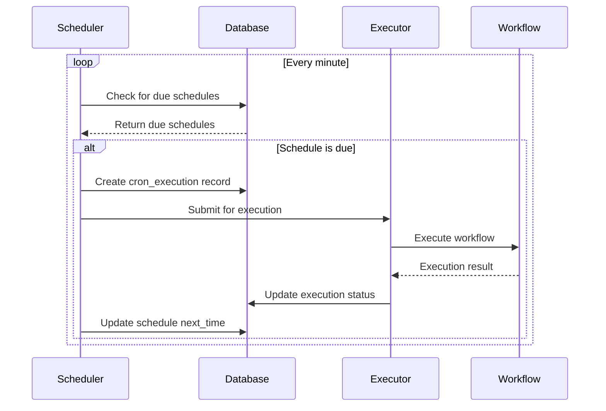

# Cron Scheduling Architecture

Cloacina provides a robust cron scheduling system built on PostgreSQL with automatic recovery, distributed execution support, and strong consistency guarantees.

## Overview

The cron scheduling system consists of several key components:

- **CronScheduler** - Manages schedule parsing and next execution calculation
- **CronExecutor** - Handles actual workflow execution from schedules
- **Recovery System** - Automatically recovers from failures and missed executions
- **Database Integration** - Persistent storage with transaction safety

## Architecture Components



## Scheduling Process

### 1. Schedule Registration

```rust
// Register a cron schedule
let schedule = CronSchedule {
    id: "backup_daily".to_string(),
    workflow_name: "daily_backup".to_string(),
    cron_expression: "0 2 * * *".to_string(), // 2 AM daily
    timezone: "UTC".to_string(),
    enabled: true,
    context: Context::new(),
};

runner.add_cron_schedule(schedule).await?;
```

**What happens internally:**

1. **Validation** - Cron expression is parsed and validated
2. **Storage** - Schedule is persisted to `cron_schedules` table
3. **Next Calculation** - Next execution time is calculated and stored
4. **Activation** - Schedule becomes active for execution

### 2. Schedule Evaluation

```rust
impl CronScheduler {
    async fn evaluate_schedules(&self) -> Result<Vec<DueExecution>, CronError> {
        let now = Utc::now();

        // Find all schedules due for execution
        let due_schedules = self.dal
            .find_due_schedules(now)
            .await?;

        let mut executions = Vec::new();
        for schedule in due_schedules {
            // Calculate next execution time
            let next_time = self.calculate_next_execution(&schedule)?;

            // Create execution record
            let execution = DueExecution {
                schedule_id: schedule.id,
                workflow_name: schedule.workflow_name,
                scheduled_time: now,
                next_time,
                context: schedule.context,
            };

            executions.push(execution);
        }

        Ok(executions)
    }
}
```

### 3. Execution Lifecycle



## Database Schema

### cron_schedules Table

```sql
CREATE TABLE cron_schedules (
    id UUID PRIMARY KEY DEFAULT gen_random_uuid(),
    workflow_name VARCHAR NOT NULL,
    cron_expression VARCHAR NOT NULL,
    timezone VARCHAR NOT NULL DEFAULT 'UTC',
    enabled BOOLEAN NOT NULL DEFAULT true,
    context JSONB NOT NULL DEFAULT '{}',
    next_execution_time TIMESTAMPTZ,
    created_at TIMESTAMPTZ NOT NULL DEFAULT CURRENT_TIMESTAMP,
    updated_at TIMESTAMPTZ NOT NULL DEFAULT CURRENT_TIMESTAMP
);
```

### cron_executions Table

```sql
CREATE TABLE cron_executions (
    id UUID PRIMARY KEY DEFAULT gen_random_uuid(),
    schedule_id UUID NOT NULL REFERENCES cron_schedules(id),
    scheduled_time TIMESTAMPTZ NOT NULL,
    actual_start_time TIMESTAMPTZ,
    completion_time TIMESTAMPTZ,
    status VARCHAR NOT NULL, -- 'scheduled', 'running', 'completed', 'failed'
    pipeline_execution_id UUID REFERENCES pipeline_executions(id),
    error_message TEXT,
    created_at TIMESTAMPTZ NOT NULL DEFAULT CURRENT_TIMESTAMP
);
```

## Execution Guarantees

### At-Least-Once Execution

Cloacina guarantees **at-least-once execution** for all scheduled workflows:

```rust
impl CronExecutor {
    async fn execute_schedule(&self, execution: CronExecution) -> Result<(), CronError> {
        // Mark as running
        self.dal.update_execution_status(
            &execution.id,
            CronExecutionStatus::Running,
            Some(Utc::now())
        ).await?;

        // Execute workflow
        let result = match self.workflow_executor.execute(
            &execution.workflow_name,
            execution.context
        ).await {
            Ok(result) => {
                // Mark as completed
                self.dal.update_execution_status(
                    &execution.id,
                    CronExecutionStatus::Completed,
                    Some(Utc::now())
                ).await?;
                result
            },
            Err(error) => {
                // Mark as failed with error details
                self.dal.update_execution_failed(
                    &execution.id,
                    &error.to_string(),
                    Some(Utc::now())
                ).await?;
                return Err(error.into());
            }
        };

        Ok(())
    }
}
```

### Exactly-Once Semantics

While execution is at-least-once, Cloacina provides mechanisms for exactly-once semantics:

```rust
@cloaca.task(id="idempotent_backup")
def idempotent_backup(context):
    """Example of idempotent task design."""

    backup_date = context.get("backup_date")
    backup_id = f"backup_{backup_date}"

    # Check if backup already exists
    if backup_exists(backup_id):
        print(f"Backup {backup_id} already exists, skipping")
        context.set("backup_status", "already_exists")
        return context

    # Perform backup
    result = perform_backup(backup_id)
    context.set("backup_status", "created")
    context.set("backup_location", result.location)

    return context
```

## Recovery Mechanisms

### Automatic Recovery

The recovery system automatically handles various failure scenarios:

```rust
impl CronRecovery {
    async fn recover_orphaned_executions(&self) -> Result<u32, CronError> {
        let recovery_threshold = Utc::now() - Duration::minutes(30);

        // Find executions that started but never completed
        let orphaned = self.dal
            .find_orphaned_executions(recovery_threshold)
            .await?;

        let mut recovered_count = 0;
        for execution in orphaned {
            match self.attempt_recovery(&execution).await {
                Ok(_) => {
                    recovered_count += 1;
                    info!("Recovered orphaned execution: {}", execution.id);
                },
                Err(e) => {
                    error!("Failed to recover execution {}: {}", execution.id, e);
                }
            }
        }

        Ok(recovered_count)
    }

    async fn attempt_recovery(&self, execution: &CronExecution) -> Result<(), CronError> {
        // Check if the associated pipeline execution exists and its status
        if let Some(pipeline_id) = &execution.pipeline_execution_id {
            let pipeline_status = self.dal
                .get_pipeline_execution_status(pipeline_id)
                .await?;

            match pipeline_status {
                PipelineStatus::Failed => {
                    // Mark cron execution as failed
                    self.dal.update_execution_status(
                        &execution.id,
                        CronExecutionStatus::Failed,
                        Some(Utc::now())
                    ).await?;
                },
                PipelineStatus::Completed => {
                    // Mark cron execution as completed
                    self.dal.update_execution_status(
                        &execution.id,
                        CronExecutionStatus::Completed,
                        Some(Utc::now())
                    ).await?;
                },
                _ => {
                    // Re-submit for execution
                    self.resubmit_execution(execution).await?;
                }
            }
        } else {
            // No pipeline execution found, re-submit
            self.resubmit_execution(execution).await?;
        }

        Ok(())
    }
}
```

### Missed Execution Handling

```rust
impl CronScheduler {
    async fn handle_missed_executions(&self) -> Result<(), CronError> {
        let now = Utc::now();
        let grace_period = Duration::minutes(5);

        // Find schedules that should have executed but didn't
        let missed = self.dal
            .find_missed_schedules(now - grace_period)
            .await?;

        for schedule in missed {
            // Decide whether to execute late or skip
            match self.missed_execution_policy(&schedule) {
                MissedExecutionPolicy::Execute => {
                    // Execute immediately
                    self.submit_immediate_execution(&schedule).await?;
                },
                MissedExecutionPolicy::Skip => {
                    // Log and skip, update next execution time
                    warn!("Skipping missed execution for schedule: {}", schedule.id);
                    self.update_next_execution_time(&schedule).await?;
                },
                MissedExecutionPolicy::ExecuteWithDelay => {
                    // Execute with a small delay to avoid system overload
                    self.submit_delayed_execution(&schedule).await?;
                }
            }
        }

        Ok(())
    }
}
```

## Cron Expression Parsing

### Supported Format

Cloacina uses the standard cron format with timezone support:

```
┌───────────── minute (0 - 59)
│ ┌───────────── hour (0 - 23)
│ │ ┌───────────── day of month (1 - 31)
│ │ │ ┌───────────── month (1 - 12)
│ │ │ │ ┌───────────── day of week (0 - 6) (Sunday to Saturday)
│ │ │ │ │
* * * * *
```

### Expression Examples

```rust
// Valid cron expressions
let expressions = vec![
    "0 2 * * *",        // Daily at 2 AM
    "*/15 * * * *",     // Every 15 minutes
    "0 9 * * MON-FRI",  // Weekdays at 9 AM
    "0 0 1 * *",        // First day of each month
    "0 */6 * * *",      // Every 6 hours
    "30 2 * * SUN",     // Sundays at 2:30 AM
];

// Expression validation
impl CronScheduler {
    fn validate_expression(&self, expr: &str) -> Result<Schedule, CronError> {
        Schedule::from_str(expr)
            .map_err(|e| CronError::InvalidExpression(e.to_string()))
    }

    fn calculate_next_execution(
        &self,
        schedule: &CronSchedule
    ) -> Result<DateTime<Utc>, CronError> {
        let cron_schedule = self.validate_expression(&schedule.cron_expression)?;
        let timezone = schedule.timezone.parse::<Tz>()
            .map_err(|e| CronError::InvalidTimezone(e.to_string()))?;

        let now = Utc::now().with_timezone(&timezone);
        let next = cron_schedule.upcoming(timezone)
            .next()
            .ok_or(CronError::NoFutureExecution)?;

        Ok(next.with_timezone(&Utc))
    }
}
```

## Timezone Handling

### Timezone Support

```rust
impl CronSchedule {
    pub fn new_with_timezone(
        workflow_name: String,
        cron_expression: String,
        timezone: &str,
    ) -> Result<Self, CronError> {
        // Validate timezone
        let tz = timezone.parse::<Tz>()
            .map_err(|_| CronError::InvalidTimezone(timezone.to_string()))?;

        Ok(CronSchedule {
            workflow_name,
            cron_expression,
            timezone: timezone.to_string(),
            enabled: true,
            context: Context::new(),
            // ... other fields
        })
    }
}
```

### Daylight Saving Time

```rust
// DST transition handling
fn calculate_next_with_dst_awareness(
    expr: &str,
    timezone: &Tz,
    from: DateTime<Utc>
) -> Result<DateTime<Utc>, CronError> {
    let schedule = Schedule::from_str(expr)?;
    let local_time = from.with_timezone(timezone);

    // Handle DST transitions
    match schedule.upcoming(timezone).next() {
        Some(next) => {
            // Verify the next execution isn't in a DST gap
            if is_dst_gap(&next, timezone) {
                // Skip forward to avoid the gap
                let adjusted = next + Duration::hours(1);
                Ok(adjusted.with_timezone(&Utc))
            } else {
                Ok(next.with_timezone(&Utc))
            }
        },
        None => Err(CronError::NoFutureExecution)
    }
}
```

## Distributed Execution

### Leader Election

```rust
impl DistributedCronScheduler {
    async fn try_acquire_leadership(&self) -> Result<bool, CronError> {
        let lease_duration = Duration::minutes(5);
        let leader_id = self.node_id.clone();

        // Atomic leadership acquisition
        let acquired = self.dal.try_acquire_leader_lease(
            &leader_id,
            lease_duration
        ).await?;

        if acquired {
            info!("Acquired cron scheduler leadership");
            self.start_lease_renewal_task().await?;
        }

        Ok(acquired)
    }

    async fn renew_leadership(&self) -> Result<(), CronError> {
        let lease_duration = Duration::minutes(5);

        let renewed = self.dal.renew_leader_lease(
            &self.node_id,
            lease_duration
        ).await?;

        if !renewed {
            warn!("Failed to renew leadership, stepping down");
            self.step_down().await?;
        }

        Ok(())
    }
}
```

### Work Distribution

```rust
impl DistributedCronExecutor {
    async fn distribute_execution(
        &self,
        execution: CronExecution
    ) -> Result<(), CronError> {
        // Find available executor nodes
        let available_nodes = self.dal
            .get_available_executor_nodes()
            .await?;

        if available_nodes.is_empty() {
            // Execute locally
            return self.execute_locally(execution).await;
        }

        // Select node based on load balancing strategy
        let selected_node = self.select_executor_node(&available_nodes)?;

        // Submit execution to selected node
        self.submit_to_node(&selected_node, execution).await
    }
}
```

## Performance Considerations

### Efficient Polling

```rust
impl CronScheduler {
    async fn optimized_schedule_check(&self) -> Result<(), CronError> {
        // Use database-level filtering to minimize data transfer
        let current_time = Utc::now();
        let check_window = current_time + Duration::minutes(2);

        // Only fetch schedules due within the next 2 minutes
        let due_schedules = self.dal
            .find_schedules_due_within(current_time, check_window)
            .await?;

        // Process in batches to avoid overwhelming the system
        for batch in due_schedules.chunks(10) {
            self.process_schedule_batch(batch).await?;
        }

        Ok(())
    }
}
```

### Index Optimization

```sql
-- Optimized indexes for cron scheduling
CREATE INDEX CONCURRENTLY idx_cron_schedules_next_execution
ON cron_schedules(next_execution_time)
WHERE enabled = true;

CREATE INDEX CONCURRENTLY idx_cron_executions_status_scheduled
ON cron_executions(scheduled_time, status);

CREATE INDEX CONCURRENTLY idx_cron_executions_orphaned
ON cron_executions(actual_start_time)
WHERE status = 'running' AND completion_time IS NULL;
```

## Monitoring and Observability

### Metrics Collection

```rust
#[derive(Debug, Clone)]
pub struct CronMetrics {
    pub total_schedules: u64,
    pub active_schedules: u64,
    pub executions_per_minute: f64,
    pub average_execution_time: Duration,
    pub failed_executions_rate: f64,
    pub recovery_events: u64,
}

impl CronMetrics {
    async fn collect(dal: &CronDal) -> Result<Self, CronError> {
        let total_schedules = dal.count_total_schedules().await?;
        let active_schedules = dal.count_active_schedules().await?;

        let recent_window = Utc::now() - Duration::hours(1);
        let recent_executions = dal
            .count_executions_since(recent_window)
            .await?;

        let executions_per_minute = recent_executions as f64 / 60.0;

        // Calculate other metrics...

        Ok(CronMetrics {
            total_schedules,
            active_schedules,
            executions_per_minute,
            // ... other fields
        })
    }
}
```

### Health Checks

```rust
pub async fn cron_health_check(scheduler: &CronScheduler) -> HealthStatus {
    let mut issues = Vec::new();

    // Check if scheduler is running
    if !scheduler.is_running().await {
        issues.push("Scheduler not running".to_string());
    }

    // Check for excessive missed executions
    let missed_count = scheduler.count_missed_executions().await.unwrap_or(0);
    if missed_count > 10 {
        issues.push(format!("High missed execution count: {}", missed_count));
    }

    // Check for stalled executions
    let stalled_count = scheduler.count_stalled_executions().await.unwrap_or(0);
    if stalled_count > 5 {
        issues.push(format!("Stalled executions detected: {}", stalled_count));
    }

    if issues.is_empty() {
        HealthStatus::Healthy
    } else {
        HealthStatus::Unhealthy(issues)
    }
}
```

## Best Practices

### Schedule Design

```rust
// Good: Idempotent with clear failure handling
@cloaca.task(id="robust_backup")
def robust_backup(context):
    backup_id = context.get("backup_id")

    try:
        # Check if already done
        if backup_exists(backup_id):
            return context

        # Perform backup
        result = create_backup(backup_id)
        context.set("backup_success", True)
        context.set("backup_location", result.path)

    except Exception as e:
        context.set("backup_success", False)
        context.set("error", str(e))
        # Don't re-raise - let cron handle retry policy

    return context

// Avoid: Non-idempotent operations
@cloaca.task(id="bad_counter")
def bad_counter(context):
    # This will cause issues if executed multiple times
    current = get_counter()
    set_counter(current + 1)  # Race condition!
    return context
```

### Error Handling

```rust
impl CronExecutor {
    async fn execute_with_retry(
        &self,
        execution: &CronExecution,
        max_retries: u32
    ) -> Result<(), CronError> {
        let mut attempt = 0;

        while attempt < max_retries {
            match self.execute_once(execution).await {
                Ok(_) => return Ok(()),
                Err(e) if attempt == max_retries - 1 => {
                    // Final attempt failed
                    error!("Cron execution failed after {} attempts: {}", max_retries, e);
                    return Err(e);
                },
                Err(e) => {
                    attempt += 1;
                    warn!("Cron execution attempt {} failed: {}", attempt, e);

                    // Exponential backoff
                    let delay = Duration::seconds(2_i64.pow(attempt));
                    tokio::time::sleep(delay.to_std().unwrap()).await;
                }
            }
        }

        unreachable!()
    }
}
```

## See Also

- [Cron Scheduling Tutorial](/tutorials/05-cron-scheduling/) - Practical implementation guide
- [Python Cron Tutorial](/python-bindings/tutorials/05-cron-scheduling/) - Python-specific examples
- [Production Scheduling Guide](/how-to-guides/production-scheduling/) - Deployment best practices
- [Guaranteed Execution Architecture](/explanation/guaranteed-execution-architecture/) - Overall execution guarantees
