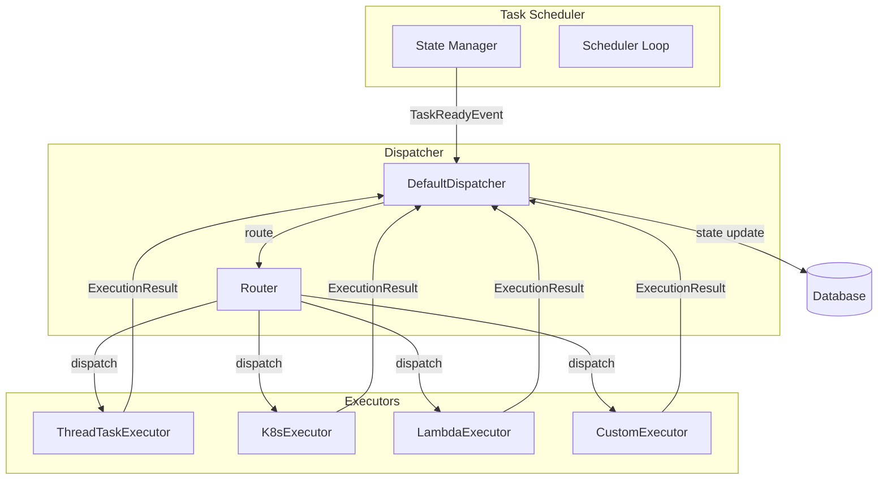
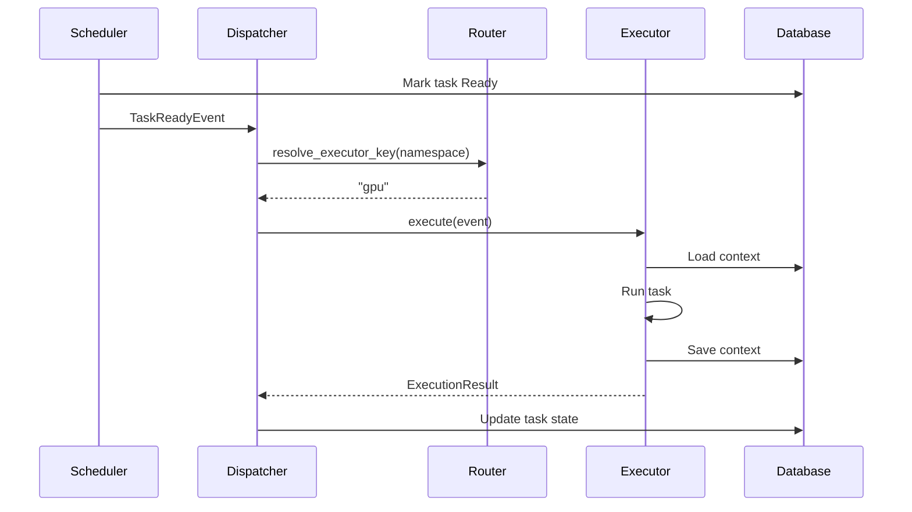

## Overview

Cloacina uses a dispatcher architecture to decouple task scheduling from task execution. This enables pluggable execution backends - you can implement custom executors for Kubernetes jobs, serverless functions, remote workers, or any other execution environment.

## Architecture



### Key Components

| Component | Purpose |
|-----------|---------|
| **TaskReadyEvent** | Event emitted when a task becomes ready for execution |
| **Dispatcher** | Routes events to appropriate executors based on configuration |
| **Router** | Pattern-matching engine for task-to-executor routing |
| **TaskExecutor** | Trait implemented by execution backends |
| **ExecutionResult** | Outcome of task execution (success, failure, retry) |

## The Dispatcher Trait

The `Dispatcher` trait defines the interface for routing task events:

```rust
pub trait Dispatcher: Send + Sync {
    /// Dispatch a task-ready event to an appropriate executor.
    fn dispatch(&self, event: TaskReadyEvent) -> Result<(), DispatchError>;

    /// Register an executor with a given key.
    fn register_executor(&self, key: &str, executor: Arc<dyn TaskExecutor>);

    /// Check if any registered executor has capacity.
    fn has_capacity(&self) -> bool;

    /// Resolve which executor key should handle a task.
    fn resolve_executor_key(&self, task_namespace: &str) -> String;
}
```

## The TaskExecutor Trait

To implement a custom executor, implement the `TaskExecutor` trait:

```rust
pub trait TaskExecutor: Send + Sync {
    /// Execute a task and return the result.
    fn execute(&self, event: TaskReadyEvent) -> Result<ExecutionResult, DispatchError>;

    /// Check if this executor has capacity for more tasks.
    fn has_capacity(&self) -> bool;

    /// Get current executor metrics.
    fn metrics(&self) -> ExecutorMetrics;

    /// Get the executor's name for logging/debugging.
    fn name(&self) -> &str;
}
```

## TaskReadyEvent

When the scheduler determines a task is ready, it emits a `TaskReadyEvent`:

```rust
pub struct TaskReadyEvent {
    /// The pipeline execution this task belongs to
    pub pipeline_execution_id: UniversalUuid,
    /// Unique identifier for this task execution record
    pub task_execution_id: UniversalUuid,
    /// Full task namespace (e.g., "public::embedded::workflow::task_name")
    pub task_namespace: String,
    /// Current attempt number (1-based)
    pub attempt: i32,
    /// Maximum allowed attempts
    pub max_attempts: i32,
}
```

Note: The event does not include context data. Executors should load context from the database at execution time to ensure they have the latest state.

## Implementing a Custom Executor

Here's a template for implementing a custom executor:

```rust
use cloacina::dispatcher::{
    TaskExecutor, TaskReadyEvent, ExecutionResult, ExecutionStatus,
    ExecutorMetrics, DispatchError,
};
use std::sync::atomic::{AtomicU64, Ordering};

pub struct MyCustomExecutor {
    name: String,
    max_concurrent: usize,
    active_tasks: AtomicU64,
    total_executed: AtomicU64,
    total_failed: AtomicU64,
    // Your custom fields here (client connections, config, etc.)
}

impl MyCustomExecutor {
    pub fn new(name: &str, max_concurrent: usize) -> Self {
        Self {
            name: name.to_string(),
            max_concurrent,
            active_tasks: AtomicU64::new(0),
            total_executed: AtomicU64::new(0),
            total_failed: AtomicU64::new(0),
        }
    }
}

impl TaskExecutor for MyCustomExecutor {
    fn execute(&self, event: TaskReadyEvent) -> Result<ExecutionResult, DispatchError> {
        self.active_tasks.fetch_add(1, Ordering::SeqCst);

        // 1. Load context from database using event.pipeline_execution_id
        // 2. Resolve the task implementation from registry
        // 3. Execute the task in your custom environment
        // 4. Handle success/failure and update database

        let result = match self.run_task(&event) {
            Ok(()) => {
                self.total_executed.fetch_add(1, Ordering::SeqCst);
                ExecutionResult {
                    task_execution_id: event.task_execution_id,
                    status: ExecutionStatus::Completed,
                    error_message: None,
                    should_retry: false,
                }
            }
            Err(e) => {
                self.total_failed.fetch_add(1, Ordering::SeqCst);
                let should_retry = event.attempt < event.max_attempts;
                ExecutionResult {
                    task_execution_id: event.task_execution_id,
                    status: if should_retry {
                        ExecutionStatus::Retry
                    } else {
                        ExecutionStatus::Failed
                    },
                    error_message: Some(e.to_string()),
                    should_retry,
                }
            }
        };

        self.active_tasks.fetch_sub(1, Ordering::SeqCst);
        Ok(result)
    }

    fn has_capacity(&self) -> bool {
        self.active_tasks.load(Ordering::SeqCst) < self.max_concurrent as u64
    }

    fn metrics(&self) -> ExecutorMetrics {
        ExecutorMetrics {
            active_tasks: self.active_tasks.load(Ordering::SeqCst),
            total_executed: self.total_executed.load(Ordering::SeqCst),
            total_failed: self.total_failed.load(Ordering::SeqCst),
        }
    }

    fn name(&self) -> &str {
        &self.name
    }
}
```

## Routing Configuration

The dispatcher uses glob-pattern routing to direct tasks to executors:

```rust
use cloacina::dispatcher::{RoutingConfig, RoutingRule};

// Route ML tasks to GPU executor, everything else to default
let routing = RoutingConfig::new("default")
    .with_rule(RoutingRule::new("*::ml::*", "gpu"))
    .with_rule(RoutingRule::new("*::batch::*", "k8s"));
```

### Pattern Syntax

| Pattern | Matches |
|---------|---------|
| `*` | Single path segment |
| `**` | Multiple path segments |
| `exact` | Exact match |

Examples:
- `*::ml::*` matches `public::ml::train`, `tenant::ml::inference`
- `batch::**` matches `batch::jobs::daily`, `batch::jobs::hourly::cleanup`
- `public::embedded::my_workflow::*` matches all tasks in `my_workflow`

## Registering Custom Executors

Register executors with the dispatcher before starting the runner:

```rust
use cloacina::runner::DefaultRunner;
use cloacina::dispatcher::{RoutingConfig, RoutingRule};

// Create runner with custom routing
let runner = DefaultRunner::builder()
    .database_url("postgresql://localhost/cloacina")
    .routing_config(
        RoutingConfig::new("default")
            .with_rule(RoutingRule::new("*::gpu::*", "gpu"))
    )
    .build()
    .await?;

// The default ThreadTaskExecutor is registered automatically as "default"
// Register additional executors for custom routing targets
```

## Execution Flow

1. **Scheduler** evaluates task dependencies and trigger rules
2. **State Manager** marks task as Ready and emits `TaskReadyEvent`
3. **Dispatcher** receives event and routes via `Router`
4. **Router** matches task namespace against rules, returns executor key
5. **Executor** receives event, executes task, returns `ExecutionResult`
6. **Dispatcher** processes result, updates database state



## Error Handling

The dispatcher handles errors at multiple levels:

| Error Type | Handling |
|------------|----------|
| **DispatchError::NoExecutor** | No executor registered for routing target |
| **DispatchError::NoCapacity** | All executors at capacity (task stays Ready) |
| **DispatchError::ExecutionFailed** | Task execution failed (retry or fail based on policy) |

## Best Practices

1. **Idempotency**: Design tasks to be idempotent since they may be retried
2. **Context Loading**: Always load fresh context at execution time
3. **Metrics**: Track active tasks, success/failure counts for observability
4. **Capacity**: Implement `has_capacity()` accurately to prevent overload
5. **Timeouts**: Implement execution timeouts in your executor
6. **Error Messages**: Return descriptive error messages for debugging

## Example: Kubernetes Job Executor

A K8s executor might:

1. Create a Kubernetes Job spec from the task configuration
2. Submit the job to the cluster
3. Wait for completion (or timeout)
4. Retrieve logs and results
5. Return appropriate `ExecutionResult`

```rust
impl TaskExecutor for K8sExecutor {
    fn execute(&self, event: TaskReadyEvent) -> Result<ExecutionResult, DispatchError> {
        // Create job spec
        let job = self.create_job_spec(&event)?;

        // Submit to K8s
        let job_name = self.k8s_client.create_job(job).await?;

        // Wait for completion
        match self.wait_for_job(&job_name, self.timeout).await {
            Ok(()) => Ok(ExecutionResult::success(event.task_execution_id)),
            Err(e) => Ok(ExecutionResult::failed(
                event.task_execution_id,
                e.to_string(),
                event.attempt < event.max_attempts,
            )),
        }
    }
    // ...
}
```

## See Also

- [Task Execution Sequence]() - Detailed task lifecycle
- [Guaranteed Execution Architecture]() - Reliability guarantees
- [Performance Characteristics]() - Tuning executors
