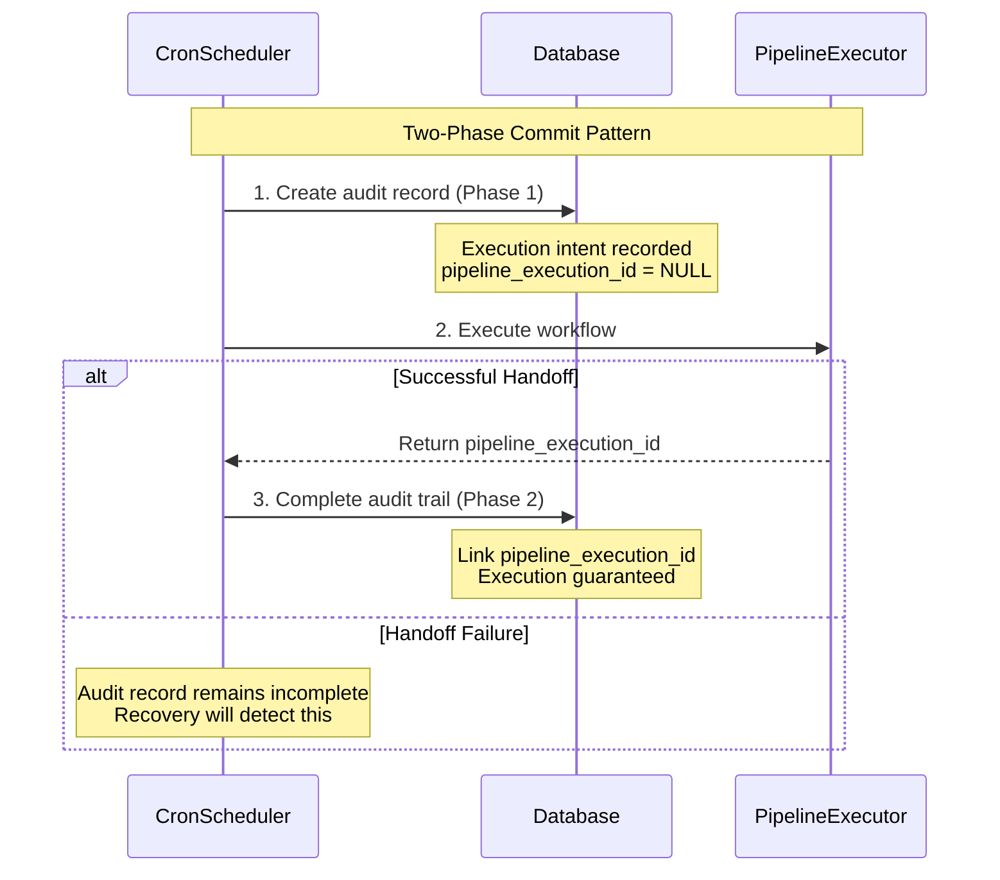
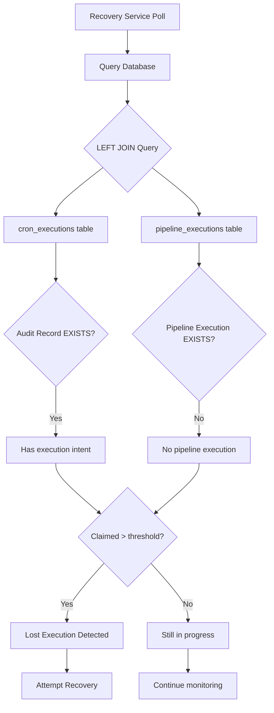
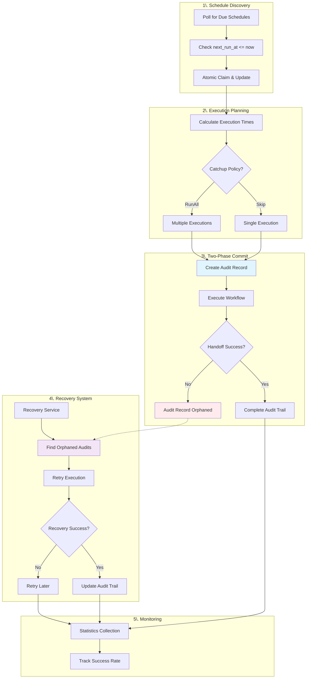
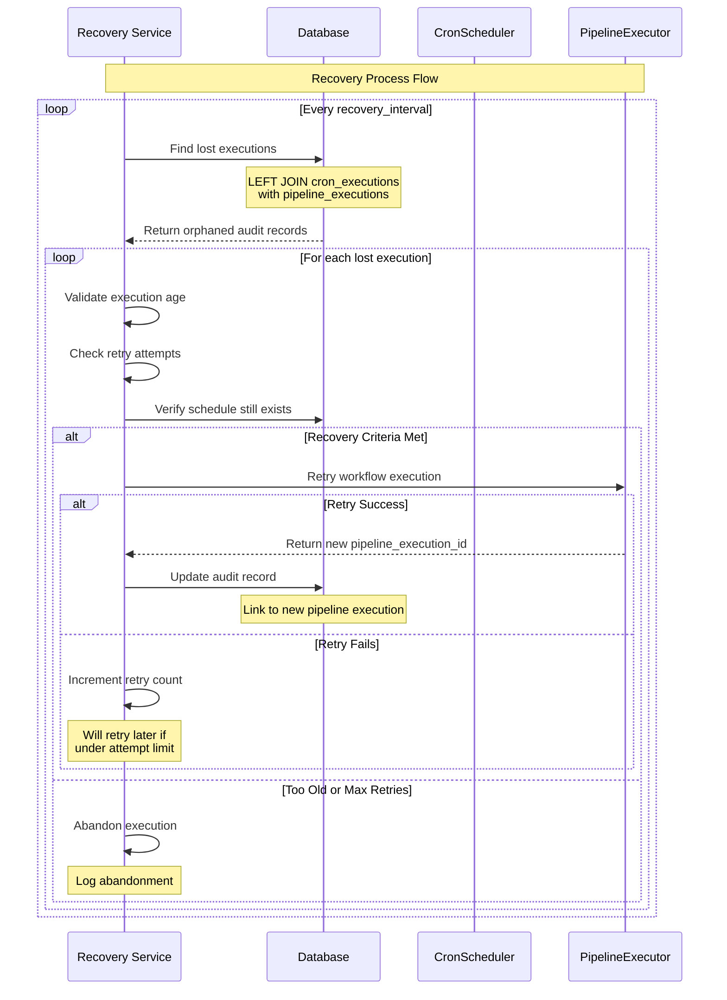

## Overview of the Guaranteed Execution Problem

Traditional cron systems suffer from a fundamental reliability problem: they're fire-and-forget. When a cron daemon executes a scheduled job, it simply spawns a process and moves on. If that process fails to start, crashes during execution, or gets lost due to system failures, there's no mechanism to detect or recover from these failures. This creates gaps in scheduled execution that can be particularly problematic for critical business processes.

**What "Guaranteed Execution" Means**

In Cloacina's context, guaranteed execution means:
- Every scheduled execution leaves a durable audit trail before handoff
- Failed handoffs can be detected and recovered automatically
- No executions are silently lost due to system failures
- Complete observability into the scheduling and execution pipeline
- Atomic claiming prevents duplicate executions across multiple instances

The system doesn't guarantee that workflows will complete successfully (business logic can still fail), but it guarantees that scheduled executions won't be lost in the handoff process between the scheduler and executor.

## Two-Phase Commit Pattern

Cloacina implements a two-phase commit pattern that creates execution intent records before handing off to the pipeline executor. This pattern ensures durability and enables recovery.



### Phase 1: Execution Intent Recording

Before any workflow execution begins, the system creates a durable audit record:

```rust
// From CronScheduler::process_schedule()
let audit_record_id = match self.create_execution_audit(schedule.id, scheduled_time) {
    Ok(id) => id,
    Err(e) => {
        error!("Failed to create execution audit for schedule {} at {}: {}",
               schedule.id, scheduled_time, e);
        continue; // This execution is lost, but we continue with others
    }
};
```

The audit record creation uses the `NewCronExecution::new()` pattern:

```rust
pub fn new(schedule_id: UniversalUuid, scheduled_time: UniversalTimestamp) -> Self {
    Self {
        id: Some(UniversalUuid::new_v4()),
        schedule_id,
        pipeline_execution_id: None, // Will be set after successful handoff
        scheduled_time,
        claimed_at: None, // Will be set by DAL layer (database-specific)
        created_at: None, // Will be set by DAL layer (database-specific)
        updated_at: None, // Will be set by DAL layer (database-specific)
    }
}
```

This creates a record with execution intent but no pipeline execution ID, establishing a "claim" on the scheduled time.

### Phase 2: Pipeline Handoff and Completion

After successful handoff to the pipeline executor, the audit record is completed:

```rust
// From CronScheduler::process_schedule()
match self.execute_workflow(schedule, scheduled_time).await {
    Ok(pipeline_execution_id) => {
        // Complete audit trail linking
        if let Err(e) = self.complete_execution_audit(audit_record_id, pipeline_execution_id) {
            error!("Failed to complete audit trail for schedule {} execution: {}",
                   schedule.id, e);
            // Continue - the execution succeeded, just audit completion failed
        }
    }
    Err(e) => {
        error!("Failed to execute workflow {} for schedule {}: {}",
               schedule.workflow_name, schedule.id, e);
        // Note: Audit record exists without pipeline_execution_id
        // Recovery service will detect this as a "lost" execution
    }
}
```

### The Role of Audit Trails

The audit trail serves multiple critical functions:

1. **Duplicate Prevention**: The UNIQUE constraint on `(schedule_id, scheduled_time)` prevents multiple executions for the same schedule at the same time
2. **Recovery Detection**: Records with no `pipeline_execution_id` after a threshold indicate lost executions
3. **Observability**: Complete history of what was scheduled versus what actually executed
4. **Performance Monitoring**: Timing data for execution delays and patterns

## Database Design for Reliability

The database schema is carefully designed to support the guaranteed execution pattern while maintaining cross-database compatibility.

### Table Structure and Constraints

**PostgreSQL Implementation:**
```sql
CREATE TABLE cron_executions (
    id UUID PRIMARY KEY DEFAULT gen_random_uuid(),
    schedule_id UUID NOT NULL REFERENCES cron_schedules(id) ON DELETE CASCADE,
    pipeline_execution_id UUID REFERENCES pipeline_executions(id) ON DELETE CASCADE,
    scheduled_time TIMESTAMP NOT NULL,
    claimed_at TIMESTAMP DEFAULT CURRENT_TIMESTAMP NOT NULL,
    created_at TIMESTAMP DEFAULT CURRENT_TIMESTAMP NOT NULL,
    updated_at TIMESTAMP DEFAULT CURRENT_TIMESTAMP NOT NULL,

    -- Prevent duplicate executions for the same schedule at the same time
    UNIQUE(schedule_id, scheduled_time)
);
```

**SQLite Implementation:**
```sql
CREATE TABLE cron_executions (
    id BLOB PRIMARY KEY NOT NULL,
    schedule_id BLOB NOT NULL REFERENCES cron_schedules(id) ON DELETE CASCADE,
    pipeline_execution_id BLOB REFERENCES pipeline_executions(id) ON DELETE CASCADE,
    scheduled_time TEXT NOT NULL,
    claimed_at TEXT NOT NULL,
    created_at TEXT NOT NULL,
    updated_at TEXT NOT NULL,

    -- Prevent duplicate executions for the same schedule at the same time
    UNIQUE(schedule_id, scheduled_time)
);
```

### Cross-Database Compatibility

Cloacina uses a `UniversalTypes` system to handle differences between PostgreSQL and SQLite:

```rust
// From models/cron_execution.rs
pub struct CronExecution {
    pub id: UniversalUuid,
    pub schedule_id: UniversalUuid,
    pub pipeline_execution_id: Option<UniversalUuid>,
    pub scheduled_time: UniversalTimestamp,
    pub claimed_at: UniversalTimestamp,
    // ...
}
```

This abstraction allows the same business logic to work across both databases while handling their different type systems (PostgreSQL's native UUID vs SQLite's BLOB storage).

### Indexing Strategy for Performance

The system uses targeted indexes for efficient queries:

```sql
-- Index for efficient lookups by schedule
CREATE INDEX idx_cron_executions_schedule
ON cron_executions (schedule_id, scheduled_time DESC);

-- Index for pipeline execution correlation (only for non-null values)
CREATE INDEX idx_cron_executions_pipeline
ON cron_executions (pipeline_execution_id) WHERE pipeline_execution_id IS NOT NULL;

-- Index for time-based queries
CREATE INDEX idx_cron_executions_claimed_at
ON cron_executions (claimed_at DESC);
```

These indexes support the most common query patterns:
- Finding executions by schedule for history queries
- Correlating pipeline executions back to their cron origins
- Time-based queries for recovery and monitoring

## Recovery and Monitoring

The recovery system implements the detection and retry side of the guaranteed execution pattern.

### Lost Execution Detection

The recovery service identifies lost executions using a LEFT JOIN query:



```rust
// From postgres_dal/cron_execution.rs
pub fn find_lost_executions(
    &self,
    older_than_minutes: i32,
) -> Result<Vec<CronExecution>, ValidationError> {
    let cutoff_time = UniversalTimestamp(
        Utc::now() - chrono::Duration::minutes(older_than_minutes as i64)
    );

    // Find cron executions that don't have corresponding pipeline executions
    // and were claimed before the cutoff time
    let lost_executions = cron_executions::table
        .left_join(
            pipeline_executions::table.on(
                cron_executions::pipeline_execution_id
                    .eq(pipeline_executions::id.nullable())
            )
        )
        .filter(pipeline_executions::id.is_null())
        .filter(cron_executions::claimed_at.lt(cutoff_time))
        .select(cron_executions::all_columns)
        .load(&mut conn)?;

    Ok(lost_executions)
}
```

This query finds executions that have audit records but no corresponding pipeline executions, indicating they were claimed but never successfully handed off.

### Recovery Process and Policies

The recovery service implements sophisticated retry logic:

```rust
// From cron_recovery.rs
async fn recover_execution(&self, execution: &CronExecution) -> Result<(), PipelineError> {
    let execution_age = Utc::now() - execution.scheduled_time();

    // Check if execution is too old to recover
    if execution_age > chrono::Duration::from_std(self.config.max_recovery_age).unwrap() {
        warn!("Execution {} is too old to recover (age: {:?}), abandoning",
              execution.id, execution_age);
        return Ok(());
    }

    // Check recovery attempts
    let mut attempts = self.recovery_attempts.lock().await;
    let attempt_count = attempts.entry(execution.id).or_insert(0);
    *attempt_count += 1;

    if *attempt_count > self.config.max_recovery_attempts {
        error!("Execution {} has exceeded max recovery attempts ({}), abandoning",
               execution.id, self.config.max_recovery_attempts);
        return Ok(());
    }

    // ... recovery logic continues
}
```

Recovery policies include:
- **Age limits**: Executions older than 24 hours (configurable) are abandoned
- **Retry limits**: Maximum 3 recovery attempts per execution
- **Schedule validation**: Only recover for schedules that still exist and are enabled
- **Context preservation**: Recovery executions include metadata about being recoveries

### Performance Monitoring and Statistics

The system provides comprehensive statistics for monitoring:

```rust
// From postgres_dal/cron_execution.rs
pub struct CronExecutionStats {
    /// Total number of executions attempted
    pub total_executions: i64,
    /// Number of executions that successfully handed off to pipeline executor
    pub successful_executions: i64,
    /// Number of executions that were lost (claimed but never executed)
    pub lost_executions: i64,
    /// Success rate as a percentage
    pub success_rate: f64,
}
```

These statistics enable monitoring dashboards and alerting systems to track the health of the cron scheduling system.

## Architecture Flow

The complete execution flow demonstrates the sophisticated coordination between components:



### Step-by-Step Execution Flow

1. **Schedule Discovery**
   ```rust
   let due_schedules = self.dal.cron_schedule().get_due_schedules(now)?;
   ```

2. **Atomic Claiming**
   ```rust
   let claimed = self.dal.cron_schedule()
       .claim_and_update(schedule.id, now, now, next_run)?;

   if !claimed {
       debug!("Schedule {} was already claimed by another instance", schedule.id);
       return Ok(());
   }
   ```

3. **Execution Time Calculation** (based on catchup policy)
   ```rust
   let execution_times = self.calculate_execution_times(schedule, now)?;
   ```

4. **Audit Record Creation** (Phase 1 of two-phase commit)
   ```rust
   let audit_record_id = self.create_execution_audit(schedule.id, scheduled_time)?;
   ```

5. **Pipeline Handoff**
   ```rust
   let pipeline_execution_id = self.execute_workflow(schedule, scheduled_time).await?;
   ```

6. **Audit Completion** (Phase 2 of two-phase commit)
   ```rust
   self.complete_execution_audit(audit_record_id, pipeline_execution_id)?;
   ```

### Error Handling at Each Stage

The system implements comprehensive error handling that maintains system resilience:

- **Schedule claiming failures**: Continue with other schedules
- **Audit record creation failures**: Skip this execution but continue
- **Pipeline handoff failures**: Leave audit record for recovery detection
- **Audit completion failures**: Log error but don't fail the execution

### Integration with the Broader Workflow System

The cron scheduler integrates seamlessly with Cloacina's existing workflow execution infrastructure:

```rust
// From default_runner.rs - CronScheduler creation
let cron_scheduler = CronScheduler::new(
    Arc::new(dal),
    Arc::new(self.clone()), // DefaultRunner implements PipelineExecutor!
    cron_config,
    cron_shutdown_rx,
);
```

This design allows the cron scheduler to leverage all of Cloacina's existing capabilities:
- Task retry logic
- Dependency resolution
- Context management
- Multi-tenancy support
- Performance monitoring

## Scheduler Recovery Process

The recovery system is a critical component that ensures no executions are permanently lost due to system failures. It operates as an independent service within the cron scheduling subsystem.

### Recovery Service Architecture

The recovery service runs on a separate interval from the main scheduler:

```rust
// From cron_recovery.rs
impl CronRecovery {
    pub async fn run(&self) -> Result<(), PipelineError> {
        let mut interval = tokio::time::interval(self.config.recovery_interval);

        loop {
            tokio::select! {
                _ = interval.tick() => {
                    if let Err(e) = self.recover_lost_executions().await {
                        error!("Recovery cycle failed: {}", e);
                    }
                }
                _ = self.shutdown_rx.recv() => {
                    info!("Recovery service shutting down");
                    break;
                }
            }
        }
        Ok(())
    }
}
```

### Recovery Detection Logic

The recovery process identifies lost executions using sophisticated criteria:



```rust
async fn recover_lost_executions(&self) -> Result<(), PipelineError> {
    let threshold_minutes = self.config.lost_threshold_minutes;
    let lost_executions = self.dal
        .cron_execution()
        .find_lost_executions(threshold_minutes)?;

    info!("Found {} potentially lost executions", lost_executions.len());

    for execution in lost_executions {
        if let Err(e) = self.recover_execution(&execution).await {
            error!("Failed to recover execution {}: {}", execution.id, e);
        }
    }

    Ok(())
}
```

The detection uses a LEFT JOIN to find audit records without corresponding pipeline executions:

1. **Time-based filtering**: Only consider executions older than the threshold (default: 5 minutes)
2. **Null check**: Find cron_executions where pipeline_execution_id is NULL
3. **Age verification**: Ensure enough time has passed to confidently declare them "lost"

### Recovery Execution Process

When recovering a lost execution, the system preserves the original schedule context while adding recovery metadata:

```rust
async fn recover_execution(&self, execution: &CronExecution) -> Result<(), PipelineError> {
    // Validate the schedule still exists and is enabled
    let schedule = match self.dal.cron_schedule().get_by_id(execution.schedule_id)? {
        Some(s) if s.enabled => s,
        Some(_) => {
            debug!("Schedule {} is disabled, skipping recovery", execution.schedule_id);
            return Ok(());
        }
        None => {
            warn!("Schedule {} no longer exists, skipping recovery", execution.schedule_id);
            return Ok(());
        }
    };

    // Create recovery context with additional metadata
    let mut context = Context::new();
    context.insert("is_recovery", json!(true))?;
    context.insert("original_scheduled_time", json!(execution.scheduled_time()))?;
    context.insert("recovery_attempt_time", json!(Utc::now()))?;
    context.insert("execution_id", json!(execution.id))?;

    // Execute the workflow through the pipeline
    match self.executor.execute_workflow(&schedule.workflow_name, context).await {
        Ok(pipeline_execution_id) => {
            // Link the recovered execution to the pipeline execution
            self.dal.cron_execution().update_pipeline_execution_id(
                execution.id,
                pipeline_execution_id,
            )?;
            info!("Successfully recovered execution {} for schedule {}",
                  execution.id, execution.schedule_id);
        }
        Err(e) => {
            error!("Recovery execution failed for {}: {}", execution.id, e);
            return Err(e);
        }
    }

    Ok(())
}
```

### Recovery Policies and Limits

The recovery system implements several policies to prevent runaway recovery attempts:

**Age Limits:**
```rust
let execution_age = Utc::now() - execution.scheduled_time();
if execution_age > self.config.max_recovery_age {
    warn!("Execution {} is too old to recover, abandoning", execution.id);
    return Ok(());
}
```

**Retry Limits:**
```rust
let mut attempts = self.recovery_attempts.lock().await;
let attempt_count = attempts.entry(execution.id).or_insert(0);
*attempt_count += 1;

if *attempt_count > self.config.max_recovery_attempts {
    error!("Execution {} has exceeded max recovery attempts, abandoning", execution.id);
    return Ok(());
}
```

**Schedule Validation:**
- Only recover executions for schedules that still exist
- Skip recovery for disabled schedules
- Validate workflow names still exist in the system

### Recovery Metrics and Monitoring

The recovery system provides detailed metrics for operational monitoring:

```rust
pub struct RecoveryStats {
    pub total_recovery_attempts: u64,
    pub successful_recoveries: u64,
    pub failed_recoveries: u64,
    pub abandoned_recoveries: u64,
    pub recovery_success_rate: f64,
}
```

These metrics enable operators to:
- Track recovery effectiveness
- Identify patterns in lost executions
- Tune recovery parameters for optimal performance
- Set up alerting for high recovery rates (indicating system issues)

## Design Decision Rationale

Several key design decisions make this architecture particularly robust:

### Saga Pattern Implementation

The separation between scheduling (CronScheduler) and execution (PipelineExecutor) follows the saga pattern, where each service has clear responsibilities and compensation actions. This prevents the complexity that would arise from trying to handle both concerns in a single component.

### Database-First Durability

By creating audit records in the database before any execution, the system ensures that no execution intent is lost even in the face of process crashes or network failures. This is more reliable than in-memory coordination mechanisms.

### Atomic Claiming with Timestamps

The `claim_and_update` operation atomically updates both the `last_run_at` and `next_run_at` timestamps, preventing race conditions between multiple scheduler instances while providing clear semantics for when a schedule was last processed.

### Recovery as a Separate Service

The recovery service runs independently of the main scheduler, providing resilience even if the scheduler itself fails. This separation of concerns allows for different retry policies and prevents recovery logic from complicating the main scheduling loop.

### Cross-Database Timestamp Handling

The sophisticated handling of timestamps (PostgreSQL using database defaults, SQLite using application-level timestamps) ensures consistent behavior across different database backends while leveraging each database's strengths.

This architecture demonstrates how sophisticated distributed systems patterns can be applied to solve the fundamental reliability problems in cron-based scheduling, providing enterprise-grade guarantees while maintaining operational simplicity.
