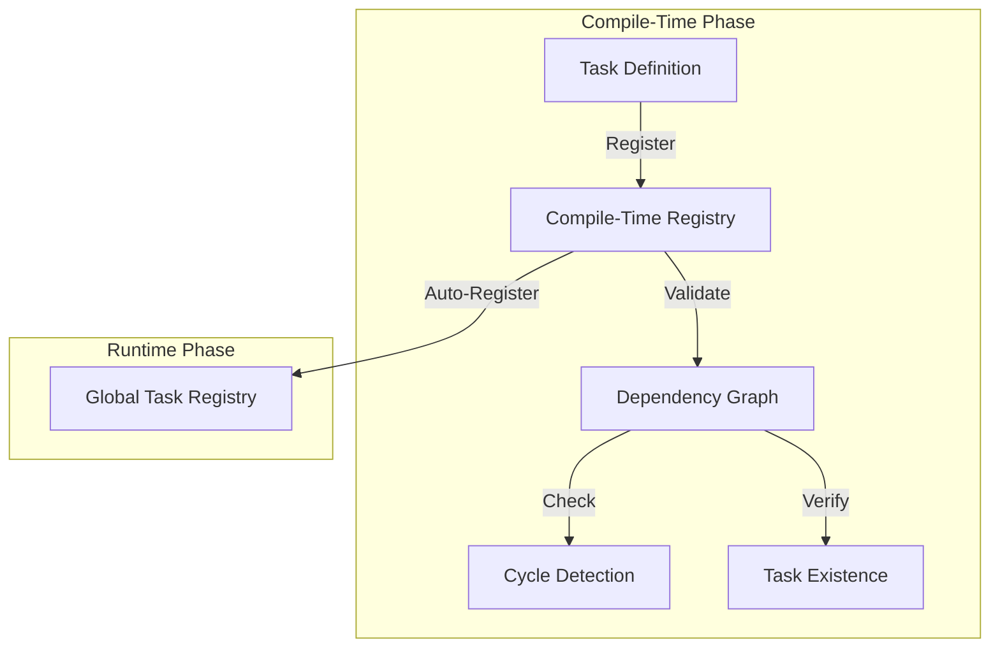

# Inside Cloacina's Macro System

## Introduction

Cloacina's macro system provides a powerful way to define and validate task pipelines at compile time. This article explores the core concepts and practical usage of the system.

The macro system is the preferred way to use Cloacina for several key reasons:

1. **Compile-Time Safety**: The macro system validates your entire pipeline during compilation, catching common errors like missing dependencies or circular references before your code runs.

2. **Type Safety**: By using the macro system, you get full type checking of your task inputs and outputs, ensuring data consistency across your pipeline.

3. **Automatic Registration**: Tasks and workflows are automatically registered in the global registry, eliminating the need for manual registration and reducing boilerplate code.

4. **Developer Experience**: The declarative syntax makes it easier to understand and maintain your pipelines, with clear visualization of dependencies and execution flow.

5. **Pipeline Versioning**: The system automatically generates and tracks versions for your workflows based on their content and dependencies, making it easier to manage changes and track pipeline evolution. For a detailed explanation of how versioning works, see [Pipeline Versioning](pipeline-versioning.md).

While Cloacina can be used without macros, the macro system provides these benefits with minimal additional complexity, making it the recommended approach for most use cases.

## Core Concepts

### Tasks and Workflows

At its heart, Cloacina's macro system revolves around two main concepts:

1. **Tasks**: Individual units of work that can be executed independently
2. **Workflows**: Compositions of tasks that define execution order and dependencies

The macro system ensures these concepts are properly structured and validated at compile time. It also handles automatic versioning of workflows based on their content and dependencies. For a detailed explanation of how versioning works, see [Pipeline Versioning](pipeline-versioning.md).

### Compile-Time Validation

The macro system performs several important validations:

- Task ID uniqueness
- Dependency existence
- Circular dependency detection
- Workflow structure validation

These validations happen during compilation, catching errors before runtime.

## The Task Macro

### How It Works

The `#[task]` macro transforms your async function into a fully-featured Cloacina task by:

1. **Code Generation**: Creates a task struct that implements the `Task` trait
2. **Registry Integration**: Registers the task in the global registry using `ctor`
3. **Validation**: Performs compile-time validation of dependencies and configuration
4. **Fingerprinting**: Generates a unique code fingerprint for versioning

### Compile-Time Validation

The macro performs several validations during compilation:

1. **Dependency Existence**: Ensures all declared dependencies exist
2. **ID Uniqueness**: Verifies task IDs are unique within the codebase
3. **Configuration Validity**: Validates retry policies and other settings
4. **Type Safety**: Ensures context types match the task's requirements

These validations catch common errors before runtime, making your pipelines more reliable.

### Generated Code

Behind the scenes, the macro generates code that:

1. Implements the `Task` trait with proper error handling
2. Creates a task struct with the specified configuration
3. Sets up automatic registration using `ctor`
4. Implements retry logic based on the configuration

This generated code is what enables the compile-time safety and automatic registration features.

## The Workflow Macro

### How It Works

The `workflow!` macro creates a complete workflow implementation by:

1. **Task Validation**: Verifies all referenced tasks exist and are properly registered
2. **Graph Analysis**: Performs topological sorting and cycle detection
3. **Version Calculation**: Generates a content-based version for the workflow
4. **Registry Integration**: Registers the workflow in the global registry

### Generated Implementation

The macro generates code that:
1. Creates a workflow struct with the specified configuration
2. Implements proper task ordering and dependency management
3. Sets up automatic version calculation
4. Handles workflow registration and execution

## Implementation Details

### Required Dependencies

The macro system requires several dependencies to be explicitly included in your `Cargo.toml`:

```toml
[dependencies]
cloacina = { version = "0.1.0", features = ["macros"] }
async-trait = "0.1"    # Required for async task definitions
ctor = "0.2"          # Required for task registration
serde_json = "1.0"    # Required for context data
chrono = "0.4"        # Required for timestamps in errors and state tracking
```

These dependencies cannot be made transitive (automatically included) because they are used directly in the code generated by the macros. During macro expansion, the generated code needs to reference these types and traits, so they must be available at the call site. This is a fundamental requirement of Rust's procedural macro system - any types used in the generated code must be available where the macro is used.

### Registry System

The macro system uses a compile-time registry to track tasks and their dependencies. This registry is implemented as a global singleton using `once_cell` and `Mutex` for thread-safe access during compilation. It serves as the central source of truth for task relationships and validation.



#### Key Components

1. **Task Registration**
   - Each task is registered with a unique ID
   - Dependencies are recorded in a directed graph
   - File paths are tracked for better error messages
   - Registration happens during macro expansion

2. **Dependency Management**
   - Maintains a directed acyclic graph (DAG) of task dependencies
   - Tracks both direct and transitive dependencies
   - Enables efficient dependency validation
   - Supports complex workflow structures

3. **Validation System**
   - **Cycle Detection**: Uses Tarjan's algorithm to detect circular dependencies
   - **Task Existence**: Verifies all referenced tasks are registered
   - **ID Uniqueness**: Ensures no duplicate task IDs
   - **Dependency Completeness**: Validates all dependencies exist

4. **Error Handling**
   - Provides detailed error messages with file locations
   - Suggests similar task names for typo detection
   - Includes dependency paths in error messages
   - Supports test mode with relaxed validation


## Conclusion

Cloacina's macro system provides a powerful way to build type-safe, validated task pipelines. By understanding the core concepts and following best practices, you can create robust and maintainable workflows that catch errors at compile time rather than runtime.
