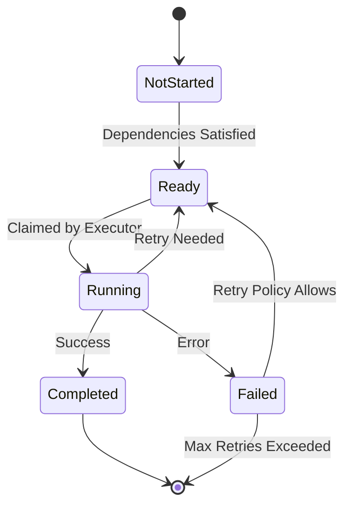
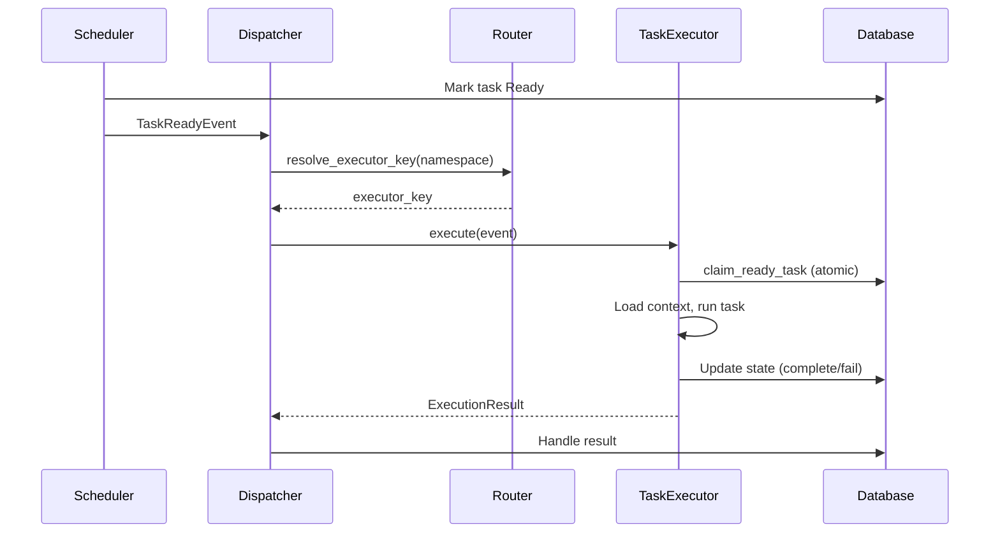

## Overview

Cloacina implements a robust task execution system that ensures reliable, concurrent execution of workflow tasks while maintaining proper dependency ordering and state management. This article explores the complete lifecycle of a task from initialization to completion.

## Task Lifecycle States

Tasks progress through a well-defined set of states during their execution:



## Task Initialization

When a workflow is scheduled for execution, tasks are initialized in a specific order:

```rust
async fn initialize_task_executions(
    &self,
    pipeline_execution_id: Uuid,
    workflow: &Workflow,
) -> Result<(), ValidationError> {
    let task_ids = workflow.topological_sort()?;

    for task_id in task_ids {
        let new_task = NewTaskExecution {
            pipeline_execution_id: UniversalUuid(pipeline_execution_id),
            task_name: task_id,
            status: "NotStarted".to_string(),
            attempt: 1,
            max_attempts,
            trigger_rules: trigger_rules.to_string(),
            task_configuration: task_configuration.to_string(),
        };

        self.dal.task_execution().create(new_task)?;
    }
    Ok(())
}
```

Key aspects of initialization:
- Tasks are created in topological order (respecting dependencies)
- Each task starts in "NotStarted" state
- Initial attempt counter is set to 1
- Retry policy and trigger rules are configured
- Task configuration is stored for execution

## Execution Architecture

Cloacina uses a **dispatcher-based architecture** that decouples task scheduling from task execution. This enables pluggable execution backends while maintaining reliable state management.

```rust
pub struct ExecutorConfig {
    pub max_concurrent_tasks: usize,  // Default: 4
    pub task_timeout: Duration,       // Default: 5 minutes
}
```

### Push-Based Execution Flow

The scheduler pushes tasks to executors via the dispatcher:

<!-- codespell:disable -->

<!-- codespell:enable -->

The execution process:
1. Scheduler determines task is ready (dependencies satisfied, trigger rules pass)
2. Scheduler emits `TaskReadyEvent` to dispatcher
3. Dispatcher routes event to appropriate executor based on task namespace
4. Executor atomically claims the task (Ready -> Running)
5. Executor loads context and executes the task
6. Executor updates task state and returns result
7. Dispatcher handles result (retry scheduling, state updates)

### Atomic Task Claiming

The `claim_ready_task()` operation ensures safe concurrent execution:

```sql
-- Atomic claim with FOR UPDATE SKIP LOCKED
UPDATE task_executions
SET status = 'Running', claimed_at = NOW(), claimed_by = $executor_id
WHERE id = (
    SELECT id FROM task_executions
    WHERE status = 'Ready' AND id = $task_id
    FOR UPDATE SKIP LOCKED
)
RETURNING *;
```

This prevents multiple executors from claiming the same task even in distributed scenarios.

## Task Isolation and Threading

Each task runs in its own isolated Tokio task, providing several important benefits:

```rust
// Execute task in background with pre-loaded context
tokio::spawn(async move {
    let _permit = permit; // Hold permit until task completes

    info!(
        "Executing task with pre-loaded context: {} (attempt {})",
        claimed_task.task_name, claimed_task.attempt
    );

    if let Err(e) = executor
        .execute_claimed_task_with_context(claimed_task, preloaded_context)
        .await
    {
        error!("Task execution failed: {}", e);
    }
});
```

Key aspects of task isolation:

1. **Independent Execution Context**:
   - Each task runs in its own Tokio task
   - Tasks can't interfere with each other's execution
   - Memory and state are isolated between tasks

2. **Resource Management**:
   - Semaphore controls total concurrent tasks
   - Each task holds a permit until completion
   - Resources are automatically released on task completion

3. **Error Containment**:
   - Task failures are isolated
   - Panics in one task don't affect others
   - Error handling is task-specific

4. **Timeout Protection**:
   ```rust
   match tokio::time::timeout(self.config.task_timeout, task.execute(context)).await {
       Ok(result) => result.map_err(ExecutorError::TaskExecution),
       Err(_) => Err(ExecutorError::TaskTimeout),
   }
   ```
   - Each task has its own timeout
   - Long-running tasks are automatically terminated
   - System resources are protected from runaway tasks

5. **State Management**:
   - Task state is persisted in the database
   - Context is isolated per task
   - Dependencies are managed through database state

This isolation ensures that tasks can execute safely in parallel without interfering with each other, while still maintaining proper coordination through the database and semaphore controls.

## Dependency Management

Tasks don't execute in isolation. The system manages dependencies through:

```rust
async fn check_task_dependencies(
    &self,
    task_execution: &TaskExecution,
) -> Result<bool, ValidationError> {
    let dependencies = workflow.get_dependencies(&task_execution.task_name)?;

    // Batch fetch all dependency statuses
    let status_map = self.dal.task_execution()
        .get_task_statuses_batch(
            task_execution.pipeline_execution_id,
            dependency_names
        )?;

    // Check all dependencies are in terminal states
    let all_satisfied = dependencies.iter().all(|dependency| {
        status_map.get(dependency)
            .map(|status| matches!(status.as_str(),
                "Completed" | "Failed" | "Skipped"))
            .unwrap_or(false)
    });

    Ok(all_satisfied)
}
```

## Dependency Safety and Race Conditions

To prevent race conditions in task execution, particularly with retrying tasks, the system implements several safety mechanisms:

```rust
async fn claim_task_for_execution(
    &self,
    task_execution: &TaskExecution,
) -> Result<Option<ClaimedTask>, ExecutorError> {
    // Start a transaction to ensure atomicity
    let mut transaction = self.dal.begin_transaction().await?;

    // Re-check dependencies within transaction
    let dependencies_satisfied = self.check_task_dependencies_within_tx(
        &mut transaction,
        task_execution
    ).await?;

    if !dependencies_satisfied {
        return Ok(None);
    }

    // Claim the task atomically
    let claimed_task = self.dal.task_execution()
        .claim_task_within_tx(
            &mut transaction,
            task_execution.id,
            self.executor_id
        ).await?;

    // Commit the transaction
    transaction.commit().await?;

    Ok(Some(claimed_task))
}
```

The system prevents race conditions through:

1. **Atomic Dependency Checking**:
   - Dependencies are re-checked within a transaction
   - Prevents "greedy" executors from picking up tasks too early
   - Ensures all upstream tasks are truly complete

2. **Transaction-based Task Claiming**:
   - Task claiming is atomic with dependency verification
   - Prevents multiple executors from claiming the same task
   - Maintains consistency even with retrying tasks

3. **Status Verification**:
   - Only terminal states ("Completed", "Failed", "Skipped") are considered valid
   - "Ready" state is not considered a valid completion state
   - Prevents premature execution of downstream tasks

4. **Retry-Aware Dependency Checking**:
   - System tracks retry attempts and states
   - Downstream tasks wait for final resolution
   - Prevents execution before retry attempts are exhausted

This ensures that even if a task is marked as "Ready" for retry, downstream tasks won't execute until the retrying task reaches a terminal state (either "Completed" or permanently "Failed").

{}
**Race Condition Prevention**: The system's transaction-based approach prevents a common race condition where an executor might try to pick up a downstream task before its upstream dependencies (including retrying tasks) have properly completed. This is achieved through atomic dependency checking and strict state requirements that only consider terminal states as valid for dependency satisfaction.
{}

## Context Management

Each task execution maintains its own context:

1. **Initial Context**:
   - Loaded from parent pipeline execution
   - Contains workflow-level variables
   - Includes scheduled time and metadata

2. **Dependency Context**:
   - Merged from completed dependency tasks
   - Preserves task outputs
   - Maintains execution history

3. **Task Context**:
   - Task-specific configuration
   - Runtime variables
   - Execution metadata

## Error Handling and Retry Logic

The system implements comprehensive error handling:

```rust
async fn handle_task_result(
    &self,
    claimed_task: ClaimedTask,
    result: Result<Context<serde_json::Value>, ExecutorError>,
) -> Result<(), ExecutorError> {
    match result {
        Ok(result_context) => {
            // Complete task successfully
            self.complete_task_transaction(&claimed_task, result_context).await?;
        }
        Err(error) => {
            // Check retry policy
            if self.should_retry_task(&claimed_task, &error, &retry_policy).await? {
                self.schedule_task_retry(&claimed_task, &retry_policy).await?;
            } else {
                self.mark_task_failed(claimed_task.task_execution_id, &error).await?;
            }
        }
    }
    Ok(())
}
```

## Retry Policies

When a task fails, the system evaluates whether to retry the task based on the configured retry policy. This is why tasks can transition from "Failed" back to "Ready" state:

```rust
pub struct RetryPolicy {
    pub max_attempts: u32,           // Maximum number of retry attempts
    pub initial_delay: Duration,     // Initial delay before first retry
    pub max_delay: Duration,         // Maximum delay between retries
    pub backoff_factor: f64,         // Exponential backoff multiplier
    pub retry_on_errors: Vec<String> // Specific error types to retry on
}
```

The retry process works as follows:

1. **Failure Detection**:
   - Task execution fails with an error
   - System captures error details and context

2. **Retry Evaluation**:
   - Checks if error type is retryable
   - Verifies attempt count against max_attempts
   - Calculates next retry delay using backoff

3. **State Transition**:
   - If retry is allowed: Failed → Ready
   - If no more retries: Failed → [Terminal]

4. **Retry Scheduling**:
   - Task is marked as Ready for next attempt
   - Backoff delay is applied before execution
   - Attempt counter is incremented

This retry mechanism ensures that transient failures (like network issues or temporary resource unavailability) don't permanently fail tasks, while still maintaining control over retry behavior through configurable policies.

## Task Completion and Pipeline Progress

When a task completes:

1. **Status Update**:
   - Task status is updated to terminal state
   - Execution time and duration are recorded
   - Error details are preserved if applicable

2. **Context Persistence**:
   - Task output context is stored
   - Available for dependent tasks
   - Maintains execution history

3. **Pipeline Progress**:
   - Dependent tasks are evaluated for readiness
   - Pipeline completion is checked
   - Final pipeline status is updated

## Recovery Mechanisms

The system includes robust recovery features:

1. **Orphaned Task Detection**:
   - Identifies tasks stuck in "Running" state
   - Implements timeout-based recovery
   - Maintains execution consistency

2. **Retry Management**:
   - Configurable retry policies
   - Exponential backoff support
   - Maximum attempt limits

3. **Error Recovery**:
   - Detailed error tracking
   - Recovery event logging
   - Pipeline-level error handling

## Performance Considerations

The task execution system is optimized for:

1. **Concurrency**:
   - Controlled parallel execution
   - Resource-aware scheduling
   - Efficient task claiming

2. **Database Operations**:
   - Batch status updates
   - Efficient context loading
   - Optimized dependency checks

3. **Resource Management**:
   - Configurable timeouts
   - Memory-efficient context handling
   - Controlled retry behavior

## Pluggable Executors

The dispatcher architecture enables custom execution backends. Implement the `TaskExecutor` trait to create executors for:

- **Kubernetes Jobs**: Run tasks as K8s batch jobs
- **Serverless Functions**: Execute via AWS Lambda, Cloud Functions
- **Remote Workers**: Distribute to worker pools
- **GPU Clusters**: Route ML tasks to specialized hardware

See [Dispatcher Architecture]() for implementation details.

### Routing Configuration

Route tasks to different executors based on namespace patterns:

```rust
let routing = RoutingConfig::new("default")
    .with_rule(RoutingRule::new("*::ml::*", "gpu"))
    .with_rule(RoutingRule::new("*::batch::*", "k8s"));
```

## Conclusion

Cloacina's task execution system provides a robust, reliable framework for executing complex workflows. Through careful state management, dependency handling, and error recovery, it ensures that tasks execute in the correct order while maintaining system stability and performance.

The system's design emphasizes:
- Reliability through retry mechanisms
- Efficiency through push-based dispatch
- Extensibility through pluggable executors
- Observability through detailed status tracking
- Flexibility through configurable trigger rules
- Resilience through comprehensive error handling

## See Also

- [Dispatcher Architecture]() - Implementing custom executors
- [Guaranteed Execution Architecture]() - Reliability guarantees
- [Performance Characteristics]() - Tuning for performance
