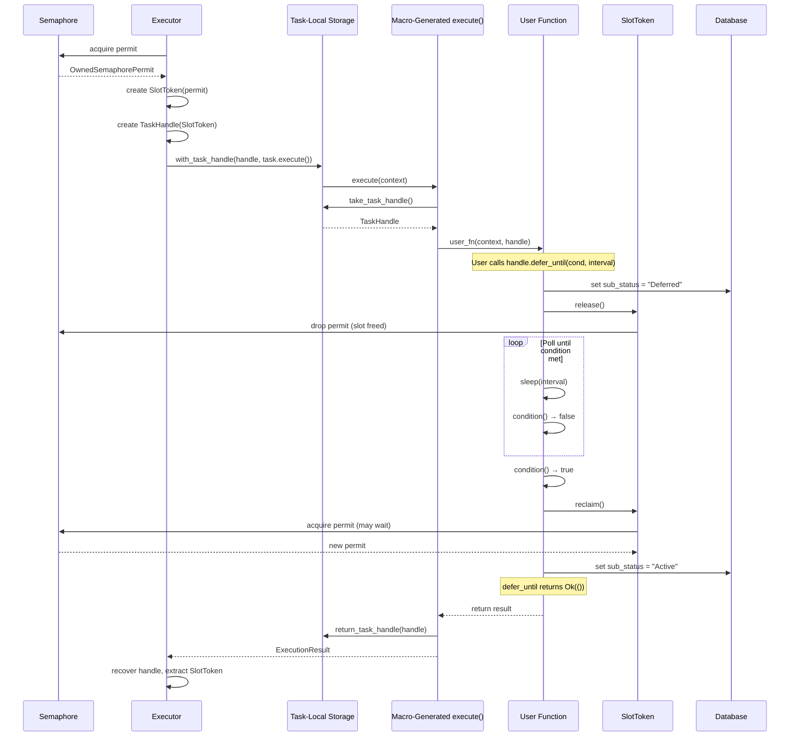

## Overview

TaskHandle provides execution control capabilities to tasks that opt in. The primary feature is `defer_until`, which lets a task release its executor concurrency slot while polling an external condition, then reclaim a slot when the condition is met. This allows long-polling tasks to coexist with compute-bound tasks without starving the executor.

## The Problem

In a concurrency-limited executor (e.g., `max_concurrent_tasks: 10`), a task that spends most of its time polling an external condition -- waiting for a file to appear, an API to return a result, a database row to reach a certain state -- wastes a concurrency slot. The slot is held even though the task is doing no real work. Other tasks that could make progress are blocked waiting for a slot to free up.

Consider a workflow with 20 tasks, 10 of which poll an external sensor every 30 seconds. Without slot release, those 10 polling tasks consume all 10 slots, and the remaining 10 compute tasks sit in the Ready queue indefinitely.

`defer_until` solves this by letting a task temporarily give up its slot during the polling phase and reacquire one when the condition is satisfied.

## Architecture

### SlotToken

`SlotToken` wraps a tokio `OwnedSemaphorePermit` and provides controlled release and reclaim semantics:

- **`release()`** -- drops the inner permit, freeing the concurrency slot immediately. Other tasks waiting for a slot can proceed.
- **`reclaim()`** -- acquires a new permit from the semaphore. This may block if all slots are currently held.
- **`is_held()`** -- returns whether the token currently holds a permit.

SlotToken exists as a separate type to decouple TaskHandle from tokio's specific semaphore types. This enables future extensibility such as weighted slots (a GPU task consuming 4 slots) or alternative semaphore implementations.

### TaskHandle

TaskHandle is created by the executor for each task execution. It is not reusable across executions. It contains:

- A `SlotToken` for concurrency control
- A `task_execution_id` for identification
- An optional DAL reference for persisting sub-status changes

The core method is `defer_until(condition, poll_interval)`, which performs the following steps:

1. Sets `sub_status` to `"Deferred"` in the database (if a DAL is present)
2. Releases the concurrency slot via `SlotToken::release()`
3. Enters a poll loop: sleeps for `poll_interval`, then calls `condition()`
4. When the condition returns `true`, reclaims a slot via `SlotToken::reclaim()` (this may wait if the executor is at capacity)
5. Sets `sub_status` back to `"Active"`

Additional methods:

- **`is_slot_held()`** -- delegates to `SlotToken::is_held()` for introspection
- **`task_execution_id()`** -- returns the execution ID

### Task-Local Storage

The handle is passed to tasks through `tokio::task_local!` storage rather than through function parameters on the `Task::execute()` trait. This avoids a breaking change to the trait signature while keeping the feature opt-in.

The mechanism uses three functions:

- **`with_task_handle(handle, future)`** -- the executor sets the handle into task-local storage before calling `task.execute()`
- **`take_task_handle()`** -- macro-generated code takes the handle out of task-local storage at the start of the user function
- **`return_task_handle(handle)`** -- macro-generated code returns the handle to task-local storage after the user function completes, so the executor can recover it

### Handle Detection

#### Rust (compile-time)

The `#[task]` proc macro inspects the function's parameter list at compile time. If a parameter is named `handle` or `task_handle`, the generated `Task` impl:

1. Returns `true` from `requires_handle()`
2. Calls `take_task_handle()` before invoking the user function
3. Calls `return_task_handle()` after the user function returns

No attribute or trait annotation is needed on the parameter itself -- the name is sufficient.

#### Python (runtime)

The `TaskDecorator` (in `bindings/cloaca-backend/src/task.rs`) inspects `__code__.co_varnames` of the decorated Python function at registration time. If the second variable (after `context`) is named `handle` or `task_handle`, the `PythonTaskWrapper`:

1. Sets `requires_handle = true`
2. Creates a `PyTaskHandle` wrapper at execution time and passes it as the second argument to the Python function
3. `PyTaskHandle.defer_until()` accepts a Python callable (synchronous) and a `poll_interval_ms` integer

## Sequence Diagram

The following diagram shows the full lifecycle of a task that uses `defer_until`:



## Python Bridge (PyTaskHandle)

`PyTaskHandle` wraps a Rust `TaskHandle` via `Arc<Mutex<>>` to satisfy PyO3's requirements for shared ownership across the Python/Rust boundary.

Key characteristics:

- **`defer_until(condition, poll_interval_ms)`** acquires the GIL to call the Python condition callable, then releases the GIL during the sleep interval. This ensures other Python threads can run during the polling gaps.
- The Python condition function must be **synchronous** (not `async def`). This is a deliberate choice because PyO3 GIL management is significantly simpler with synchronous calls, and polling conditions are typically short-lived checks (an HTTP request, a file existence check).
- The handle is passed as the **second argument** to the decorated function, only when handle detection identifies it. Functions without a handle parameter receive only the context.

Example usage in Python:

```python
@task()
def wait_for_approval(context, handle):
    request_id = context["approval_request_id"]

    def check_approved():
        resp = requests.get(f"https://api.example.com/approvals/{request_id}")
        return resp.json()["status"] == "approved"

    handle.defer_until(check_approved, poll_interval_ms=30000)

    # Slot is re-acquired here; continue with real work
    return {"approved": True}
```

## Design Decisions

### Why task-local storage instead of changing `Task::execute()` signature

Adding a `TaskHandle` parameter to `Task::execute()` would be a breaking change for every existing task implementation. Task-local storage keeps the feature entirely opt-in: tasks that do not need a handle are completely unaffected. The `Task` trait remains stable.

### Why parameter name detection instead of a trait or attribute

Requiring users to add `#[needs_handle]` or implement a separate trait adds ceremony. Name-based detection is ergonomic -- adding `handle: TaskHandle` to the function signature is self-documenting and requires no additional annotation. The tradeoff is a "magic name" convention, but `handle` and `task_handle` are sufficiently specific to avoid accidental matches.

### Why SlotToken as a separate type

Directly exposing `OwnedSemaphorePermit` on TaskHandle would couple the API to tokio's semaphore implementation. SlotToken provides an abstraction boundary that enables future features like weighted slots (where a single task can consume multiple concurrency units) or alternative concurrency control mechanisms without changing the TaskHandle API.

### Why synchronous conditions in Python

Async condition functions in Python would require running a Python coroutine from Rust, which involves complex GIL/event-loop interactions. Synchronous conditions provide a simpler mental model: the condition function runs, returns `True` or `False`, and the handle manages the polling loop. Since most conditions are quick I/O checks, the synchronous constraint is not a practical limitation.

## See Also

- [Task Execution Sequence]() -- detailed task lifecycle and state transitions
- [Dispatcher Architecture]() -- how executors are selected and tasks are routed
- [Macro System]() -- how the `#[task]` macro generates `Task` implementations
