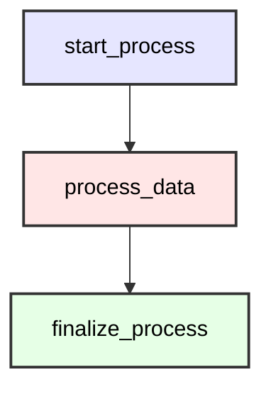

# Your First Python Workflow

Welcome to your first Cloacina Python tutorial! In this guide, you'll learn how to create and execute a simple workflow using Python decorators and the workflow builder pattern. By the end of this tutorial, you'll understand the basic concepts of tasks, workflows, context, and execution in Python.

## Learning Objectives

- Define tasks using Python decorators
- Build workflows with the WorkflowBuilder
- Execute workflows with the DefaultRunner
- Pass data between tasks using Context
- Handle workflow results and cleanup

## Prerequisites

- Basic knowledge of Python
- Python 3.9 or higher installed
- A code editor of your choice

## Time Estimate
10-15 minutes

## Installation

First, install the Python bindings:

```bash
pip install cloaca[sqlite]
```

## Creating Your First Workflow

Let's create a simple workflow with three tasks that demonstrates the core concepts. Create a new file called `first_workflow.py`:

```python
import cloaca

# Define tasks using the @task decorator
@cloaca.task(id="start_process")
def start_process(context):
    """Initialize the workflow with some data."""
    print("Starting the workflow...")

    # Add initial data to the context
    context.set("process_id", "proc_001")
    context.set("start_time", "2025-01-07T10:00:00Z")
    context.set("items_to_process", 10)

    print(f"Process {context.get('process_id')} initialized")
    return context

@cloaca.task(id="process_data", dependencies=["start_process"])
def process_data(context):
    """Process the data from the previous task."""
    print("Processing data...")

    # Get data from the previous task
    process_id = context.get("process_id")
    items_count = context.get("items_to_process")

    # Simulate processing
    processed_items = []
    for i in range(items_count):
        processed_items.append(f"item_{i}_processed")

    # Store results in context
    context.set("processed_items", processed_items)
    context.set("processing_complete", True)

    print(f"Processed {len(processed_items)} items for {process_id}")
    return context

@cloaca.task(id="finalize_process", dependencies=["process_data"])
def finalize_process(context):
    """Finalize the workflow and generate summary."""
    print("Finalizing process...")

    # Get all the data
    process_id = context.get("process_id")
    start_time = context.get("start_time")
    processed_items = context.get("processed_items")

    # Create summary
    summary = {
        "process_id": process_id,
        "start_time": start_time,
        "items_processed": len(processed_items),
        "status": "completed"
    }

    context.set("final_summary", summary)
    print(f"Process {process_id} completed successfully")
    return context

# Create workflow builder function
def create_simple_workflow():
    """Build and return the workflow."""
    builder = cloaca.WorkflowBuilder("simple_workflow")
    builder.description("A simple three-task workflow demonstrating basic concepts")

    # Add tasks to the workflow
    builder.add_task("start_process")
    builder.add_task("process_data")
    builder.add_task("finalize_process")

    return builder.build()

# Register the workflow
cloaca.register_workflow_constructor("simple_workflow", create_simple_workflow)

# Execute the workflow
if __name__ == "__main__":
    print("=== Cloacina Python Workflow Tutorial ===")

    # Create a runner with SQLite database
    runner = cloaca.DefaultRunner("sqlite:///tutorial_01.db")

    # Create initial context
    context = cloaca.Context({"tutorial": "01", "user": "learner"})

    # Execute the workflow
    print("\nExecuting workflow...")
    result = runner.execute("simple_workflow", context)

    # Check results
    print(f"\nWorkflow Status: {result.status}")

    if result.status == "Completed":
        print("Success! Workflow completed.")

        # Access the final context and results
        final_context = result.final_context
        summary = final_context.get("final_summary")

        print(f"Final Summary: {summary}")
        print(f"All context data: {dict(final_context)}")

    else:
        print(f"Workflow failed with status: {result.status}")
        if hasattr(result, 'error'):
            print(f"Error: {result.error}")

    # Clean up
    print("\nCleaning up...")
    runner.shutdown()
    print("Tutorial completed!")
```

## Understanding the Workflow

Let's examine the workflow structure and execution flow:

### Workflow Diagram



The diagram shows:
- Sequential execution from start to finish
- Each task depends on the previous one
- Data flows through the context between tasks

## Understanding the Code

Let's walk through each component:

### 1. Task Definition

```python
@cloaca.task(id="start_process")
def start_process(context):
    # Task logic here
    return context
```

Key points:
- Use the `@cloaca.task` decorator
- Provide a unique `id` for each task
- Tasks receive a `context` parameter
- Always return the context (modified or unmodified)

### 2. Task Dependencies

```python
@cloaca.task(id="process_data", dependencies=["start_process"])
def process_data(context):
    # This task runs after start_process completes
    return context
```

Dependencies ensure:
- Tasks run in the correct order
- Dependent tasks wait for their prerequisites
- Failed dependencies prevent downstream execution

### 3. Context Data Flow

```python
# Set data in one task
context.set("process_id", "proc_001")

# Get data in another task
process_id = context.get("process_id")
```

The context provides:
- Persistent data storage across tasks
- Type-safe data access
- Automatic serialization/deserialization

### 4. Workflow Builder

```python
def create_simple_workflow():
    builder = cloaca.WorkflowBuilder("simple_workflow")
    builder.description("A simple three-task workflow")
    builder.add_task("start_process")
    builder.add_task("process_data")
    builder.add_task("finalize_process")
    return builder.build()
```

The builder pattern:
- Creates workflows programmatically
- Validates task dependencies
- Generates executable workflow objects

### 5. Workflow Registration and Execution

```python
# Register the workflow constructor
cloaca.register_workflow_constructor("simple_workflow", create_simple_workflow)

# Create runner and execute
runner = cloaca.DefaultRunner("sqlite:///tutorial_01.db")
result = runner.execute("simple_workflow", context)
```

Execution involves:
- Registering workflow constructors globally
- Creating a runner with database connection
- Executing by workflow name with initial context

## Running Your Workflow

Execute your workflow:

```bash
python first_workflow.py
```

You should see output like this:

```
=== Cloacina Python Workflow Tutorial ===

Executing workflow...
Starting the workflow...
Process proc_001 initialized
Processing data...
Processed 10 items for proc_001
Finalizing process...
Process proc_001 completed successfully

Workflow Status: Completed
Success! Workflow completed.
Final Summary: {'process_id': 'proc_001', 'start_time': '2025-01-07T10:00:00Z', 'items_processed': 10, 'status': 'completed'}
All context data: {'tutorial': '01', 'user': 'learner', 'process_id': 'proc_001', 'start_time': '2025-01-07T10:00:00Z', 'items_to_process': 10, 'processed_items': ['item_0_processed', 'item_1_processed', ...], 'processing_complete': True, 'final_summary': {...}}

Cleaning up...
Tutorial completed!
```

## Key Concepts Learned



**Tasks** are Python functions decorated with `@cloaca.task`:

- Each task has a unique ID
- Tasks can specify dependencies
- Tasks receive and return a context
- Tasks can be async or synchronous



**Dependencies** control execution order:

- Use `dependencies=["task_id"]` parameter
- Multiple dependencies: `dependencies=["task1", "task2"]`
- Creates a directed acyclic graph (DAG)
- Automatic parallelization when possible



**Context** manages data flow:

- `context.set(key, value)` stores data
- `context.get(key)` retrieves data
- Persisted throughout workflow execution
- Available in final results



**WorkflowBuilder** assembles workflows:

- Builder pattern for clean construction
- Automatic dependency validation
- Generates executable workflow objects
- Must be registered before execution



## Exercises

Try these modifications to deepen your understanding:

### Exercise 1: Add a Validation Task

Add a new task that validates the processed data:

```python
@cloaca.task(id="validate_results", dependencies=["process_data"])
def validate_results(context):
    """Validate that processing was successful."""
    processed_items = context.get("processed_items")

    # Validation logic
    if len(processed_items) > 0:
        context.set("validation_passed", True)
        print("Validation passed")
    else:
        context.set("validation_passed", False)
        print("Validation failed")

    return context
```

Update the workflow to include validation before finalization:

```python
# Update finalize_process dependencies
@cloaca.task(id="finalize_process", dependencies=["validate_results"])
def finalize_process(context):
    # ... existing code ...
```

### Exercise 2: Parallel Processing

Create two parallel processing tasks:

```python
@cloaca.task(id="process_odds", dependencies=["start_process"])
def process_odds(context):
    """Process odd-numbered items."""
    items_count = context.get("items_to_process")
    odds = [f"odd_item_{i}" for i in range(1, items_count, 2)]
    context.set("odd_items", odds)
    return context

@cloaca.task(id="process_evens", dependencies=["start_process"])
def process_evens(context):
    """Process even-numbered items."""
    items_count = context.get("items_to_process")
    evens = [f"even_item_{i}" for i in range(0, items_count, 2)]
    context.set("even_items", evens)
    return context

@cloaca.task(id="combine_results", dependencies=["process_odds", "process_evens"])
def combine_results(context):
    """Combine parallel processing results."""
    odds = context.get("odd_items")
    evens = context.get("even_items")
    combined = odds + evens
    context.set("combined_items", combined)
    return context
```

## What's Next?

Congratulations! You've created and executed your first Python workflow. In the next tutorial, we'll explore:

- Advanced context handling and data types
- Working with complex data structures
- Context serialization and type safety
- Best practices for data flow

Continue to Tutorial 02

## Related Resources

- [Quick Start Guide](/python-bindings/quick-start/) - Simpler introduction
- [API Reference](/python-bindings/api-reference/) - Complete API documentation
- [Examples](/python-bindings/examples/) - More code examples


This tutorial is based on the test patterns found in [`test_scenario_02_single_task_workflow_execution.py`](https://github.com/dstorey/cloacina/blob/main/python-tests/test_scenario_02_single_task_workflow_execution.py) and [`test_scenario_08_multi_task_workflow_execution.py`](https://github.com/dstorey/cloacina/blob/main/python-tests/test_scenario_08_multi_task_workflow_execution.py) from the Cloacina test suite.

