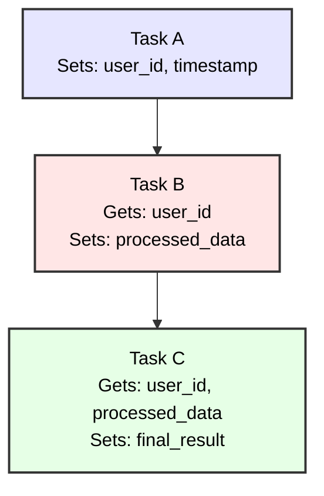
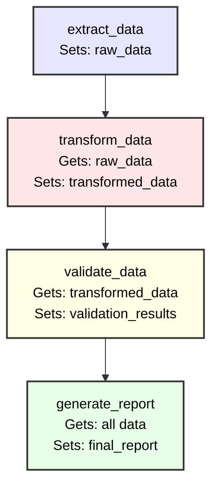

# Context Handling

Welcome to the second tutorial in our Python Cloacina series! In this tutorial, you'll learn how to effectively manage data flow between tasks using the Context system. We'll explore different data types, serialization patterns, and best practices for passing complex data through your workflows.

## Learning Objectives

- Understand the Context data model
- Work with different data types in Context
- Implement data transformation pipelines
- Handle context serialization and type safety
- Apply best practices for data flow

## Prerequisites

- Completion of [Tutorial 1]()
- Basic understanding of Python data types
- Familiarity with JSON serialization

## Time Estimate
20-25 minutes

## Understanding Context

The Context is Cloacina's data container that flows through your workflow. It provides:

- **Persistent storage** across task executions
- **Type-safe access** to stored data
- **Automatic serialization** for database persistence
- **Dictionary-like interface** for Python developers

### Context Data Flow



## Basic Context Operations

Let's start with a simple example showing basic context operations:

```python
import sys
import cloaca

# Create workflow using the new workflow-scoped pattern
with cloaca.WorkflowBuilder("context_basics") as builder:
    builder.description("Basic context operations")

    @cloaca.task(id="context_basics")
    def context_basics(context):
        """Demonstrate basic context operations."""

        # Set different data types
        context.set("string_value", "Hello, World!")
        context.set("integer_value", 42)
        context.set("float_value", 3.14159)
        context.set("boolean_value", True)
        context.set("list_value", [1, 2, 3, 4, 5])
        context.set("dict_value", {"name": "Alice", "age": 30})

        # Get values with defaults
        name = context.get("dict_value", {}).get("name", "Unknown")
        print(f"User name: {name}")

        return context
    # Task is automatically registered when defined within WorkflowBuilder context
```

## Data Transformation Pipeline

Now let's build a more complex example that demonstrates data transformation through multiple tasks:

```python
import cloaca
import json
from datetime import datetime

# Create data transformation pipeline using workflow-scoped pattern
with cloaca.WorkflowBuilder("data_pipeline") as builder:
    builder.description("Complete data extraction, transformation, validation, and reporting pipeline")

    # Data transformation pipeline - tasks defined within workflow scope
    @cloaca.task(id="extract_data")
    def extract_data(context):
        """Extract raw data from a simulated source."""
        print("Extracting data...")

        # Simulate raw data extraction
        raw_data = {
            "users": [
                {"id": 1, "name": "Alice", "email": "alice@example.com", "score": 85},
                {"id": 2, "name": "Bob", "email": "bob@example.com", "score": 92},
                {"id": 3, "name": "Charlie", "email": "charlie@example.com", "score": 78},
                {"id": 4, "name": "Diana", "email": "diana@example.com", "score": 95}
            ],
            "extracted_at": datetime.now().isoformat(),
            "source": "user_database"
        }

        context.set("raw_data", raw_data)
        context.set("extraction_complete", True)

        print(f"Extracted {len(raw_data['users'])} users")
        return context

    @cloaca.task(id="transform_data", dependencies=["extract_data"])
    def transform_data(context):
        """Transform the raw data into a processed format."""
        print("Transforming data...")

        # Get raw data from previous task
        raw_data = context.get("raw_data")

        if not raw_data:
            raise ValueError("No raw data found in context")

        # Transform data
        transformed_users = []
        total_score = 0

        for user in raw_data["users"]:
            # Calculate grade based on score
            score = user["score"]
            if score >= 90:
                grade = "A"
            elif score >= 80:
                grade = "B"
            elif score >= 70:
                grade = "C"
            else:
                grade = "F"

            transformed_user = {
                "user_id": user["id"],
                "display_name": user["name"].upper(),
                "email_domain": user["email"].split("@")[1],
                "score": score,
                "grade": grade,
                "performance": "high" if score >= 85 else "standard"
            }

            transformed_users.append(transformed_user)
            total_score += score

        # Create summary statistics
        transformation_result = {
            "users": transformed_users,
            "summary": {
                "total_users": len(transformed_users),
                "average_score": total_score / len(transformed_users),
                "high_performers": len([u for u in transformed_users if u["performance"] == "high"]),
                "grade_distribution": {
                    "A": len([u for u in transformed_users if u["grade"] == "A"]),
                    "B": len([u for u in transformed_users if u["grade"] == "B"]),
                    "C": len([u for u in transformed_users if u["grade"] == "C"]),
                    "F": len([u for u in transformed_users if u["grade"] == "F"])
                }
            },
            "transformed_at": datetime.now().isoformat()
        }

        context.set("transformed_data", transformation_result)
        context.set("transformation_complete", True)

        print(f"Transformed {len(transformed_users)} users")
        print(f"Average score: {transformation_result['summary']['average_score']:.1f}")

        return context

    @cloaca.task(id="validate_data", dependencies=["transform_data"])
    def validate_data(context):
        """Validate the transformed data meets quality standards."""
        print("Validating data...")

        transformed_data = context.get("transformed_data")

        if not transformed_data:
            raise ValueError("No transformed data found in context")

        validation_results = {
            "total_records": len(transformed_data["users"]),
            "validation_checks": {},
            "errors": [],
            "warnings": []
        }

        # Validation checks
        users = transformed_data["users"]

        # Check 1: All users have required fields
        required_fields = ["user_id", "display_name", "email_domain", "score", "grade"]
        for user in users:
            for field in required_fields:
                if field not in user:
                    validation_results["errors"].append(
                        f"User {user.get('user_id', 'unknown')} missing field: {field}"
                    )

        # Check 2: Score ranges are valid
        for user in users:
            score = user.get("score", 0)
            if not (0 <= score <= 100):
                validation_results["errors"].append(
                    f"User {user['user_id']} has invalid score: {score}"
                )

        # Check 3: Grade consistency
        for user in users:
            score = user.get("score", 0)
            grade = user.get("grade", "")
            expected_grade = "A" if score >= 90 else "B" if score >= 80 else "C" if score >= 70 else "F"
            if grade != expected_grade:
                validation_results["errors"].append(
                    f"User {user['user_id']} grade mismatch: expected {expected_grade}, got {grade}"
                )

        # Check 4: Data quality warnings
        summary = transformed_data["summary"]
        if summary["average_score"] < 75:
            validation_results["warnings"].append("Average score is below 75")

        validation_results["validation_checks"] = {
            "required_fields": "passed" if not any("missing field" in error for error in validation_results["errors"]) else "failed",
            "score_ranges": "passed" if not any("invalid score" in error for error in validation_results["errors"]) else "failed",
            "grade_consistency": "passed" if not any("grade mismatch" in error for error in validation_results["errors"]) else "failed"
        }

        # Overall validation status
        validation_status = "passed" if not validation_results["errors"] else "failed"
        validation_results["status"] = validation_status

        context.set("validation_results", validation_results)
        context.set("validation_complete", True)
        context.set("data_valid", validation_status == "passed")

        print(f"Validation {validation_status}")
        if validation_results["errors"]:
            print(f"Errors found: {len(validation_results['errors'])}")
        if validation_results["warnings"]:
            print(f"Warnings: {len(validation_results['warnings'])}")

        return context

    @cloaca.task(id="generate_report", dependencies=["validate_data"])
    def generate_report(context):
        """Generate a final report combining all data."""
        print("Generating report...")

        # Gather all data from context
        raw_data = context.get("raw_data")
        transformed_data = context.get("transformed_data")
        validation_results = context.get("validation_results")

        # Create comprehensive report
        report = {
            "report_metadata": {
                "generated_at": datetime.now().isoformat(),
                "workflow_id": context.get("tutorial", "02"),
                "report_type": "user_data_processing"
            },
            "data_summary": {
                "source_info": {
                    "source": raw_data["source"],
                    "extracted_at": raw_data["extracted_at"],
                    "total_records": len(raw_data["users"])
                },
                "processing_summary": transformed_data["summary"],
                "validation_summary": {
                    "status": validation_results["status"],
                    "checks_performed": len(validation_results["validation_checks"]),
                    "errors": len(validation_results["errors"]),
                    "warnings": len(validation_results["warnings"])
                }
            },
            "processed_users": transformed_data["users"],
            "quality_metrics": validation_results
        }

        context.set("final_report", report)
        context.set("report_complete", True)

        print(f"Report generated with {len(report['processed_users'])} user records")
        return context
    # Tasks are automatically registered when defined within WorkflowBuilder context

# Main execution
if __name__ == "__main__":
    print("=== Context Handling Tutorial ===")

    # Create runner
    runner = cloaca.DefaultRunner("sqlite://:memory:")

    # Create initial context with metadata
    context = cloaca.Context({
        "tutorial": "02",
        "pipeline_name": "user_data_processing",
        "started_by": "tutorial_user"
    })

    # Execute the workflow
    print("\nExecuting data pipeline workflow...")
    result = runner.execute("data_pipeline", context)

    # Display results
    print(f"\nWorkflow Status: {result.status}")

    if result.status == "Completed":
        print("Success! Data pipeline completed.")

        # Access specific results from context
        final_context = result.final_context
        report = final_context.get("final_report")

        if report:
            print("\n=== Pipeline Results ===")
            print(f"Total users processed: {report['data_summary']['source_info']['total_records']}")
            print(f"Average score: {report['data_summary']['processing_summary']['average_score']:.1f}")
            print(f"High performers: {report['data_summary']['processing_summary']['high_performers']}")
            print(f"Validation status: {report['data_summary']['validation_summary']['status']}")

            # Show grade distribution
            grade_dist = report['data_summary']['processing_summary']['grade_distribution']
            print(f"Grade distribution: A={grade_dist['A']}, B={grade_dist['B']}, C={grade_dist['C']}, F={grade_dist['F']}")

    else:
        print(f"Pipeline failed with status: {result.status}")

    # Cleanup
    print("\nCleaning up...")
    runner.shutdown()
    print("Tutorial completed!")
```

## Understanding Context Patterns

### 1. Data Storage and Retrieval

```python
# Store data
context.set("key", value)

# Retrieve data
value = context.get("key")

# Retrieve with default
value = context.get("key", default_value)

# Check if key exists
if "key" in context:
    value = context.get("key")
```

### 2. Complex Data Types

The context can store any JSON-serializable data:

```python
# Lists and dictionaries
context.set("user_list", [{"id": 1, "name": "Alice"}, {"id": 2, "name": "Bob"}])
context.set("config", {"timeout": 30, "retries": 3, "debug": True})

# Nested structures
context.set("result", {
    "status": "success",
    "data": {
        "users": [1, 2, 3],
        "metadata": {"processed_at": "2025-01-07T10:00:00Z"}
    }
})
```

### 3. Data Transformation Patterns

```python
with cloaca.WorkflowBuilder("transform_workflow") as builder:
    @cloaca.task(id="transform_example", dependencies=["source_task"])
    def transform_example(context):
        # Get input data
        input_data = context.get("input_data", [])

        # Transform data
        transformed = [
            {"id": item["id"], "value": item["value"] * 2}
            for item in input_data
            if item["value"] > 10
        ]

        # Store result
        context.set("transformed_data", transformed)
        return context
```

## Working with Context Data

### Data Pipeline Visualization



## Running the Pipeline

Execute the complete example:

```bash
python context_tutorial.py
```

Expected output:
```
=== Context Handling Tutorial ===

Executing data pipeline workflow...
Extracting data...
Extracted 4 users
Transforming data...
Transformed 4 users
Average score: 87.5
Validating data...
Validation passed
Generating report...
Report generated with 4 user records

Workflow Status: Completed
Success! Data pipeline completed.

=== Pipeline Results ===
Total users processed: 4
Average score: 87.5
High performers: 3
Validation status: passed
Grade distribution: A=2, B=2, C=0, F=0

Cleaning up...
Tutorial completed!
```

## Best Practices



**Organize your context data consistently:**

```python
# Good: Structured data organization
context.set("user_data", {
    "raw": raw_users,
    "processed": processed_users,
    "metadata": {"count": len(raw_users)}
})

# Avoid: Flat, unclear structure
context.set("users", raw_users)
context.set("processed", processed_users)
context.set("count", len(raw_users))
```



**Always validate context data:**

```python
with cloaca.WorkflowBuilder("safe_workflow") as builder:
    @cloaca.task(id="safe_task")
    def safe_task(context):
        # Validate input exists
        data = context.get("input_data")
        if not data:
            raise ValueError("Missing required input_data")

        # Validate data structure
        if not isinstance(data, list):
            raise TypeError("input_data must be a list")

        # Process safely
        result = process_data(data)
        context.set("result", result)
        return context
```



**Use type hints for clarity:**

```python
from typing import Dict, List, Any

with cloaca.WorkflowBuilder("typed_workflow") as builder:
    @cloaca.task(id="typed_task")
    def typed_task(context):
        """Process user data with clear type expectations."""
        # Get with type hints in comments
        user_data: List[Dict[str, Any]] = context.get("users", [])
        config: Dict[str, Any] = context.get("config", {})

        # Process with type awareness
        processed: List[Dict[str, Any]] = [
            {"id": user["id"], "score": float(user["score"])}
            for user in user_data
        ]

        context.set("processed_users", processed)
        return context
```



**Optimize context usage:**

```python
# Good: Store processed data, not intermediate steps
with cloaca.WorkflowBuilder("efficient_workflow") as builder:
    @cloaca.task(id="efficient_task")
    def efficient_task(context):
        data = context.get("raw_data")

        # Process data
        result = expensive_processing(data)

        # Store only the final result
        context.set("final_result", result)
        return context

# Avoid: Storing every intermediate step
# context.set("step1", step1_result)
# context.set("step2", step2_result)
# context.set("step3", step3_result)
```



## Exercises

### Exercise 1: Add Data Aggregation

Add a new task that creates aggregated statistics:

```python
with cloaca.WorkflowBuilder("aggregation_workflow") as builder:
    @cloaca.task(id="aggregate_data", dependencies=["transform_data"])
    def aggregate_data(context):
        """Create aggregated statistics from transformed data."""
        transformed_data = context.get("transformed_data")
        users = transformed_data["users"]

        # Calculate aggregations
        aggregations = {
            "score_stats": {
                "min": min(u["score"] for u in users),
                "max": max(u["score"] for u in users),
                "avg": sum(u["score"] for u in users) / len(users)
            },
            "domain_distribution": {},
            "performance_breakdown": {
                "high": len([u for u in users if u["performance"] == "high"]),
                "standard": len([u for u in users if u["performance"] == "standard"])
            }
        }

        # Count email domains
        for user in users:
            domain = user["email_domain"]
            aggregations["domain_distribution"][domain] = aggregations["domain_distribution"].get(domain, 0) + 1

        context.set("aggregations", aggregations)
        return context
```

### Exercise 2: Implement Data Filtering

Create a task that filters data based on criteria:

```python
with cloaca.WorkflowBuilder("filtering_workflow") as builder:
    @cloaca.task(id="filter_data", dependencies=["validate_data"])
    def filter_data(context):
        """Filter data based on validation results and criteria."""
        transformed_data = context.get("transformed_data")
        validation_results = context.get("validation_results")

        # Only proceed if validation passed
        if not validation_results.get("status") == "passed":
            context.set("filtered_data", {"users": [], "filter_applied": False})
            return context

        users = transformed_data["users"]

        # Apply filters
        high_performers = [u for u in users if u["performance"] == "high"]
        top_grades = [u for u in users if u["grade"] in ["A", "B"]]

        filtered_result = {
            "high_performers": high_performers,
            "top_grades": top_grades,
            "filter_summary": {
                "total_users": len(users),
                "high_performers": len(high_performers),
                "top_grades": len(top_grades)
            },
            "filter_applied": True
        }

        context.set("filtered_data", filtered_result)
        return context
```

## What's Next?

Excellent work! You now understand how to manage complex data flows through Cloacina workflows. In the next tutorial, we'll explore:

- Error handling and recovery strategies
- Task failure scenarios and debugging
- Retry mechanisms and error propagation
- Building resilient workflows

Continue to Tutorial 03

## Related Resources

- [API Reference: Context]() - Complete Context API
- [Examples: Data Processing]() - More data pipeline examples
- [How-to: Testing Workflows]() - Testing with context data


This tutorial is based on patterns from [`test_scenario_09_context_propagation.py`](https://github.com/colliery-io/cloacina/blob/main/tests/python/test_scenario_09_context_propagation.py) and data processing examples from the Cloacina test suite.

