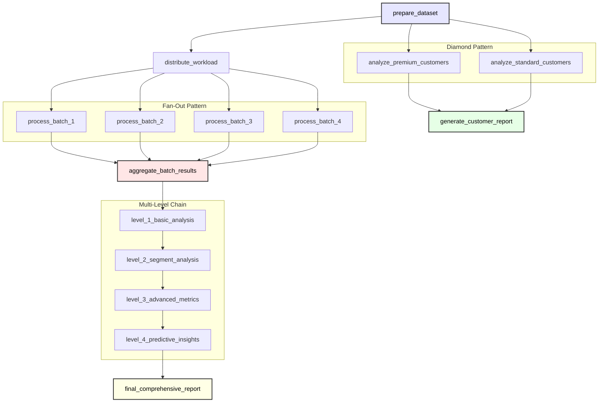

# Complex Workflows

Welcome to the fourth tutorial in our Python Cloacina series! In this tutorial, you'll learn how to create sophisticated workflows with advanced dependency patterns. We'll explore diamond patterns, fan-out/fan-in architectures, multi-level chains, and complex mixed patterns that enable powerful parallel processing and conditional execution.

## Learning Objectives

- Design diamond dependency patterns for fork-join operations
- Implement fan-out patterns for parallel task execution
- Create fan-in patterns for result aggregation
- Build multi-level dependency chains
- Combine patterns for complex workflow architectures
- Optimize workflow performance through smart dependency design

## Prerequisites

- Completion of [Tutorial 2]()
- Understanding of dependency management
- Familiarity with parallel processing concepts

## Time Estimate
30-35 minutes

## Understanding Complex Dependency Patterns

Complex workflows often require sophisticated task orchestration patterns beyond simple linear execution. Let's explore the key patterns:



**Fork-Join Pattern:**
- One task branches into multiple parallel tasks
- Multiple tasks converge back to a single task
- Enables parallel processing with synchronization

```
    A
   / \
  B   C
   \ /
    D
```



**One-to-Many Distribution:**
- Single task triggers multiple parallel tasks
- Enables parallel processing of independent operations
- Often used for batch processing

```
    A
   /||\
  B C D E
```



**Many-to-One Aggregation:**
- Multiple independent tasks feed into one task
- Enables result aggregation and synchronization
- Common for collecting distributed results

```
  A B C D
   \||/
    E
```



**Sequential Processing:**
- Deep dependency chains for complex processing
- Each level depends on the previous
- Enables step-by-step data transformation

```
A → B → C → D → E
```



## Building Complex Workflow Patterns

Let's implement each pattern with a practical example. We'll build a comprehensive data processing system that demonstrates all these patterns.

### 1. Diamond Pattern - Data Processing Pipeline

```python
import sys
import cloaca
import random
import time
from datetime import datetime
from typing import Dict, List, Any

# Diamond Pattern: Fork-Join Processing
with cloaca.WorkflowBuilder("complex_customer_analysis") as builder:
    # All tasks are automatically registered when defined within the WorkflowBuilder context

    @cloaca.task(id="prepare_dataset")
    def prepare_dataset(context):
        """Prepare initial dataset for parallel processing."""
        print("Preparing dataset...")

        # Generate sample dataset
        dataset = {
            "customers": [
                {"id": i, "name": f"Customer_{i}", "segment": random.choice(["premium", "standard", "basic"]), "value": random.randint(100, 10000)}
                for i in range(1, 101)
            ],
            "prepared_at": datetime.now().isoformat(),
            "total_records": 100
        }

        context.set("dataset", dataset)
        context.set("preparation_complete", True)

        print(f"Dataset prepared with {len(dataset['customers'])} customers")
        return context

    # Fork: Split into parallel processing branches
    @cloaca.task(id="analyze_premium_customers", dependencies=["prepare_dataset"])
    def analyze_premium_customers(context):
        """Analyze premium customer segment (parallel branch 1)."""
        print("Analyzing premium customers...")

        dataset = context.get("dataset")
        customers = dataset["customers"]

        # Filter premium customers
        premium_customers = [c for c in customers if c["segment"] == "premium"]

        # Analyze premium segment
        analysis = {
            "segment": "premium",
            "count": len(premium_customers),
            "total_value": sum(c["value"] for c in premium_customers),
            "average_value": sum(c["value"] for c in premium_customers) / len(premium_customers) if premium_customers else 0,
            "top_customers": sorted(premium_customers, key=lambda x: x["value"], reverse=True)[:5]
        }

        context.set("premium_analysis", analysis)
        print(f"Premium analysis complete: {analysis['count']} customers, avg value: ${analysis['average_value']:.2f}")

        return context

    @cloaca.task(id="analyze_standard_customers", dependencies=["prepare_dataset"])
    def analyze_standard_customers(context):
        """Analyze standard customer segment (parallel branch 2)."""
        print("Analyzing standard customers...")

        dataset = context.get("dataset")
        customers = dataset["customers"]

        # Filter standard customers
        standard_customers = [c for c in customers if c["segment"] == "standard"]

        # Analyze standard segment
        analysis = {
            "segment": "standard",
            "count": len(standard_customers),
            "total_value": sum(c["value"] for c in standard_customers),
            "average_value": sum(c["value"] for c in standard_customers) / len(standard_customers) if standard_customers else 0,
            "distribution": {"low": 0, "medium": 0, "high": 0}
        }

        # Value distribution analysis
        for customer in standard_customers:
            if customer["value"] < 1000:
                analysis["distribution"]["low"] += 1
            elif customer["value"] < 5000:
                analysis["distribution"]["medium"] += 1
            else:
                analysis["distribution"]["high"] += 1

        context.set("standard_analysis", analysis)
        print(f"Standard analysis complete: {analysis['count']} customers")

        return context

    # Join: Combine results from parallel branches
    @cloaca.task(id="generate_customer_report", dependencies=["analyze_premium_customers", "analyze_standard_customers"])
    def generate_customer_report(context):
        """Generate comprehensive customer report (join point)."""
        print("Generating customer report...")

        premium_analysis = context.get("premium_analysis")
        standard_analysis = context.get("standard_analysis")
        dataset = context.get("dataset")

        # Combine analyses
        report = {
            "report_type": "customer_segmentation",
            "generated_at": datetime.now().isoformat(),
            "dataset_info": {
                "total_customers": dataset["total_records"],
                "prepared_at": dataset["prepared_at"]
            },
            "segment_analysis": {
                "premium": premium_analysis,
                "standard": standard_analysis
            },
            "summary": {
                "total_premium_value": premium_analysis["total_value"],
                "total_standard_value": standard_analysis["total_value"],
                "premium_percentage": (premium_analysis["count"] / dataset["total_records"]) * 100,
                "standard_percentage": (standard_analysis["count"] / dataset["total_records"]) * 100
            }
        }

        context.set("customer_report", report)
        print(f"Customer report generated - Premium: {premium_analysis['count']}, Standard: {standard_analysis['count']}")

        return context
```

### 2. Fan-Out Pattern - Parallel Data Processing

```python
    # Fan-Out Pattern: Distribute processing across multiple parallel tasks
    @cloaca.task(id="distribute_workload")
    def distribute_workload(context):
        """Distribute workload for parallel processing."""
        print("Distributing workload...")

        dataset = context.get("dataset")
        customers = dataset["customers"]

        # Split customers into 4 processing batches
        batch_size = len(customers) // 4
        batches = {
            "batch_1": customers[0:batch_size],
            "batch_2": customers[batch_size:batch_size*2],
            "batch_3": customers[batch_size*2:batch_size*3],
            "batch_4": customers[batch_size*3:]
        }

        context.set("processing_batches", batches)
        context.set("workload_distributed", True)

        print(f"Workload distributed into 4 batches: {[len(batch) for batch in batches.values()]}")
        return context

    # Parallel processing tasks - all automatically registered within the workflow context
    @cloaca.task(id="process_batch_1", dependencies=["distribute_workload"])
    def process_batch_1(context):
        """Process batch 1 in parallel."""
        print("Processing batch 1...")

        batches = context.get("processing_batches")
        batch = batches["batch_1"]

        # Simulate processing work
        processed_customers = []
        for customer in batch:
            processed_customer = {
                **customer,
                "processed": True,
                "score": customer["value"] * 0.1 + random.randint(1, 10),
                "batch": 1
            }
            processed_customers.append(processed_customer)

        result = {
            "batch_id": 1,
            "processed_count": len(processed_customers),
            "customers": processed_customers,
            "batch_total_value": sum(c["value"] for c in processed_customers),
            "processing_time": datetime.now().isoformat()
        }

        context.set("batch_1_result", result)
        print(f"Batch 1 complete: {len(processed_customers)} customers processed")

        return context

    @cloaca.task(id="process_batch_2", dependencies=["distribute_workload"])
    def process_batch_2(context):
        """Process batch 2 in parallel."""
        print("Processing batch 2...")

        batches = context.get("processing_batches")
        batch = batches["batch_2"]

        processed_customers = []
        for customer in batch:
            processed_customer = {
                **customer,
                "processed": True,
                "score": customer["value"] * 0.12 + random.randint(1, 10),
                "batch": 2
            }
            processed_customers.append(processed_customer)

        result = {
            "batch_id": 2,
            "processed_count": len(processed_customers),
            "customers": processed_customers,
            "batch_total_value": sum(c["value"] for c in processed_customers),
            "processing_time": datetime.now().isoformat()
        }

        context.set("batch_2_result", result)
        print(f"Batch 2 complete: {len(processed_customers)} customers processed")

        return context

    @cloaca.task(id="process_batch_3", dependencies=["distribute_workload"])
    def process_batch_3(context):
        """Process batch 3 in parallel."""
        print("Processing batch 3...")

        batches = context.get("processing_batches")
        batch = batches["batch_3"]

        processed_customers = []
        for customer in batch:
            processed_customer = {
                **customer,
                "processed": True,
                "score": customer["value"] * 0.08 + random.randint(1, 10),
                "batch": 3
            }
            processed_customers.append(processed_customer)

        result = {
            "batch_id": 3,
            "processed_count": len(processed_customers),
            "customers": processed_customers,
            "batch_total_value": sum(c["value"] for c in processed_customers),
            "processing_time": datetime.now().isoformat()
        }

        context.set("batch_3_result", result)
        print(f"Batch 3 complete: {len(processed_customers)} customers processed")

        return context

    @cloaca.task(id="process_batch_4", dependencies=["distribute_workload"])
    def process_batch_4(context):
        """Process batch 4 in parallel."""
        print("Processing batch 4...")

        batches = context.get("processing_batches")
        batch = batches["batch_4"]

        processed_customers = []
        for customer in batch:
            processed_customer = {
                **customer,
                "processed": True,
                "score": customer["value"] * 0.09 + random.randint(1, 10),
                "batch": 4
            }
            processed_customers.append(processed_customer)

        result = {
            "batch_id": 4,
            "processed_count": len(processed_customers),
            "customers": processed_customers,
            "batch_total_value": sum(c["value"] for c in processed_customers),
            "processing_time": datetime.now().isoformat()
        }

        context.set("batch_4_result", result)
        print(f"Batch 4 complete: {len(processed_customers)} customers processed")

        return context
```

### 3. Fan-In Pattern - Result Aggregation

```python
    # Fan-In Pattern: Aggregate results from parallel processing
    @cloaca.task(id="aggregate_batch_results", dependencies=["process_batch_1", "process_batch_2", "process_batch_3", "process_batch_4"])
    def aggregate_batch_results(context):
        """Aggregate results from all parallel batch processing (fan-in)."""
        print("Aggregating batch results...")

        # Collect all batch results
        batch_results = [
            context.get("batch_1_result"),
            context.get("batch_2_result"),
            context.get("batch_3_result"),
            context.get("batch_4_result")
        ]

        # Aggregate all processed customers
        all_processed_customers = []
        total_customers_processed = 0
        total_value_processed = 0
        batch_statistics = []

        for batch_result in batch_results:
            all_processed_customers.extend(batch_result["customers"])
            total_customers_processed += batch_result["processed_count"]
            total_value_processed += batch_result["batch_total_value"]

            batch_statistics.append({
                "batch_id": batch_result["batch_id"],
                "count": batch_result["processed_count"],
                "value": batch_result["batch_total_value"],
                "avg_value": batch_result["batch_total_value"] / batch_result["processed_count"] if batch_result["processed_count"] > 0 else 0
            })

        # Create aggregated result
        aggregated_result = {
            "aggregation_type": "batch_processing",
            "total_customers_processed": total_customers_processed,
            "total_value_processed": total_value_processed,
            "average_customer_value": total_value_processed / total_customers_processed if total_customers_processed > 0 else 0,
            "batch_statistics": batch_statistics,
            "processed_customers": all_processed_customers,
            "aggregated_at": datetime.now().isoformat()
        }

        context.set("aggregated_results", aggregated_result)
        print(f"Aggregation complete: {total_customers_processed} customers, total value: ${total_value_processed:,.2f}")

        return context
```

### 4. Multi-Level Chain - Sequential Analysis

```python
    # Multi-Level Chain: Sequential processing with deep dependencies
    @cloaca.task(id="level_1_basic_analysis", dependencies=["aggregate_batch_results"])
    def level_1_basic_analysis(context):
        """Level 1: Basic statistical analysis."""
        print("Level 1: Basic analysis...")

        aggregated = context.get("aggregated_results")
        customers = aggregated["processed_customers"]

        # Basic statistics
        values = [c["value"] for c in customers]
        scores = [c["score"] for c in customers]

        basic_stats = {
            "level": 1,
            "customer_count": len(customers),
            "value_stats": {
                "min": min(values),
                "max": max(values),
                "avg": sum(values) / len(values),
                "total": sum(values)
            },
            "score_stats": {
                "min": min(scores),
                "max": max(scores),
                "avg": sum(scores) / len(scores)
            }
        }

        context.set("level_1_analysis", basic_stats)
        print(f"Level 1 complete: {basic_stats['customer_count']} customers analyzed")

        return context

    @cloaca.task(id="level_2_segment_analysis", dependencies=["level_1_basic_analysis"])
    def level_2_segment_analysis(context):
        """Level 2: Segment-based analysis."""
        print("Level 2: Segment analysis...")

        aggregated = context.get("aggregated_results")
        customers = aggregated["processed_customers"]

        # Group by segment
        segments = {}
        for customer in customers:
            segment = customer["segment"]
            if segment not in segments:
                segments[segment] = []
            segments[segment].append(customer)

        # Analyze each segment
        segment_analysis = {}
        for segment_name, segment_customers in segments.items():
            values = [c["value"] for c in segment_customers]
            scores = [c["score"] for c in segment_customers]

            segment_analysis[segment_name] = {
                "count": len(segment_customers),
                "total_value": sum(values),
                "avg_value": sum(values) / len(values),
                "avg_score": sum(scores) / len(scores),
                "top_customer": max(segment_customers, key=lambda x: x["value"])
            }

        level_2_result = {
            "level": 2,
            "segments": segment_analysis,
            "segment_count": len(segments)
        }

        context.set("level_2_analysis", level_2_result)
        print(f"Level 2 complete: {len(segments)} segments analyzed")

        return context

    @cloaca.task(id="level_3_advanced_metrics", dependencies=["level_2_segment_analysis"])
    def level_3_advanced_metrics(context):
        """Level 3: Advanced metrics and correlations."""
        print("Level 3: Advanced metrics...")

        aggregated = context.get("aggregated_results")
        level_2 = context.get("level_2_analysis")
        customers = aggregated["processed_customers"]

        # Advanced calculations
        values = [c["value"] for c in customers]
        scores = [c["score"] for c in customers]

        # Calculate percentiles
        sorted_values = sorted(values)
        n = len(sorted_values)

        advanced_metrics = {
            "level": 3,
            "percentiles": {
                "p25": sorted_values[n//4],
                "p50": sorted_values[n//2],
                "p75": sorted_values[3*n//4],
                "p90": sorted_values[9*n//10],
                "p95": sorted_values[19*n//20]
            },
            "segment_comparison": {},
            "outlier_analysis": {
                "high_value_customers": [c for c in customers if c["value"] > sorted_values[19*n//20]],
                "low_value_customers": [c for c in customers if c["value"] < sorted_values[n//20]]
            }
        }

        # Compare segments
        for segment_name, segment_data in level_2["segments"].items():
            advanced_metrics["segment_comparison"][segment_name] = {
                "value_efficiency": segment_data["avg_score"] / segment_data["avg_value"] if segment_data["avg_value"] > 0 else 0,
                "relative_performance": segment_data["avg_value"] / (sum(values) / len(values))
            }

        context.set("level_3_analysis", advanced_metrics)
        print(f"Level 3 complete: Advanced metrics calculated")

        return context

    @cloaca.task(id="level_4_predictive_insights", dependencies=["level_3_advanced_metrics"])
    def level_4_predictive_insights(context):
        """Level 4: Predictive insights and recommendations."""
        print("Level 4: Predictive insights...")

        level_1 = context.get("level_1_analysis")
        level_2 = context.get("level_2_analysis")
        level_3 = context.get("level_3_analysis")

        # Generate insights based on analysis
        insights = {
            "level": 4,
            "key_insights": [],
            "recommendations": [],
            "risk_factors": [],
            "opportunities": []
        }

        # Analyze trends and generate insights
        avg_value = level_1["value_stats"]["avg"]

        for segment_name, segment_data in level_2["segments"].items():
            segment_avg = segment_data["avg_value"]

            if segment_avg > avg_value * 1.5:
                insights["key_insights"].append(f"{segment_name} segment shows high value potential (${segment_avg:.2f} vs ${avg_value:.2f} average)")
                insights["recommendations"].append(f"Focus retention efforts on {segment_name} customers")

            if segment_data["count"] < 10:
                insights["risk_factors"].append(f"{segment_name} segment has low customer count ({segment_data['count']})")

            efficiency = level_3["segment_comparison"][segment_name]["value_efficiency"]
            if efficiency > 0.02:
                insights["opportunities"].append(f"{segment_name} shows high score-to-value efficiency ({efficiency:.4f})")

        # Overall recommendations
        p95_value = level_3["percentiles"]["p95"]
        high_value_count = len(level_3["outlier_analysis"]["high_value_customers"])

        insights["recommendations"].extend([
            f"Target customers with values above ${p95_value} for premium services",
            f"Investigate {high_value_count} high-value customers for expansion opportunities"
        ])

        context.set("level_4_analysis", insights)
        print(f"Level 4 complete: {len(insights['key_insights'])} insights generated")

        return context

    @cloaca.task(id="final_comprehensive_report", dependencies=["level_4_predictive_insights"])
    def final_comprehensive_report(context):
        """Level 5: Final comprehensive report combining all analyses."""
        print("Generating final comprehensive report...")

        # Collect all analysis levels
        customer_report = context.get("customer_report")
        aggregated_results = context.get("aggregated_results")
        level_1 = context.get("level_1_analysis")
        level_2 = context.get("level_2_analysis")
        level_3 = context.get("level_3_analysis")
        level_4 = context.get("level_4_analysis")

        # Create comprehensive report
        comprehensive_report = {
            "report_title": "Comprehensive Customer Analysis Report",
            "generated_at": datetime.now().isoformat(),
            "workflow_summary": {
                "total_tasks_executed": 15,
                "patterns_demonstrated": ["diamond", "fan-out", "fan-in", "multi-level-chain"],
                "parallel_processing_batches": 4
            },
            "executive_summary": {
                "total_customers_analyzed": level_1["customer_count"],
                "total_customer_value": f"${level_1['value_stats']['total']:,.2f}",
                "average_customer_value": f"${level_1['value_stats']['avg']:,.2f}",
                "segments_identified": level_2["segment_count"],
                "key_insights_count": len(level_4["key_insights"]),
                "recommendations_count": len(level_4["recommendations"])
            },
            "detailed_analysis": {
                "diamond_pattern_results": customer_report,
                "fanout_processing_results": aggregated_results,
                "sequential_analysis": {
                    "level_1_basic": level_1,
                    "level_2_segments": level_2,
                    "level_3_advanced": level_3,
                    "level_4_insights": level_4
                }
            },
            "actionable_recommendations": level_4["recommendations"],
            "risk_assessment": level_4["risk_factors"],
            "growth_opportunities": level_4["opportunities"]
        }

        context.set("comprehensive_report", comprehensive_report)
        print("Final comprehensive report generated!")
        print(f"Analysis complete: {comprehensive_report['executive_summary']['total_customers_analyzed']} customers")
        print(f"Total value: {comprehensive_report['executive_summary']['total_customer_value']}")
        print(f"Insights generated: {comprehensive_report['executive_summary']['key_insights_count']}")

        return context

# Workflow is automatically built and registered when the WorkflowBuilder context exits
```

## Creating the Complex Workflow

The workflow is now complete! With the new workflow-scoped pattern, all tasks are automatically registered when defined within the `WorkflowBuilder` context manager. The workflow is built and registered automatically when the context exits.

Key advantages of the new pattern:
- **Automatic task registration**: No need to manually add tasks to the builder
- **Cleaner code organization**: All workflow-related code is contained within the context
- **Reduced boilerplate**: No separate workflow constructor function needed
- **Better encapsulation**: Tasks are scoped to their specific workflow

# Main execution
if __name__ == "__main__":
    print("=== Complex Workflows Tutorial ===")

    # Create runner
    runner = cloaca.DefaultRunner("sqlite://:memory:")

    # Create initial context
    context = cloaca.Context({
        "tutorial": "03",
        "analysis_type": "comprehensive_customer_analysis",
        "request_id": f"req_{int(time.time())}"
    })

    # Execute the complex workflow
    print("\nExecuting complex workflow...")
    print("This will demonstrate:")
    print("- Diamond pattern (fork-join)")
    print("- Fan-out pattern (parallel batch processing)")
    print("- Fan-in pattern (result aggregation)")
    print("- Multi-level chain (sequential analysis)")

    start_time = time.time()
    result = runner.execute("complex_customer_analysis", context)
    execution_time = time.time() - start_time

    # Display results
    print(f"\nWorkflow Status: {result.status}")
    print(f"Execution Time: {execution_time:.2f} seconds")

    if result.status == "Completed":
        print("Success! Complex workflow completed.")

        # Show comprehensive results
        final_context = result.final_context
        comprehensive_report = final_context.get("comprehensive_report")

        if comprehensive_report:
            print("\n=== Workflow Results ===")
            summary = comprehensive_report["executive_summary"]
            print(f"Customers Analyzed: {summary['total_customers_analyzed']}")
            print(f"Total Customer Value: {summary['total_customer_value']}")
            print(f"Average Customer Value: {summary['average_customer_value']}")
            print(f"Segments Identified: {summary['segments_identified']}")

            print(f"\n=== Insights Generated ===")
            print(f"Key Insights: {summary['key_insights_count']}")
            print(f"Recommendations: {summary['recommendations_count']}")

            # Show some specific insights
            if comprehensive_report["actionable_recommendations"]:
                print("\nTop Recommendations:")
                for i, rec in enumerate(comprehensive_report["actionable_recommendations"][:3], 1):
                    print(f"  {i}. {rec}")

    else:
        print(f"Workflow failed with status: {result.status}")

    # Cleanup
    print("\nCleaning up...")
    runner.shutdown()
    print("Tutorial completed!")
```

## Complex Workflow Visualization



The diagram shows how all patterns work together:
- **Diamond**: Premium/standard analysis branches and rejoins
- **Fan-Out**: Workload distribution to 4 parallel batch processors
- **Fan-In**: Batch results aggregation
- **Chain**: Sequential analysis levels building on each other

## Running the Complex Workflow

Execute the complete example:

```bash
python complex_workflows.py
```

Expected output showing the progression through each pattern:
```
=== Complex Workflows Tutorial ===

Executing complex workflow...
This will demonstrate:
- Diamond pattern (fork-join)
- Fan-out pattern (parallel batch processing)
- Fan-in pattern (result aggregation)
- Multi-level chain (sequential analysis)

Preparing dataset...
Dataset prepared with 100 customers
Analyzing premium customers...
Analyzing standard customers...
Distributing workload...
Processing batch 1...
Processing batch 2...
Processing batch 3...
Processing batch 4...
...

Workflow Status: Completed
Execution Time: 2.34 seconds

=== Workflow Results ===
Customers Analyzed: 100
Total Customer Value: $487,423.00
Average Customer Value: $4,874.23
Segments Identified: 3

=== Insights Generated ===
Key Insights: 4
Recommendations: 6

Top Recommendations:
  1. Focus retention efforts on premium customers
  2. Target customers with values above $9,456 for premium services
  3. Investigate 5 high-value customers for expansion opportunities
```

## Best Practices for Complex Workflows



**Choose the right pattern for your use case:**

- **Diamond**: When you need parallel processing with a sync point
- **Fan-Out**: For distributing independent work across parallel tasks
- **Fan-In**: When collecting and combining results from multiple sources
- **Chains**: For sequential processing where each step builds on the previous



**Optimize for parallel execution:**

```python
with cloaca.WorkflowBuilder("optimized_workflow") as builder:
    # Good: Independent parallel tasks
    @cloaca.task(id="task_a", dependencies=["common_input"])
    def task_a(context):
        # Independent processing
        pass

    @cloaca.task(id="task_b", dependencies=["common_input"])
    def task_b(context):
        # Independent processing
        pass

    # Avoid: Unnecessary sequential dependencies
    # @cloaca.task(id="task_b", dependencies=["task_a"])  # Unnecessary if B doesn't need A's output
```



**Manage context data efficiently in complex workflows:**

```python
with cloaca.WorkflowBuilder("data_efficient_workflow") as builder:
    @cloaca.task(id="data_manager")
    def data_manager(context):
        # Clear intermediate data to save memory
        context.delete("large_intermediate_data")

        # Use structured data organization
        context.set("results", {
            "processing_stage": "batch_complete",
            "metadata": {"processed_at": datetime.now().isoformat()},
            "summary": summary_data  # Keep only what's needed
        })

        return context
```



**Handle failures in complex patterns:**

```python
with cloaca.WorkflowBuilder("robust_workflow") as builder:
    @cloaca.task(id="robust_aggregator", dependencies=["batch_1", "batch_2", "batch_3"])
    def robust_aggregator(context):
        """Aggregate results with partial failure handling."""

        results = []
        failed_batches = []

        for batch_id in ["batch_1", "batch_2", "batch_3"]:
            batch_result = context.get(f"{batch_id}_result")
            if batch_result:
                results.append(batch_result)
            else:
                failed_batches.append(batch_id)

        if not results:
            raise ValueError("All batch processing failed")

        if failed_batches:
            print(f"Warning: {len(failed_batches)} batches failed: {failed_batches}")

        # Process available results
        aggregated = aggregate_partial_results(results)
        context.set("aggregated_results", aggregated)
        context.set("partial_failure", len(failed_batches) > 0)

        return context
```



## Exercises

### Exercise 1: Add Conditional Branches

Extend the diamond pattern with conditional logic:

```python
with cloaca.WorkflowBuilder("conditional_workflow") as builder:
    @cloaca.task(id="conditional_processor", dependencies=["prepare_dataset"])
    def conditional_processor(context):
        """Add conditional processing based on data characteristics."""

        dataset = context.get("dataset")
        total_value = sum(c["value"] for c in dataset["customers"])

        # Set processing strategy based on data
        if total_value > 500000:
            context.set("processing_strategy", "high_value")
            context.set("use_advanced_analytics", True)
        elif total_value > 200000:
            context.set("processing_strategy", "medium_value")
            context.set("use_advanced_analytics", False)
        else:
            context.set("processing_strategy", "basic")
            context.set("use_advanced_analytics", False)

        return context
```

### Exercise 2: Implement Dynamic Fan-Out

Create a fan-out pattern that adjusts the number of parallel tasks based on data size:

```python
with cloaca.WorkflowBuilder("dynamic_fanout_workflow") as builder:
    @cloaca.task(id="dynamic_distribution")
    def dynamic_distribution(context):
        """Dynamically determine number of processing batches."""

        dataset = context.get("dataset")
        customer_count = len(dataset["customers"])

        # Determine optimal batch count
        if customer_count > 1000:
            batch_count = 8
        elif customer_count > 500:
            batch_count = 4
        else:
            batch_count = 2

        # Create dynamic batches
        batch_size = customer_count // batch_count
        batches = {}

        for i in range(batch_count):
            start_idx = i * batch_size
            end_idx = start_idx + batch_size if i < batch_count - 1 else customer_count
            batches[f"batch_{i+1}"] = dataset["customers"][start_idx:end_idx]

        context.set("dynamic_batches", batches)
        context.set("batch_count", batch_count)

        return context
```

## What's Next?

Excellent work! You now understand how to build sophisticated workflows with complex dependency patterns. In the next tutorial, we'll explore:

- Multi-tenant workflow deployment
- Schema-based data isolation
- Tenant-specific configuration management
- Scaling workflows across multiple tenants

Continue to Tutorial 04

## Related Resources

- [How-to: Performance Optimization]() - Workflow optimization techniques
- [API Reference: WorkflowBuilder]() - Advanced workflow configuration


This tutorial demonstrates patterns from [`test_scenario_13_complex_dependency_chains.py`](https://github.com/dstorey/cloacina/blob/main/python-tests/test_scenario_13_complex_dependency_chains.py) and parallel processing concepts from the Cloacina test suite.

