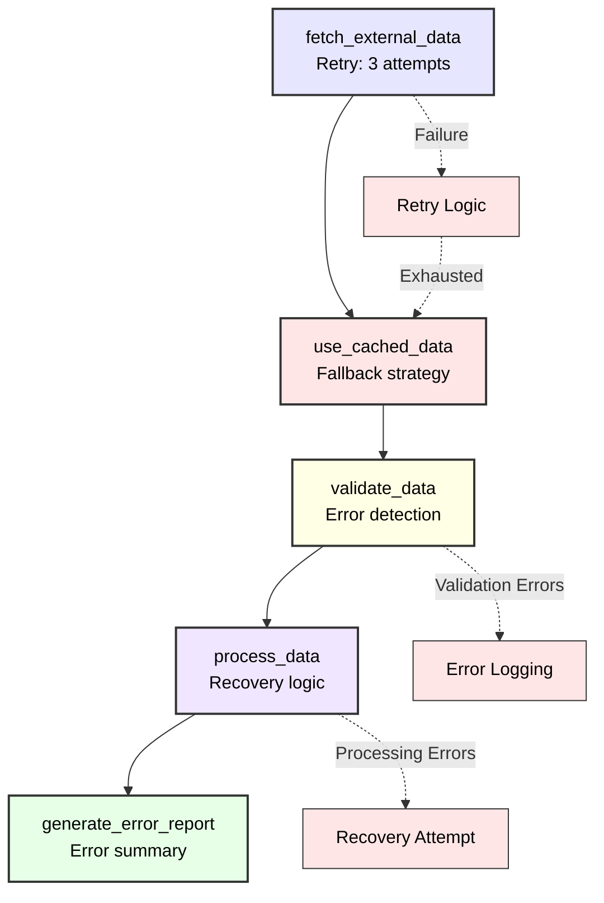

# Error Handling and Recovery

Welcome to the third tutorial in our Python Cloacina series! In this tutorial, you'll learn how to build resilient workflows that can handle failures gracefully. We'll explore error handling strategies, retry mechanisms, fallback patterns, and debugging techniques to create production-ready workflows.

## Learning Objectives

- Implement robust error handling in tasks
- Configure retry policies for transient failures
- Design fallback strategies and recovery patterns
- Handle validation errors and debugging
- Build resilient workflows with graceful degradation
- Monitor and respond to workflow failures

## Prerequisites

- Completion of [Tutorial 2](/python-bindings/tutorials/02-context-handling/)
- Understanding of Python exception handling
- Basic knowledge of error handling patterns

## Time Estimate
25-30 minutes

## Understanding Error Types

Cloacina workflows can encounter several types of errors:



**Runtime errors within task logic:**
- External service failures
- Data validation errors
- Resource unavailability
- Processing exceptions



**Issues with workflow definition:**
- Missing task dependencies
- Circular dependencies
- Invalid task references
- Configuration errors



**Infrastructure and system issues:**
- Database connection failures
- Resource exhaustion
- Network connectivity issues
- Permission errors



## Error Handling Strategies

### 1. Basic Task Error Handling

Let's start with basic error handling within tasks:

```python
import cloaca
import random
import time
from datetime import datetime

@cloaca.task(id="basic_error_handling")
def basic_error_handling(context):
    """Demonstrate basic error handling patterns."""

    try:
        # Simulate potentially failing operation
        operation_type = context.get("operation_type", "safe")

        if operation_type == "risky":
            # Simulate random failure
            if random.random() < 0.3:  # 30% failure rate
                raise ValueError("Random failure occurred")

        # Successful operation
        context.set("operation_result", "success")
        context.set("processed_at", datetime.now().isoformat())

    except ValueError as e:
        # Handle specific error type
        print(f"Validation error: {e}")
        context.set("operation_result", "validation_failed")
        context.set("error_message", str(e))
        # Re-raise to mark task as failed
        raise

    except Exception as e:
        # Handle unexpected errors
        print(f"Unexpected error: {e}")
        context.set("operation_result", "unexpected_error")
        context.set("error_message", str(e))
        context.set("error_type", type(e).__name__)
        raise

    return context
```

### 2. Retry Mechanisms

Cloacina supports retry policies for handling transient failures:

```python
@cloaca.task(
    id="retry_task",
    retry_attempts=3,
    retry_delay_ms=1000,
    retry_backoff="exponential"
)
def retry_task(context):
    """Task with retry policy for transient failures."""

    # Track retry attempts
    attempt = context.get("retry_attempt", 0) + 1
    context.set("retry_attempt", attempt)

    print(f"Attempt {attempt} - Trying to fetch data...")

    # Simulate external service call with failures
    success_rate = 0.4  # 40% success rate
    if random.random() > success_rate:
        error_msg = f"Service unavailable (attempt {attempt})"
        print(error_msg)
        context.set("last_error", error_msg)
        raise RuntimeError(error_msg)

    # Success case
    context.set("data", {"status": "success", "attempt": attempt})
    context.set("fetch_successful", True)
    print(f"Success on attempt {attempt}")

    return context
```

## Complete Error Handling Example

Let's build a comprehensive example that demonstrates multiple error handling patterns:

```python
import cloaca
import random
import json
from datetime import datetime
from typing import Dict, Any

# Data fetching with failures
@cloaca.task(
    id="fetch_external_data",
    retry_attempts=3,
    retry_delay_ms=500,
    retry_backoff="exponential"
)
def fetch_external_data(context):
    """Fetch data from external source with retry logic."""

    attempt = context.get("fetch_attempt", 0) + 1
    context.set("fetch_attempt", attempt)

    print(f"Fetching data (attempt {attempt})...")

    # Simulate external API with 70% failure rate
    if random.random() < 0.7:
        error_msg = f"External API timeout (attempt {attempt})"
        context.set("fetch_error", error_msg)
        raise ConnectionError(error_msg)

    # Success - return mock data
    external_data = {
        "records": [
            {"id": 1, "value": 100, "status": "active"},
            {"id": 2, "value": 150, "status": "active"},
            {"id": 3, "value": 200, "status": "inactive"}
        ],
        "fetched_at": datetime.now().isoformat(),
        "source": "external_api",
        "attempt": attempt
    }

    context.set("external_data", external_data)
    context.set("fetch_successful", True)
    print(f"Successfully fetched {len(external_data['records'])} records")

    return context

# Fallback data source
@cloaca.task(id="use_cached_data", dependencies=["fetch_external_data"])
def use_cached_data(context):
    """Provide fallback data when external fetch fails."""

    # Check if primary fetch succeeded
    if context.get("fetch_successful", False):
        print("Primary data fetch succeeded, skipping cache")
        return context

    print("Primary fetch failed, using cached data...")

    # Provide cached/fallback data
    cached_data = {
        "records": [
            {"id": 1, "value": 90, "status": "active"},
            {"id": 2, "value": 140, "status": "active"}
        ],
        "fetched_at": datetime.now().isoformat(),
        "source": "cache",
        "note": "fallback_data"
    }

    context.set("external_data", cached_data)
    context.set("used_cached_data", True)
    print(f"Using cached data with {len(cached_data['records'])} records")

    return context

# Data validation with error handling
@cloaca.task(id="validate_data", dependencies=["use_cached_data"])
def validate_data(context):
    """Validate fetched data with comprehensive error handling."""

    print("Validating data...")

    try:
        data = context.get("external_data")

        if not data:
            raise ValueError("No data found in context")

        if not isinstance(data, dict):
            raise TypeError(f"Expected dict, got {type(data)}")

        if "records" not in data:
            raise KeyError("Missing 'records' field in data")

        records = data["records"]
        if not isinstance(records, list):
            raise TypeError("Records must be a list")

        if len(records) == 0:
            raise ValueError("No records found in data")

        # Validate each record
        validation_errors = []
        valid_records = []

        for i, record in enumerate(records):
            record_errors = []

            # Check required fields
            required_fields = ["id", "value", "status"]
            for field in required_fields:
                if field not in record:
                    record_errors.append(f"Missing field: {field}")

            # Validate data types and ranges
            if "id" in record and not isinstance(record["id"], int):
                record_errors.append("ID must be an integer")

            if "value" in record:
                if not isinstance(record["value"], (int, float)):
                    record_errors.append("Value must be a number")
                elif record["value"] < 0:
                    record_errors.append("Value must be non-negative")

            if "status" in record and record["status"] not in ["active", "inactive"]:
                record_errors.append("Status must be 'active' or 'inactive'")

            if record_errors:
                validation_errors.append(f"Record {i}: {'; '.join(record_errors)}")
            else:
                valid_records.append(record)

        # Set validation results
        validation_result = {
            "total_records": len(records),
            "valid_records": len(valid_records),
            "validation_errors": validation_errors,
            "error_count": len(validation_errors),
            "validation_passed": len(validation_errors) == 0
        }

        context.set("validation_result", validation_result)
        context.set("valid_records", valid_records)

        if validation_errors:
            error_summary = f"Validation failed: {len(validation_errors)} errors found"
            context.set("validation_error", error_summary)
            print(f"Validation failed with {len(validation_errors)} errors")
            for error in validation_errors:
                print(f"  - {error}")
            raise ValueError(error_summary)

        print(f"Validation passed: {len(valid_records)} valid records")

    except (ValueError, TypeError, KeyError) as e:
        # Expected validation errors
        context.set("validation_error", str(e))
        context.set("validation_passed", False)
        print(f"Validation error: {e}")
        raise

    except Exception as e:
        # Unexpected errors
        context.set("validation_error", f"Unexpected error: {str(e)}")
        context.set("validation_passed", False)
        print(f"Unexpected validation error: {e}")
        raise

    return context

# Data processing with error recovery
@cloaca.task(id="process_data", dependencies=["validate_data"])
def process_data(context):
    """Process validated data with error handling."""

    print("Processing data...")

    try:
        valid_records = context.get("valid_records", [])

        if not valid_records:
            # Try to recover some data even if validation failed
            print("No valid records, attempting recovery...")
            raw_data = context.get("external_data", {})
            records = raw_data.get("records", [])

            # Attempt basic cleanup
            recovered_records = []
            for record in records:
                if isinstance(record, dict) and "id" in record and "value" in record:
                    cleaned_record = {
                        "id": record["id"],
                        "value": max(0, record.get("value", 0)),  # Ensure non-negative
                        "status": record.get("status", "unknown")
                    }
                    recovered_records.append(cleaned_record)

            if recovered_records:
                context.set("recovered_records", recovered_records)
                context.set("used_recovery", True)
                valid_records = recovered_records
                print(f"Recovered {len(recovered_records)} records")
            else:
                raise ValueError("No recoverable data found")

        # Process the records
        processed_records = []
        total_value = 0
        active_count = 0

        for record in valid_records:
            processed_record = {
                "id": record["id"],
                "original_value": record["value"],
                "processed_value": record["value"] * 1.1,  # Apply 10% markup
                "status": record["status"],
                "processed_at": datetime.now().isoformat()
            }
            processed_records.append(processed_record)
            total_value += record["value"]

            if record["status"] == "active":
                active_count += 1

        # Create processing summary
        processing_result = {
            "processed_records": processed_records,
            "summary": {
                "total_records": len(processed_records),
                "total_value": total_value,
                "average_value": total_value / len(processed_records) if processed_records else 0,
                "active_records": active_count,
                "inactive_records": len(processed_records) - active_count
            },
            "processing_successful": True
        }

        context.set("processing_result", processing_result)
        print(f"Successfully processed {len(processed_records)} records")

    except Exception as e:
        # Processing failed - create error summary
        error_result = {
            "processing_successful": False,
            "error_message": str(e),
            "error_type": type(e).__name__,
            "recovery_attempted": context.get("used_recovery", False)
        }
        context.set("processing_result", error_result)
        print(f"Processing failed: {e}")
        raise

    return context

# Error reporting and cleanup
@cloaca.task(id="generate_error_report", dependencies=["process_data"])
def generate_error_report(context):
    """Generate comprehensive error report."""

    print("Generating error report...")

    # Collect all error information
    error_report = {
        "workflow_summary": {
            "execution_time": datetime.now().isoformat(),
            "overall_status": "unknown"
        },
        "fetch_stage": {
            "attempts": context.get("fetch_attempt", 0),
            "successful": context.get("fetch_successful", False),
            "used_cache": context.get("used_cached_data", False),
            "errors": context.get("fetch_error")
        },
        "validation_stage": {
            "passed": context.get("validation_passed", False),
            "errors": context.get("validation_result", {}).get("validation_errors", []),
            "valid_records": context.get("validation_result", {}).get("valid_records", 0)
        },
        "processing_stage": {
            "successful": context.get("processing_result", {}).get("processing_successful", False),
            "recovery_used": context.get("used_recovery", False),
            "records_processed": len(context.get("processing_result", {}).get("processed_records", []))
        }
    }

    # Determine overall status
    if (error_report["fetch_stage"]["successful"] or error_report["fetch_stage"]["used_cache"]) and \
       error_report["validation_stage"]["passed"] and \
       error_report["processing_stage"]["successful"]:
        error_report["workflow_summary"]["overall_status"] = "success"
    elif error_report["processing_stage"]["records_processed"] > 0:
        error_report["workflow_summary"]["overall_status"] = "partial_success"
    else:
        error_report["workflow_summary"]["overall_status"] = "failed"

    context.set("error_report", error_report)

    # Print summary
    status = error_report["workflow_summary"]["overall_status"]
    print(f"Workflow completed with status: {status}")

    if status == "failed":
        print("Errors encountered:")
        if error_report["fetch_stage"]["errors"]:
            print(f"  - Fetch: {error_report['fetch_stage']['errors']}")
        if error_report["validation_stage"]["errors"]:
            print(f"  - Validation: {len(error_report['validation_stage']['errors'])} errors")

    return context

# Create workflow
def create_error_handling_workflow():
    """Build the error handling demonstration workflow."""

    builder = cloaca.WorkflowBuilder("error_handling_demo")
    builder.description("Comprehensive error handling and recovery demonstration")

    # Add tasks in dependency order
    builder.add_task("fetch_external_data")
    builder.add_task("use_cached_data")
    builder.add_task("validate_data")
    builder.add_task("process_data")
    builder.add_task("generate_error_report")

    return builder.build()

# Register workflow
cloaca.register_workflow_constructor("error_handling_demo", create_error_handling_workflow)

# Main execution
if __name__ == "__main__":
    print("=== Error Handling Tutorial ===")

    # Create runner
    runner = cloaca.DefaultRunner("sqlite:///tutorial_03.db")

    # Test different scenarios
    scenarios = [
        {"name": "Normal Operation", "context": {"operation_type": "safe"}},
        {"name": "Risky Operation", "context": {"operation_type": "risky"}},
        {"name": "High Failure Rate", "context": {"operation_type": "risky", "failure_simulation": True}}
    ]

    for scenario in scenarios:
        print(f"\n--- Testing {scenario['name']} ---")

        # Create context for this scenario
        context = cloaca.Context({
            "tutorial": "03",
            "scenario": scenario["name"],
            **scenario["context"]
        })

        try:
            # Execute workflow
            result = runner.execute("error_handling_demo", context)

            print(f"Workflow Status: {result.status}")

            if result.status == "Completed":
                # Show error report
                final_context = result.final_context
                error_report = final_context.get("error_report")

                if error_report:
                    status = error_report["workflow_summary"]["overall_status"]
                    fetch_attempts = error_report["fetch_stage"]["attempts"]
                    used_cache = error_report["fetch_stage"]["used_cache"]
                    records_processed = error_report["processing_stage"]["records_processed"]

                    print(f"Overall Status: {status}")
                    print(f"Fetch Attempts: {fetch_attempts}")
                    print(f"Used Cache: {used_cache}")
                    print(f"Records Processed: {records_processed}")

            else:
                print(f"Workflow failed: {result.status}")

        except Exception as e:
            print(f"Execution error: {e}")

    # Cleanup
    print("\nCleaning up...")
    runner.shutdown()
    print("Tutorial completed!")
```

## Error Handling Patterns

### Workflow Diagram



## Running the Tutorial

Execute the error handling example:

```bash
python error_handling_tutorial.py
```

You'll see output showing different error scenarios and recovery strategies in action.

## Error Handling Best Practices



**Configure retries for transient failures:**

```python
@cloaca.task(
    id="api_call",
    retry_attempts=3,           # Number of retry attempts
    retry_delay_ms=1000,        # Initial delay in milliseconds
    retry_backoff="exponential" # Backoff strategy
)
def api_call(context):
    # Task implementation
    pass
```

**Retry backoff options:**
- `"linear"`: Fixed delay between retries
- `"exponential"`: Exponentially increasing delay



**Comprehensive error context:**

```python
@cloaca.task(id="logging_task")
def logging_task(context):
    try:
        # Risky operation
        result = risky_operation()
        context.set("result", result)

    except SpecificError as e:
        # Log specific error details
        error_details = {
            "error_type": type(e).__name__,
            "error_message": str(e),
            "timestamp": datetime.now().isoformat(),
            "task_id": "logging_task",
            "context_data": dict(context)
        }
        context.set("error_details", error_details)
        print(f"Task failed: {error_details}")
        raise

    return context
```



**Implement graceful degradation:**

```python
@cloaca.task(id="primary_source")
def primary_source(context):
    # Try primary data source
    if random.random() < 0.3:  # 30% failure rate
        raise ConnectionError("Primary source unavailable")
    context.set("data", get_primary_data())
    context.set("source", "primary")
    return context

@cloaca.task(id="fallback_source", dependencies=["primary_source"])
def fallback_source(context):
    # Use fallback if primary failed
    if context.get("source") == "primary":
        return context  # Primary succeeded

    print("Using fallback data source")
    context.set("data", get_fallback_data())
    context.set("source", "fallback")
    return context
```



**Validate early and often:**

```python
@cloaca.task(id="validation_task")
def validation_task(context):
    data = context.get("input_data")

    # Input validation
    if not data:
        raise ValueError("Missing required input_data")

    if not isinstance(data, dict):
        raise TypeError(f"Expected dict, got {type(data)}")

    # Schema validation
    required_fields = ["id", "name", "value"]
    missing = [f for f in required_fields if f not in data]
    if missing:
        raise ValueError(f"Missing required fields: {missing}")

    # Business logic validation
    if data["value"] < 0:
        raise ValueError("Value must be non-negative")

    context.set("validated_data", data)
    return context
```



## Debugging Failed Workflows

### 1. Enable Detailed Logging

```python
import logging

# Configure logging for debugging
logging.basicConfig(
    level=logging.DEBUG,
    format='%(asctime)s - %(name)s - %(levelname)s - %(message)s'
)

# Enable Rust logging
import os
os.environ['RUST_LOG'] = 'cloacina=debug'
```

### 2. Inspect Workflow Results

```python
result = runner.execute("workflow_name", context)

if result.status != "Completed":
    print(f"Workflow failed with status: {result.status}")

    # Check for error details
    if hasattr(result, 'error'):
        print(f"Error: {result.error}")

    # Examine final context for error information
    final_context = result.final_context
    error_details = final_context.get("error_details")
    if error_details:
        print(f"Error details: {error_details}")
```

### 3. Common Error Scenarios



```python
# This will cause a workflow validation error
@cloaca.task(id="dependent_task", dependencies=["nonexistent_task"])
def dependent_task(context):
    return context

# Error: Task 'nonexistent_task' not found
```



```python
# This creates a circular dependency
@cloaca.task(id="task_a", dependencies=["task_b"])
def task_a(context):
    return context

@cloaca.task(id="task_b", dependencies=["task_a"])
def task_b(context):
    return context

# Error: Circular dependency detected
```



```python
@cloaca.task(id="data_error_task")
def data_error_task(context):
    # This will raise KeyError if 'required_data' doesn't exist
    data = context.get("required_data")
    if not data:
        raise ValueError("Missing required_data in context")

    return context
```



## Exercises

### Exercise 1: Implement Circuit Breaker Pattern

Create a task that stops trying after too many consecutive failures:

```python
@cloaca.task(id="circuit_breaker_task")
def circuit_breaker_task(context):
    """Implement circuit breaker pattern."""

    # Get failure history
    failures = context.get("consecutive_failures", 0)
    circuit_open = context.get("circuit_open", False)

    # Check if circuit is open
    if circuit_open and failures >= 5:
        print("Circuit breaker is open - not attempting operation")
        context.set("operation_skipped", True)
        return context

    try:
        # Attempt operation
        if random.random() < 0.6:  # 60% failure rate
            raise ConnectionError("Service unavailable")

        # Success - reset circuit
        context.set("consecutive_failures", 0)
        context.set("circuit_open", False)
        context.set("operation_successful", True)

    except Exception as e:
        # Failure - increment counter
        failures += 1
        context.set("consecutive_failures", failures)

        if failures >= 5:
            context.set("circuit_open", True)
            print("Circuit breaker opened due to excessive failures")

        raise

    return context
```

### Exercise 2: Implement Timeout Handling

Add timeout logic to prevent hanging operations:

```python
import signal
from contextlib import contextmanager

@contextmanager
def timeout(seconds):
    """Context manager for operation timeout."""
    def timeout_handler(signum, frame):
        raise TimeoutError("Operation timed out")

    signal.signal(signal.SIGALRM, timeout_handler)
    signal.alarm(seconds)
    try:
        yield
    finally:
        signal.alarm(0)

@cloaca.task(id="timeout_task")
def timeout_task(context):
    """Task with timeout protection."""

    try:
        with timeout(5):  # 5 second timeout
            # Simulate long-running operation
            time.sleep(random.randint(1, 8))
            context.set("operation_completed", True)

    except TimeoutError:
        context.set("operation_timed_out", True)
        raise

    return context
```

## What's Next?

Excellent! You now know how to build resilient workflows with comprehensive error handling. In the next tutorial, we'll explore:

- Parallel task execution patterns
- Managing concurrent workflows
- Performance optimization techniques
- Resource management strategies

Continue to Tutorial 04

## Related Resources

- [API Reference: Error Handling](/python-bindings/api-reference/exceptions/) - Exception types and handling
- [How-to: Testing Workflows](/python-bindings/how-to-guides/testing-workflows/) - Testing error scenarios
- [Examples: Error Recovery](/python-bindings/examples/error-recovery/) - Advanced error patterns


This tutorial demonstrates patterns from [`test_scenario_11_retry_mechanisms.py`](https://github.com/dstorey/cloacina/blob/main/python-tests/test_scenario_11_retry_mechanisms.py) and [`test_scenario_17_advanced_error_handling.py`](https://github.com/dstorey/cloacina/blob/main/python-tests/test_scenario_17_advanced_error_handling.py) in the Cloacina test suite.

