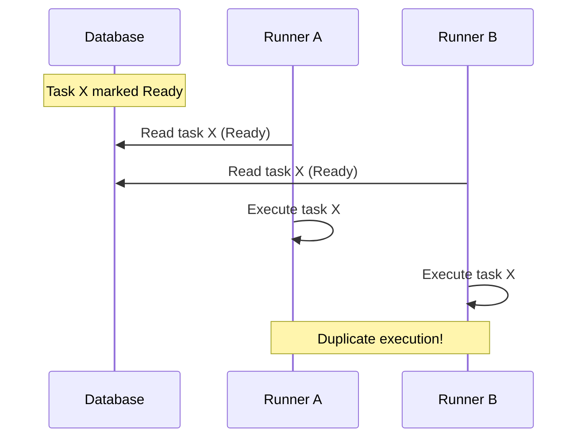
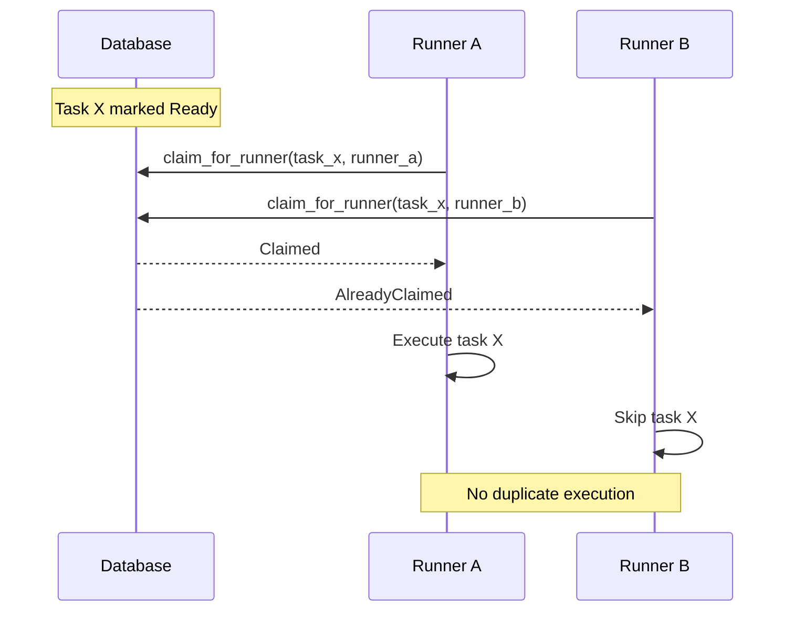
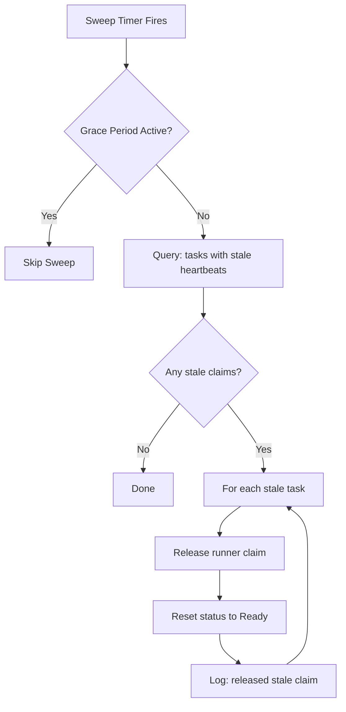
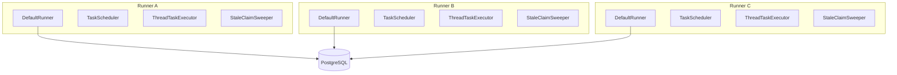
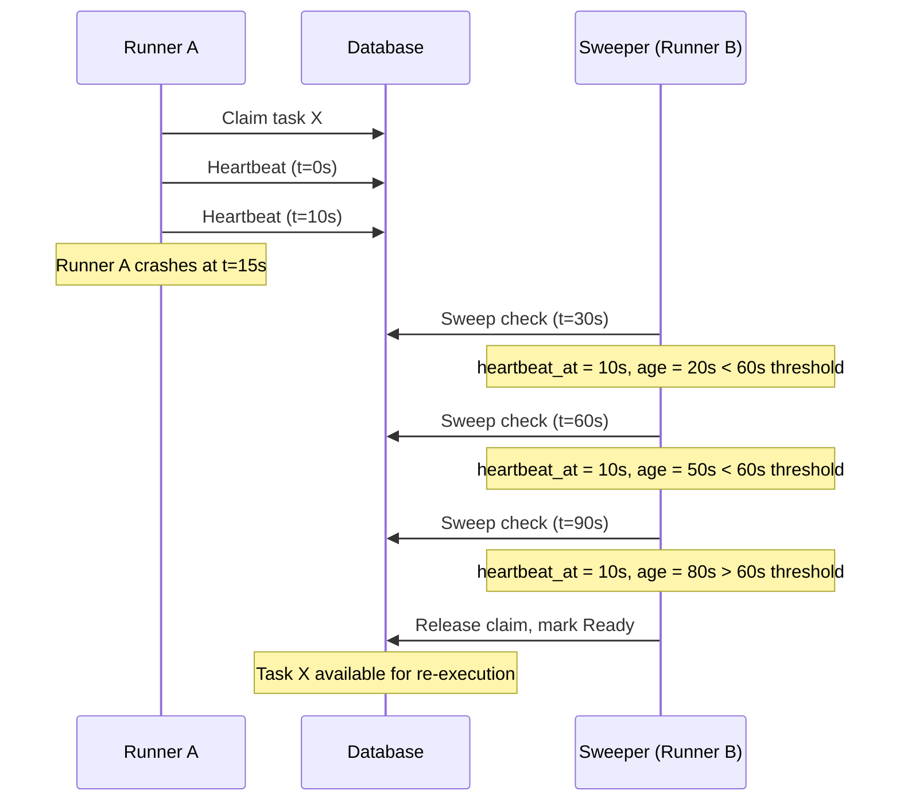

## Introduction

When you run a single Cloacina instance, task execution is straightforward: the scheduler marks tasks as `Ready`, the dispatcher hands them to the configured executor, and the executor runs them. But what happens when you deploy multiple runner instances against the same PostgreSQL database? Without coordination, two runners could pick up the same task and execute it twice.

This document explains the mechanisms Cloacina uses to prevent duplicate execution, detect crashed runners, and recover orphaned tasks in a multi-runner deployment.

## The Problem

Consider two `DefaultRunner` instances, Runner A and Runner B, both connected to the same PostgreSQL database. Both run the same scheduling loop, which means both will see the same tasks transition to `Ready` state. Without intervention, both runners will attempt to execute every ready task, leading to:

- **Duplicate execution**: The same task runs twice, potentially causing data corruption or duplicate side effects
- **Race conditions**: Both runners read the same task state, both decide to execute, and the results conflict
- **Wasted resources**: Compute time is spent on redundant work



## Task Claiming

Cloacina solves this with **atomic task claiming**. Before a runner executes a task, it attempts to claim it by writing its own runner ID into the task's `claimed_by` field. This operation is atomic -- only one runner can succeed.

The claiming logic lives in `ThreadTaskExecutor::execute()`:

```rust
if self.config.enable_claiming {
    let claim_result = self
        .dal
        .task_execution()
        .claim_for_runner(event.task_execution_id, self.instance_id)
        .await;

    match claim_result {
        Ok(RunnerClaimResult::Claimed) => {
            // We own this task -- proceed with execution
        }
        Ok(RunnerClaimResult::AlreadyClaimed) => {
            // Another runner got here first -- skip silently
            return Ok(ExecutionResult::skipped(event.task_execution_id));
        }
        Err(e) => {
            // Claim failed -- proceed without claim (best-effort)
        }
    }
}
```

The database operation uses PostgreSQL's `FOR UPDATE SKIP LOCKED` pattern (or equivalent atomic update) to ensure that only one runner can claim a given task. If Runner A claims task X, Runner B's claim attempt returns `AlreadyClaimed` and it moves on.



Claiming is controlled by the `enable_claiming` configuration flag, which defaults to `true`:

```rust
let config = DefaultRunnerConfig::builder()
    .enable_claiming(true)  // default
    .build();
```

When claiming is disabled (for single-runner deployments where the overhead is unnecessary), the executor skips the claim step and executes tasks directly.

## Heartbeat Mechanism

Claiming alone is not sufficient. If Runner A claims a task and then crashes, the task remains in `Running` state with Runner A's ID in `claimed_by`, and no other runner will touch it. The task is orphaned.

To detect this scenario, Cloacina uses a **heartbeat mechanism**. While a runner is actively executing a task, it sends periodic heartbeat updates to the database, refreshing a `heartbeat_at` timestamp on the task execution record.

The heartbeat runs as a background Tokio task, spawned when execution begins:

```rust
let heartbeat_handle = if self.config.enable_claiming {
    let dal = self.dal.clone();
    let task_id = event.task_execution_id;
    let runner_id = self.instance_id;
    let interval = self.config.heartbeat_interval;
    Some(tokio::spawn(async move {
        let mut ticker = tokio::time::interval(interval);
        loop {
            ticker.tick().await;
            match dal.task_execution().heartbeat(task_id, runner_id).await {
                Ok(HeartbeatResult::Ok) => { /* still alive */ }
                Ok(HeartbeatResult::ClaimLost) => {
                    // Another runner reclaimed this task -- stop
                    break;
                }
                Err(e) => { /* log and continue */ }
            }
        }
    }))
} else {
    None
};
```

The heartbeat serves two purposes:

1. **Liveness signal**: A fresh `heartbeat_at` timestamp tells the stale claim sweeper that the runner is still alive and working on this task.
2. **Claim verification**: The heartbeat operation verifies that the `claimed_by` field still matches the runner's ID. If another process has reclaimed the task (via stale sweep), the heartbeat returns `ClaimLost` and the runner stops.

> **CLOACI-T-0487 — cooperative cancellation on claim loss.** When the heartbeat returns `ClaimLost`, the runner doesn't just stop the heartbeat loop — it also signals the in-flight task to cancel cooperatively via the task's cancellation channel. Well-behaved tasks check the channel at await points and exit early. Misbehaved tasks that ignore cancellation continue running until the next DB write, where they'll fail because the row is no longer theirs. This closes the duplicate-execution window in network-partition scenarios (see [Failure Scenarios](#failure-scenarios) below).

> **CLOACI-T-0502 — heartbeat sweeper is the sole task-recovery path.** Earlier releases of Cloacina had a separate `RecoveryManager` background service that scanned for stuck task executions. That manager has been removed; the stale-claim sweeper described here is now the *only* task-recovery mechanism. The `enable_recovery` config field still exists (it gates the stale-claim sweeper), but the field name predates T-0502 and no longer corresponds to a separate recovery service. (Cron-level recovery — the `CronRecoveryService` for missed schedule firings — is a separate mechanism and is still in place.)

The heartbeat interval is configurable via `DefaultRunnerConfig`:

```rust
let config = DefaultRunnerConfig::builder()
    .heartbeat_interval(Duration::from_secs(10))  // default: 10s
    .build();
```

When the task completes (success, failure, or retry), the heartbeat task is aborted and the runner releases its claim:

```rust
// Stop heartbeat
if let Some(handle) = heartbeat_handle {
    handle.abort();
}

// Release claim
if self.config.enable_claiming {
    self.dal
        .task_execution()
        .release_runner_claim(event.task_execution_id)
        .await?;
}
```

## Stale Claim Sweeping

The `StaleClaimSweeper` is a background service that periodically scans for tasks whose heartbeat has gone stale -- indicating that the runner that claimed them has likely crashed or become unreachable.



The sweeper runs in a loop at a configurable interval:

```rust
pub struct StaleClaimSweeperConfig {
    /// How often to run the sweep (default 30s).
    pub sweep_interval: Duration,
    /// How old a heartbeat must be to consider the claim stale (default 60s).
    pub stale_threshold: Duration,
}
```

For each stale task it finds, the sweeper:
1. Releases the runner claim (clears `claimed_by` and `heartbeat_at`)
2. Resets the task status to `Ready`
3. Logs the release with the runner ID and heartbeat age

The next scheduling loop iteration will see the task as `Ready` and dispatch it to any available runner for re-execution.

### Startup Grace Period

There is an important edge case when the sweeper itself restarts. Consider this scenario: Runner A is executing a task, the sweeper process restarts, and immediately runs its first sweep. Runner A's task looks "stale" because the sweeper was not running to observe its heartbeats, but Runner A is actually healthy.

To handle this, the sweeper implements a **startup grace period** equal to `stale_threshold`. During this period, all sweeps are skipped:

```rust
async fn sweep(&self) {
    let uptime = self.ready_at.elapsed();
    if uptime < self.config.stale_threshold {
        debug!("Stale claim sweeper in grace period -- skipping sweep");
        return;
    }
    // ... proceed with sweep
}
```

This ensures that the sweeper only acts on tasks that have been stale for at least one full threshold duration since it started watching.

### Configuration

The sweeper is configured through `DefaultRunnerConfig`. `stale_claim_sweep_interval` and `stale_claim_threshold` are available as builder methods (alongside `enable_claiming` and `heartbeat_interval`):

```rust
let config = DefaultRunnerConfig::builder()
    .enable_claiming(true)
    .heartbeat_interval(Duration::from_secs(10))
    .stale_claim_sweep_interval(Duration::from_secs(30))  // default: 30s
    .stale_claim_threshold(Duration::from_secs(60))       // default: 60s
    .build();
```

The `stale_claim_threshold` must be greater than the `heartbeat_interval`. If the heartbeat interval is 10 seconds and the stale threshold is 60 seconds, a runner must miss 6 consecutive heartbeats before its claims are considered stale.

## Runner Identification

Each `ThreadTaskExecutor` generates a unique `instance_id` (a UUID) when it is created. This ID is used as the `claimed_by` value in the database and for heartbeat verification.

For operational visibility, you can also set human-readable runner identification in the configuration:

```rust
let config = DefaultRunnerConfig::builder()
    .runner_id(Some("runner-east-1a".to_string()))
    .runner_name(Some("Production Runner (us-east-1a)".to_string()))
    .build();
```

The `runner_id` and `runner_name` are included in tracing spans for all background services, making it straightforward to correlate logs across multiple runners:

```rust
tracing::info_span!(
    "runner_task",
    runner_id = %runner_id,
    runner_name = %runner_name,
    operation = operation,
    component = "cloacina_runner"
)
```

## Dispatcher and the Default Executor

The `DefaultDispatcher` hands every task to a single configured executor — the **default executor** key. There is no per-task matching: the dispatcher does not select an executor by task name. The key defaults to `default` (the in-process `ThreadTaskExecutor`) and is set server-wide via `[server].default_executor` in `~/.cloacina/config.toml` (or `CLOACINA_DEFAULT_EXECUTOR` / `--default-executor`). The configured key is hard-matched against the registered executors at startup; an unknown key fails fast.

In a multi-runner deployment, the executor key does not pick *which runner* claims a task — claiming does. Each runner runs the same scheduling loop and competes for ready tasks; the default-executor key only decides *how* a claimed task runs (in-process, or offloaded to the `fleet` executor when the [execution-agent fleet]() is deployed).

> **Choosing the node/compute a task lands on is an executor-internal concern** — a future capability where executors route work to specific nodes or capabilities. The scheduler and dispatcher don't make that decision per task.

All runners share the same PostgreSQL database. The claiming mechanism ensures that even if every runner sees the same `TaskReadyEvent`, only one actually executes the task.

## Deployment Pattern

A production multi-runner deployment looks like this:



Each runner is a fully independent process with its own `DefaultRunner`, scheduler, executor, and sweeper. They coordinate exclusively through the shared PostgreSQL database. There is no direct communication between runners, no leader election, and no distributed consensus protocol.

Requirements for this pattern:
- **PostgreSQL is required** -- SQLite does not support `FOR UPDATE SKIP LOCKED` and cannot safely coordinate across processes
- **Each runner needs a unique `instance_id`** -- automatically generated, no configuration required
- **All runners must have the same workflows registered** -- either through the global task/workflow registry (compiled in) or through a shared `WorkflowRegistry` backed by the database
- **Clock skew should be minimal** -- the stale claim threshold depends on wall-clock comparisons

## Failure Scenarios and Recovery

### Runner Crashes Mid-Task

When a runner crashes while executing a task:

1. The task remains in `Running` state with the crashed runner's ID in `claimed_by`
2. Heartbeat updates stop immediately
3. After `stale_claim_threshold` (default 60s), the `StaleClaimSweeper` on any surviving runner detects the stale heartbeat
4. The sweeper releases the claim and resets the task to `Ready`
5. The next scheduling loop dispatches the task to an available runner



The task will be retried from scratch. Context from the failed attempt is not preserved -- the new executor builds context fresh from dependency tasks.

### Network Partition

If a runner loses database connectivity:

1. Heartbeat updates fail (logged as warnings)
2. The task continues executing locally if the runner process is still healthy
3. After `stale_claim_threshold`, the sweeper marks the claim as stale and a new runner can claim it
4. If the original runner reconnects before the sweeper acts, heartbeats resume and the claim remains valid
5. If the sweeper acts first, the original runner's next heartbeat returns `ClaimLost`. Per CLOACI-T-0487, the runner then:
   - stops the heartbeat loop, **and**
   - signals the in-flight task to cancel cooperatively via the task's cancellation channel

This closes the historical duplicate-execution window for cooperative tasks. The `ClaimLost`-triggered cooperative cancellation arrives faster than the task's next DB write would; well-behaved tasks exit before they can race the reclaiming runner. **Tasks that ignore the cancellation channel** will still complete locally, but their next DB write (typically the `complete_task_transaction` finalize) will fail because the row is no longer theirs — so even pathological tasks cannot duplicate-finalize. Defensive idempotency on the user task body remains good practice but is no longer a correctness requirement for the claim-handoff path.

### Database Failover

If the PostgreSQL database fails over to a replica:

1. Connection pool detects failed connections and attempts reconnection
2. In-flight tasks that cannot reach the database will fail with connection errors
3. The retry policy determines whether these tasks are retried
4. Once the pool reconnects to the new primary, normal operation resumes

The connection pool handles failover transparently for new operations. Tasks that were in-flight during the failover may need to be recovered through the stale claim sweeper or the standard retry mechanism.

## Configuration Reference

All horizontal scaling configuration is set through `DefaultRunnerConfig::builder()`:

| Field | Default | Description |
|---|---|---|
| `enable_claiming` | `true` | Enable atomic task claiming for multi-runner safety |
| `heartbeat_interval` | 10s | How often to update `heartbeat_at` during task execution |
| `stale_claim_sweep_interval` | 30s | How often the sweeper checks for stale claims |
| `stale_claim_threshold` | 60s | How old a heartbeat must be to consider a claim stale |
| `runner_id` | None | Optional human-readable runner identifier for logs |
| `runner_name` | None | Optional human-readable runner name for logs |
| `max_concurrent_tasks` | 4 | Maximum tasks a single runner will execute concurrently |

**Relationship constraints**:
- `stale_claim_threshold` should be at least 3x `heartbeat_interval` to avoid false positives from temporary delays
- `stale_claim_sweep_interval` should be less than `stale_claim_threshold` to ensure timely detection

## See Also

- [Architecture Overview]() -- System-wide component relationships
- [Task Execution]() -- Task lifecycle and state transitions
- [Dispatcher Architecture]() -- The default executor and pluggable executor backends
- [Guaranteed Execution Architecture]() -- Reliability guarantees and recovery mechanisms
- [Execution-Agent Fleet]() -- Offloading task execution to a pool of DB-less remote agents (complements the single-DB multi-runner model above)
