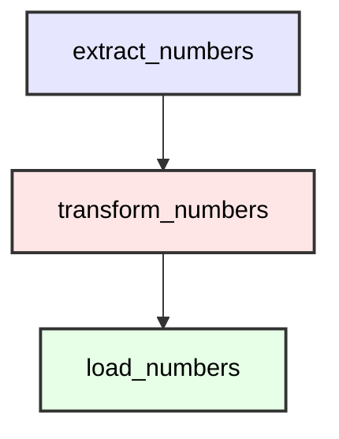

Welcome to the second tutorial in our Cloacina series! In this tutorial, you'll learn how to create powerful multi-task workflows that can handle complex data processing pipelines. We'll build on the concepts from [Tutorial 1](/tutorials/01-first-task/) and show you how to connect multiple tasks together.

## Prerequisites

- Completion of [Tutorial 1](/tutorials/01-first-task/)
- Basic understanding of Rust
- Rust toolchain installed (rustc, cargo)
- A code editor of your choice

## Time Estimate
20-25 minutes

## Setting Up Your Project

Let's start by creating a new Rust project. We'll create it in a directory that's a sibling to the Cloacina repository:

```bash
# Assuming you're in the parent directory of the Cloacina repository
mkdir -p my-cloacina-projects
cd my-cloacina-projects
cargo new workflow-etl
cd workflow-etl
```

Your directory structure should look like this:
```
.
├── cloacina/              # The Cloacina repository
└── my-cloacina-projects/  # Your projects directory
    └── workflow-etl/      # Your new project
        ├── Cargo.toml
        └── src/
            ├── main.rs
            └── tasks.rs
```

Now, add Cloacina and its dependencies to your `Cargo.toml`:

```toml
[dependencies]
cloacina = { path = "../../cloacina", default-features = false, features = ["macros", "sqlite"] }
tokio = { version = "1.0", features = ["full"] }
serde_json = "1.0"
tracing = "0.1"
tracing-subscriber = "0.3"
async-trait = "0.1"
ctor = "0.2"
chrono = "0.4"
```


Normally you'd use `cloacina = "0.1.0"` in Cargo.toml. For these tutorials, we're using path dependencies to vendor code locally.

The path must be relative to your project. Examples:
- Next to Cloacina: `path = "../cloacina"`
- In subdirectory: `path = "../../../cloacina"`

Note: Use `version = "0.1.0"` when available on crates.io.


## Understanding Workflows

In Cloacina, a workflow is a collection of tasks that work together to accomplish a larger goal. Each task can depend on other tasks, creating a directed graph of operations. Cloacina automatically handles the execution order based on these dependencies.

### Key Concepts

1. **Task Dependencies**: Tasks can specify which other tasks they depend on
2. **Execution Order**: Cloacina ensures tasks run in the correct sequence
3. **Data Flow**: Tasks share data through a shared context
4. **Error Handling**: Failed tasks can affect dependent tasks
5. **Retry Strategies**: Tasks can be configured to retry on failure
6. **DefaultRunner**: Manages workflow execution with persistence

### Workflow Structure

Here's a visual representation of our ETL pipeline workflow:



The diagram shows:
- Sequential flow of data through the ETL pipeline
- Each task's dependencies on the previous task
- The linear nature of the workflow

## Building an ETL Pipeline

Let's create a simple ETL pipeline that processes numbers. This example will demonstrate all the key workflow concepts.

First, create `src/tasks.rs` with our task definitions:

```rust
use cloacina::{task, Context, TaskError};
use serde_json::{json, Value};
use tracing::{info, debug};

// Extract numbers from the input context
#[task(
    id = "extract_numbers",
    dependencies = [],
    retry_attempts = 2,
    retry_backoff = "fixed",
    retry_delay_ms = 1000
)]
pub async fn extract_numbers(context: &mut Context<Value>) -> Result<(), TaskError> {
    info!("Extracting numbers from input");

    let numbers = context.get("numbers")
        .and_then(|v| v.as_array())
        .ok_or_else(|| TaskError::ValidationFailed {
            message: "No numbers found in context".to_string()
        })?
        .clone();

    debug!("Found {} numbers to process", numbers.len());

    // Store the extracted numbers
    context.insert("extracted_numbers", json!(numbers))?;
    context.insert("extract_timestamp", json!(chrono::Utc::now()))?;

    info!("Successfully extracted {} numbers", numbers.len());
    Ok(())
}

// Transform the numbers (multiply by 2)
#[task(
    id = "transform_numbers",
    dependencies = ["extract_numbers"],
    retry_attempts = 2,
    retry_backoff = "fixed",
    retry_delay_ms = 1000
)]
pub async fn transform_numbers(context: &mut Context<Value>) -> Result<(), TaskError> {
    info!("Transforming numbers");

    let numbers = context.get("extracted_numbers")
        .and_then(|v| v.as_array())
        .ok_or_else(|| TaskError::ValidationFailed {
            message: "No extracted numbers found for transformation".to_string()
        })?
        .clone();

    // Transform numbers (multiply by 2)
    let transformed: Vec<i64> = numbers.iter()
        .filter_map(|n| n.as_i64())
        .map(|n| n * 2)
        .collect();

    debug!("Transformed {} numbers", transformed.len());

    // Store transformed numbers
    context.insert("transformed_numbers", json!(transformed))?;
    context.insert("transform_timestamp", json!(chrono::Utc::now()))?;

    info!("Successfully transformed {} numbers", transformed.len());
    Ok(())
}

// Load the transformed numbers
#[task(
    id = "load_numbers",
    dependencies = ["transform_numbers"],
    retry_attempts = 2,
    retry_backoff = "fixed",
    retry_delay_ms = 1000
)]
pub async fn load_numbers(context: &mut Context<Value>) -> Result<(), TaskError> {
    info!("Loading transformed numbers");

    let numbers = context.get("transformed_numbers")
        .and_then(|v| v.as_array())
        .ok_or_else(|| TaskError::ValidationFailed {
            message: "No transformed numbers found for loading".to_string()
        })?
        .clone();

    // Simulate loading the numbers
    debug!("Loading {} numbers", numbers.len());

    // Store load results
    context.insert("loaded_numbers", json!(numbers))?;
    context.insert("load_timestamp", json!(chrono::Utc::now()))?;
    context.insert("load_status", json!("success"))?;

    info!("Successfully loaded {} numbers", numbers.len());
    Ok(())
}
```

Now, create `src/main.rs` to define and execute our workflow:

```rust
//! # Data Pipeline Example
//!
//! This example demonstrates a realistic data processing pipeline using Cloacina.
//! It showcases:
//! - Task definition with the macro system
//! - Complex dependency chains
//! - Error handling and retry policies
//! - Conditional execution based on data quality
//! - Recovery from failures

use cloacina::{workflow, Context};
use cloacina::runner::DefaultRunner;
use serde_json::json;
use tracing::info;

mod tasks;
use tasks::*;

#[tokio::main]
async fn main() -> Result<(), Box<dyn std::error::Error>> {
    // Initialize logging
    tracing_subscriber::fmt()
        .with_env_filter("etl_example=debug,cloacina=info")
        .init();

    info!("Starting ETL Example");

    // Initialize executor with SQLite database
    let executor = DefaultRunner::new("workflow_etl.db").await?;

    // Create the ETL workflow
    let _pipeline = create_etl_workflow()?;

    // Create two different input contexts
    let mut context1 = Context::new();
    context1.insert("numbers", json!([1, 2, 3, 4, 5]))?;

    let mut context2 = Context::new();
    context2.insert("numbers", json!([10, 20, 30, 40, 50]))?;

    // Execute the same workflow with different inputs
    info!("Submitting first ETL workflow with numbers [1, 2, 3, 4, 5]");
    let future1 = executor.execute("etl_workflow", context1);

    info!("Submitting second ETL workflow with numbers [10, 20, 30, 40, 50]");
    let future2 = executor.execute("etl_workflow", context2);

    info!("Both workflows submitted, waiting for completion...");

    // Wait for both workflows to complete
    let result2 = future2.await?;
    let result1 = future1.await?;

    // Shutdown the executor
    executor.shutdown().await?;

    Ok(())
}

/// Create the ETL workflow
fn create_etl_workflow() -> Result<cloacina::Workflow, Box<dyn std::error::Error>> {
    let workflow = workflow! {
        name: "etl_workflow",
        description: "Simple ETL workflow with extract, transform, and load tasks",
        tasks: [
            extract_numbers,
            transform_numbers,
            load_numbers
        ]
    };

    Ok(workflow)
}
```

## Understanding the Code

Let's walk through the code in execution order and understand why each component needs to be set up in this specific sequence:

1. **Task Definitions**: Each task in `tasks.rs` follows a specific pattern:
   - Task ID and dependencies
   - Retry configuration
   - Input validation
   - Data transformation
   - Context updates
   - Logging

2. **Main Function Setup**: The main function follows a specific sequence:
   ```rust
   // 1. Initialize logging first
   tracing_subscriber::fmt()
       .with_env_filter("etl_example=debug,cloacina=info")
       .init();

   // 2. Create the executor
   let executor = DefaultRunner::new("workflow_etl.db").await?;

   // 3. Define the workflow
   let workflow = workflow! {
       name: "etl_workflow",
       description: "Simple ETL workflow with extract, transform, and load tasks",
       tasks: [extract_numbers, transform_numbers, load_numbers]
   };
   ```

3. **Workflow Execution**: The workflow demonstrates how workflows can be reused with different inputs:
   ```rust
   // Create two different input contexts
   let mut context1 = Context::new();
   context1.insert("numbers", json!([1, 2, 3, 4, 5]))?;

   let mut context2 = Context::new();
   context2.insert("numbers", json!([10, 20, 30, 40, 50]))?;

   // Execute the same workflow with different inputs
   info!("Submitting first ETL workflow with numbers [1, 2, 3, 4, 5]");
   let future1 = executor.execute("etl_workflow", context1);

   info!("Submitting second ETL workflow with numbers [10, 20, 30, 40, 50]");
   let future2 = executor.execute("etl_workflow", context2);

   info!("Both workflows submitted, waiting for completion...");

   // Wait for both workflows to complete
   let result2 = future2.await?;
   let result1 = future1.await?;
   ```

   This pattern shows how workflows in Cloacina are modular units of work that can be:
   - Defined once and reused multiple times
   - Executed with different input data
   - Run independently of each other


Workflows in Cloacina are designed to be reusable units of work. Once you define a workflow, you can run it multiple times with different inputs, making it easy to process different sets of data using the same processing steps.


## Running Your Workflow

You can run this tutorial in two ways:

### Option 1: Using Angreal (Recommended)

If you're following along with the Cloacina repository, you can use angreal to run the tutorial:

```bash
# From the Cloacina repository root
angreal tutorials 02
```

This will run the tutorial code with all necessary dependencies.

### Option 2: Manual Setup

If you're building the project manually, simply run your workflow with:
2. A database named "cloacina" created
3. A user "cloacina" with password "cloacina" with access to the database

Then run your workflow with:

```bash
cargo run
```

You should see output similar to:

```
INFO  etl_example > Starting ETL Example
INFO  etl_example > Submitting first ETL workflow with numbers [1, 2, 3, 4, 5]
INFO  etl_example > Submitting second ETL workflow with numbers [10, 20, 30, 40, 50]
INFO  etl_example > Both workflows submitted, waiting for completion...
INFO  etl_example > Extracting numbers from input
DEBUG etl_example > Found 5 numbers to process
INFO  etl_example > Successfully extracted 5 numbers
INFO  etl_example > Transforming numbers
DEBUG etl_example > Transformed 5 numbers
INFO  etl_example > Successfully transformed 5 numbers
INFO  etl_example > Loading transformed numbers
DEBUG etl_example > Loading 5 numbers
INFO  etl_example > Successfully loaded 5 numbers
INFO  etl_example > Second workflow completed with status: Success
INFO  etl_example > Second workflow execution took: 123.45ms
INFO  etl_example > First workflow completed with status: Success
INFO  etl_example > First workflow execution took: 234.56ms
```

## What's Next?

Congratulations! You've created a multi-task workflow with dependencies and data sharing. In the next tutorial, we'll explore:
- Parallel task execution
- Conditional task execution
- More complex error handling strategies
- Advanced retry policies

## Related Resources

- [API Documentation](/api)
- [Task Reference](/reference/tasks)
- [Context Reference](/reference/context)
- [Workflow Reference](/reference/workflows)

## Download the Example

You can download the complete example code from our [GitHub repository](https://github.com/colliery-io/cloacina/tree/main/examples/tutorial-02).
