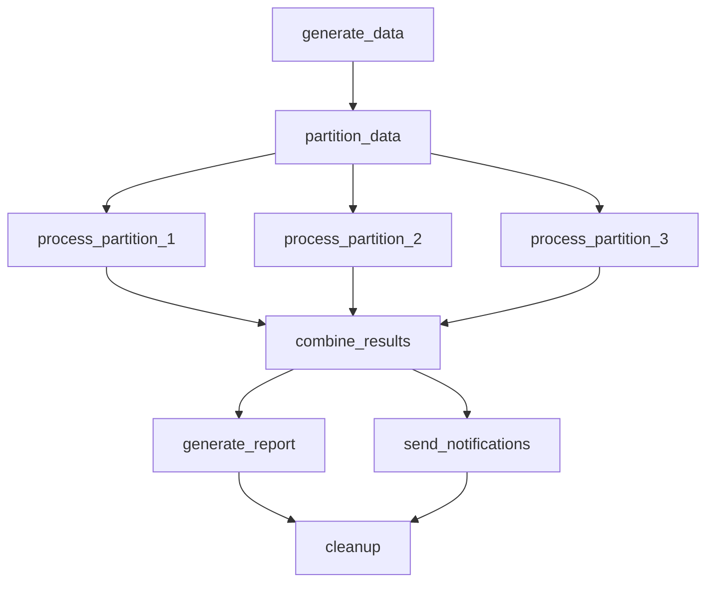

Welcome to the third tutorial in our Cloacina series! In this tutorial, you'll learn how to create sophisticated workflows with complex dependencies, parallel processing, and advanced patterns. We'll build on the concepts from [Tutorial 2]() and show you how to handle expensive operations efficiently and create complex data processing pipelines.

## Prerequisites

- Completion of [Tutorial 2]()
- Basic understanding of Rust
- Rust toolchain installed (rustc, cargo)
- A code editor of your choice

## Time Estimate
25-30 minutes

## Setting Up Your Project

Let's start by creating a new Rust project. We'll create it in a directory that's a sibling to the Cloacina repository:

```bash
# Assuming you're in the parent directory of the Cloacina repository
mkdir -p my-cloacina-projects
cd my-cloacina-projects
cargo new parallel-workflow
cd parallel-workflow
```

Your directory structure should look like this:
```
.
├── cloacina/              # The Cloacina repository
└── my-cloacina-projects/  # Your projects directory
    └── parallel-workflow/ # Your new project
        ├── Cargo.toml
        └── src/
            └── main.rs
```

Now, add Cloacina and its dependencies to your `Cargo.toml`:

```toml
[dependencies]
cloacina = { path = "../../cloacina", default-features = false, features = ["macros", "sqlite"] }
tokio = { version = "1.0", features = ["full"] }
serde_json = "1.0"
tracing = "0.1"
tracing-subscriber = "0.3"
async-trait = "0.1"
ctor = "0.2"
chrono = "0.4"
```


Normally you'd use `cloacina = "0.1.0"` in Cargo.toml. For these tutorials, we're using path dependencies to vendor code locally.

The path must be relative to your project. Examples:
- Next to Cloacina: `path = "../cloacina"`
- In subdirectory: `path = "../../../cloacina"`

Note: Use `version = "0.1.0"` when available on crates.io.


## Understanding Parallel Processing

In Cloacina, tasks can run in parallel when they don't depend on each other. This is particularly useful for handling expensive operations like:
- Long-running network calls
- CPU-intensive computations
- External API requests
- Database operations
- File I/O operations

By splitting these operations into independent tasks, we may significantly reduce the total execution time of our workflow.

### Key Concepts

1. **Task Parallelization**: Running multiple tasks simultaneously when they don't depend on each other
2. **Task Partitioning**: Splitting expensive operations into independent tasks that can run in parallel
3. **Context Synchronization**: Managing data flow and state between parallel tasks
4. **Result Combination**: Merging results from parallel tasks into a coherent output

### Workflow Structure

Here's a visual representation of our parallel processing workflow:



The diagram shows:
- Initial data generation
- Data partitioning into three streams
- Parallel processing of each partition
- Final combination of results

Notice how `process_partition_1`, `process_partition_2`, and `process_partition_3` can run simultaneously since they only depend on `partition_data` and not on each other.


**Important Note About Task Parallelization**

While we use a product catalog as an example, these principles apply to any expensive operations like API calls, file processing, or database queries.

The key is to identify operations that:
1. Can be split into independent tasks
2. Are expensive enough to justify parallelization overhead
3. Don't have interdependencies preventing parallel execution


## Building a Parallel Processing Pipeline

Let's create a workflow that processes a product catalog in parallel. We'll:
1. Generate a dataset of products
2. Split the processing into three independent tasks
3. Process each partition in parallel
4. Combine the results
5. Generate reports and send notifications

First, let's define our data structures:

```rust
use serde::{Deserialize, Serialize};

#[derive(Debug, Serialize, Deserialize, Clone)]
struct Product {
    id: u32,
    name: String,
    category: String,
    price: f64,
    stock: u32,
}

#[derive(Debug, Serialize, Deserialize)]
struct CategoryStats {
    total_value: f64,
    total_stock: u32,
    product_count: u32,
}
```

Now, let's create our tasks:

```rust
// Generate large dataset
#[task(
    id = "generate_data",
    dependencies = [],
    retry_attempts = 2
)]
async fn generate_data(context: &mut Context<serde_json::Value>) -> Result<(), TaskError> {
    info!("🚀 Generating product dataset");

    // Simulate loading a large dataset
    tokio::time::sleep(Duration::from_millis(500)).await;

    let total_products = 10000;
    let products = (1..=total_products)
        .map(|id| Product {
            id,
            name: format!("Product {}", id),
            category: format!("Category {}", (id % 10) + 1),
            price: (id as f64 * 1.5) % 100.0,
            stock: (id * 10) % 1000,
        })
        .collect::<Vec<_>>();

    context.insert("total_products", json!(total_products))?;
    context.insert("products", json!(products))?;

    info!("Generated {} products across 10 categories", total_products);
    Ok(())
}

// Partition data into three chunks
#[task(
    id = "partition_data",
    dependencies = ["generate_data"],
    retry_attempts = 2
)]
async fn partition_data(context: &mut Context<serde_json::Value>) -> Result<(), TaskError> {
    info!("Partitioning product data");

    let products: Vec<Product> = context.get("products")?;
    let chunk_size = products.len() / 3;

    let (chunk1, remainder) = products.split_at(chunk_size);
    let (chunk2, chunk3) = remainder.split_at(chunk_size);

    context.insert("partition_1", json!(chunk1.to_vec()))?;
    context.insert("partition_2", json!(chunk2.to_vec()))?;
    context.insert("partition_3", json!(chunk3.to_vec()))?;

    info!("Data partitioned into 3 chunks of {} products each", chunk_size);
    Ok(())
}

// Process first partition
#[task(
    id = "process_partition_1",
    dependencies = ["partition_data"],
    retry_attempts = 3,
    retry_delay_ms = 1000
)]
async fn process_partition_1(context: &mut Context<serde_json::Value>) -> Result<(), TaskError> {
    let products: Vec<Product> = context.get("partition_1")?;
    info!("Processing partition 1: {} products", products.len());

    // Simulate CPU-intensive processing
    let processing_time = rand::thread_rng().gen_range(1000..3000);
    tokio::time::sleep(Duration::from_millis(processing_time)).await;

    let mut stats = std::collections::HashMap::new();
    for product in products {
        let entry = stats.entry(product.category.clone())
            .or_insert(CategoryStats {
                total_value: 0.0,
                total_stock: 0,
                product_count: 0,
            });

        entry.total_value += product.price * product.stock as f64;
        entry.total_stock += product.stock;
        entry.product_count += 1;
    }

    context.insert("stats_1", json!(stats))?;
    context.insert("processing_time_1", json!(processing_time))?;

    info!("Partition 1 complete: processed {} products in {}ms", products.len(), processing_time);
    Ok(())
}

// Process second partition
#[task(
    id = "process_partition_2",
    dependencies = ["partition_data"],
    retry_attempts = 3,
    retry_delay_ms = 1000
)]
async fn process_partition_2(context: &mut Context<serde_json::Value>) -> Result<(), TaskError> {
    let products: Vec<Product> = context.get("partition_2")?;
    info!("Processing partition 2: {} products", products.len());

    // Simulate CPU-intensive processing
    let processing_time = rand::thread_rng().gen_range(1500..4000);
    tokio::time::sleep(Duration::from_millis(processing_time)).await;

    let mut stats = std::collections::HashMap::new();
    for product in products {
        let entry = stats.entry(product.category.clone())
            .or_insert(CategoryStats {
                total_value: 0.0,
                total_stock: 0,
                product_count: 0,
            });

        entry.total_value += product.price * product.stock as f64;
        entry.total_stock += product.stock;
        entry.product_count += 1;
    }

    context.insert("stats_2", json!(stats))?;
    context.insert("processing_time_2", json!(processing_time))?;

    info!("Partition 2 complete: processed {} products in {}ms", products.len(), processing_time);
    Ok(())
}

// Process third partition
#[task(
    id = "process_partition_3",
    dependencies = ["partition_data"],
    retry_attempts = 3,
    retry_delay_ms = 1000
)]
async fn process_partition_3(context: &mut Context<serde_json::Value>) -> Result<(), TaskError> {
    let products: Vec<Product> = context.get("partition_3")?;
    info!("Processing partition 3: {} products", products.len());

    // Simulate CPU-intensive processing
    let processing_time = rand::thread_rng().gen_range(800..2500);
    tokio::time::sleep(Duration::from_millis(processing_time)).await;

    let mut stats = std::collections::HashMap::new();
    for product in products {
        let entry = stats.entry(product.category.clone())
            .or_insert(CategoryStats {
                total_value: 0.0,
                total_stock: 0,
                product_count: 0,
            });

        entry.total_value += product.price * product.stock as f64;
        entry.total_stock += product.stock;
        entry.product_count += 1;
    }

    context.insert("stats_3", json!(stats))?;
    context.insert("processing_time_3", json!(processing_time))?;

    info!("Partition 3 complete: processed {} products in {}ms", products.len(), processing_time);
    Ok(())
}

// Combine results
#[task(
    id = "combine_results",
    dependencies = ["process_partition_1", "process_partition_2", "process_partition_3"],
    retry_attempts = 2
)]
async fn combine_results(context: &mut Context<serde_json::Value>) -> Result<(), TaskError> {
    info!("🔀 Combining results from parallel processing");

    let stats_1: std::collections::HashMap<String, CategoryStats> = context.get("stats_1")?;
    let stats_2: std::collections::HashMap<String, CategoryStats> = context.get("stats_2")?;
    let stats_3: std::collections::HashMap<String, CategoryStats> = context.get("stats_3")?;

    let time_1: u64 = context.get("processing_time_1")?;
    let time_2: u64 = context.get("processing_time_2")?;
    let time_3: u64 = context.get("processing_time_3")?;

    // Combine all stats
    let mut combined_stats = stats_1;

    for (category, stats) in stats_2 {
        let entry = combined_stats.entry(category)
            .or_insert(CategoryStats {
                total_value: 0.0,
                total_stock: 0,
                product_count: 0,
            });

        entry.total_value += stats.total_value;
        entry.total_stock += stats.total_stock;
        entry.product_count += stats.product_count;
    }

    for (category, stats) in stats_3 {
        let entry = combined_stats.entry(category)
            .or_insert(CategoryStats {
                total_value: 0.0,
                total_stock: 0,
                product_count: 0,
            });

        entry.total_value += stats.total_value;
        entry.total_stock += stats.total_stock;
        entry.product_count += stats.product_count;
    }

    // Calculate parallel efficiency
    let total_processing_time = time_1 + time_2 + time_3;
    let max_parallel_time = std::cmp::max(std::cmp::max(time_1, time_2), time_3);
    let parallel_efficiency = (total_processing_time as f64 / max_parallel_time as f64) * 100.0;

    context.insert("final_stats", json!(combined_stats))?;
    context.insert("total_processing_time_ms", json!(total_processing_time))?;
    context.insert("actual_parallel_time_ms", json!(max_parallel_time))?;
    context.insert("parallel_efficiency_percent", json!(parallel_efficiency))?;

    info!("Results combined: {:.1}% parallel efficiency", parallel_efficiency);
    Ok(())
}
```


Cloacina's parallel processing capabilities enable you to:

- **Task Independence**: Run multiple tasks simultaneously when they don't depend on each other
- **Resource Efficiency**: Process expensive operations in parallel to reduce total execution time
- **Result Coordination**: Automatically combine results from parallel tasks
- **Error Isolation**: Handle failures in parallel tasks without affecting others
- **Scalability**: Process more work in the same time by utilizing parallel execution

In the next tutorials, you'll learn how to build more complex parallel processing patterns.


## Running Your Workflow

You can run this tutorial in two ways:

### Option 1: Using Angreal (Recommended)

If you're following along with the Cloacina repository, you can use angreal to run the tutorial:

```bash
# From the Cloacina repository root
angreal demos tutorial-03
```

This will run the tutorial code with all necessary dependencies.

### Option 2: Manual Setup

If you're building the project manually, simply run your workflow with:
2. A database named "cloacina" created
3. A user "cloacina" with password "cloacina" with access to the database

Then run your workflow with:

```bash
cargo run
```

## What's Next?

Congratulations! You've created a parallel processing workflow. In the next tutorial, we'll explore:
- More complex parallel processing patterns
- Advanced task coordination
- Error handling in parallel workflows
- Resource management strategies

## Related Resources

- [API Documentation]()
- [Task Reference]()
- [Context Reference]()
- [Workflow Reference]()
