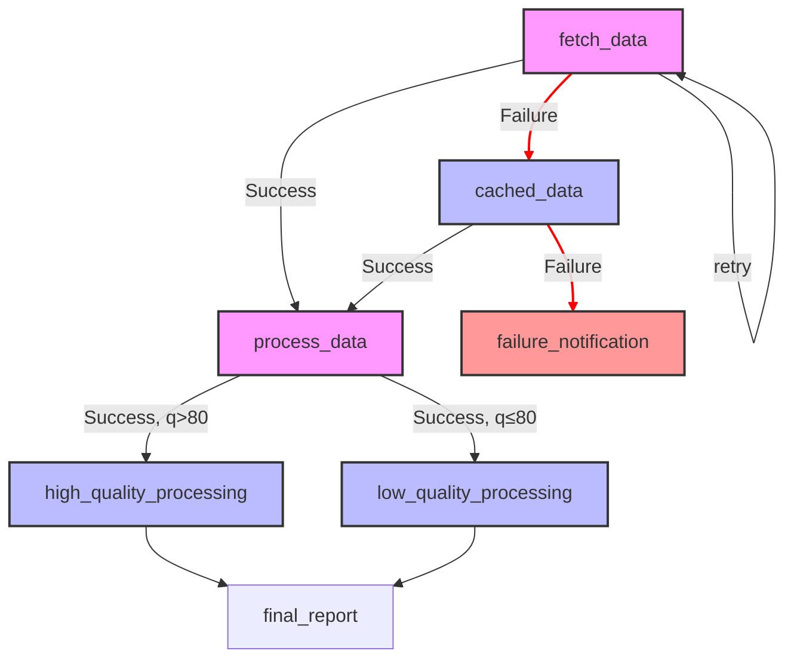

In this tutorial, you'll learn how to build sophisticated workflows that can handle failures gracefully, make intelligent decisions based on data quality, and maintain reliability through various fallback strategies. We'll explore how to create workflows that can adapt to different scenarios and ensure your data processing pipeline remains robust even when things go wrong.

## Prerequisites

- Completion of [Tutorial 3]()
- Basic understanding of Rust
- Rust toolchain installed (rustc, cargo)
- A code editor of your choice

## Time Estimate
25-30 minutes

## Setting Up Your Project

Let's start by creating a new Rust project. We'll create it in a directory that's a sibling to the Cloacina repository:

```bash
# Assuming you're in the parent directory of the Cloacina repository
mkdir -p my-cloacina-projects
cd my-cloacina-projects
cargo new error-handling
cd error-handling
```

Your directory structure should look like this:
```
.
├── cloacina/              # The Cloacina repository
└── my-cloacina-projects/  # Your projects directory
    └── error-handling/    # Your new project
        ├── Cargo.toml
        └── src/
            └── main.rs
```

Now, add Cloacina and its dependencies to your `Cargo.toml`:

```toml
[dependencies]
cloacina = { path = "../../cloacina" }
tokio = { version = "1.0", features = ["full"] }
serde_json = "1.0"
tracing = "0.1"
tracing-subscriber = "0.3"
async-trait = "0.1"
ctor = "0.2"
chrono = "0.4"
```


Normally you'd use `cloacina = "0.1.0"` in Cargo.toml. For these tutorials, we're using path dependencies to vendor code locally.

The path must be relative to your project. Examples:
- Next to Cloacina: `path = "../cloacina"`
- In subdirectory: `path = "../../../cloacina"`

Note: Use `version = "0.1.0"` when available on crates.io.


Cloacina supports both PostgreSQL and SQLite backends. The backend is selected automatically at runtime based on your connection URL - no feature flags needed.

## Understanding Error Handling in Cloacina

In Cloacina, error handling is primarily focused on retries and trigger rules. When a task fails, you can configure:

1. **Retry Configuration**:
   - `retry_attempts`: Number of times to retry a failed task (default: 3)
   - `retry_delay_ms`: Initial delay between retries in milliseconds (default: 1000)
   - `retry_max_delay_ms`: Maximum delay between retries in milliseconds (default: 30000)
   - `retry_backoff`: Backoff strategy: "fixed", "linear", or "exponential" (default: "exponential")
   - `retry_jitter`: Whether to add random variation to retry delays (default: true)

2. **Trigger Rules**:
   Trigger rules allow you to define complex conditions for task execution using a combination of:
   - Task outcomes: `task_success()`, `task_failed()`
   - Context values: `context_value()`
   - Logical operators: `all()`, `any()`
   - Comparison operators: `equals`, `greater_than`, `less_than`

   For example:
   ```rust
   #[task(
       id = "high_quality_processing",
       dependencies = ["validate_data"],
       trigger_rules = all(
           task_success("validate_data"),
           context_value("data_quality_score", greater_than, 80)
       )
   )]
   ```

   This task will only run if:
   1. The `validate_data` task succeeded
   2. The context value `data_quality_score` is greater than 80

When a task fails:
1. The system will retry the task up to the specified number of attempts
2. Between each retry, it will wait for the specified delay, which increases according to the backoff strategy:
   - Fixed: Same delay for every retry
   - Linear: Delay increases linearly with each attempt
   - Exponential: Delay increases exponentially with each attempt
3. The delay is capped at the maximum delay
4. If jitter is enabled, a random variation of ±25% is added to the delay to help spread out concurrent retry attempts

## Building a Resilient Pipeline

Let's create a workflow that demonstrates these error handling patterns. Here's a diagram showing the workflow and error handling paths:



The workflow consists of seven tasks:

1. **fetch_data**: Fetches data from an external source
   - 3 retry attempts with 1-second delay
   - Simulates network failures
   - Demonstrates retry behavior

2. **cached_data**: Fallback data source when fetch fails
   - No retries
   - Uses cached data as fallback
   - Shows failure path handling

3. **process_data**: Processes the data (either fresh or cached)
   - No retries
   - Evaluates data quality
   - Determines processing path

4. **high_quality_processing**: Processes high-quality data (quality > 80)
   - No retries
   - Handles premium processing path
   - Shows conditional execution

5. **low_quality_processing**: Processes low-quality data (quality ≤ 80)
   - No retries
   - Handles basic processing path
   - Shows conditional execution

6. **failure_notification**: Handles complete failure cases
   - No retries
   - Terminal state for failure paths
   - Sends alerts when both fetch and cache fail

7. **final_report**: Creates execution report
   - No retries
   - Summarizes pipeline execution
   - Shows task status and processing path taken

Let's implement these tasks in our workflow. Create `src/main.rs` with the following content:

```rust
//! # Tutorial 04: Error Handling and Retries
//!
//! This tutorial demonstrates error handling and retry patterns in Cloacina:
//! - Basic retry policies with exponential backoff
//! - Fallback strategies when external dependencies fail
//! - Different approaches to handling task failures
//! - Monitoring task execution outcomes

use cloacina::{task, workflow, Context, TaskError};
use cloacina::runner::{DefaultRunner, DefaultRunnerConfig};
use serde_json::json;
use std::time::Duration;
use tracing::{info, warn, error};
use rand::Rng;

// Task 1: Fetch data from external source with retries
#[task(
    id = "fetch_data",
    dependencies = [],
    retry_attempts = 3,
    retry_delay_ms = 1000,
    retry_backoff = "exponential"
)]
async fn fetch_data(context: &mut Context<serde_json::Value>) -> Result<(), TaskError> {
    info!("Attempting to fetch data from external source");

    // Simulate network call that might fail (70% failure rate)
    let success_rate = 0.3;
    let random_value: f64 = rand::random();

    if random_value > success_rate {
        error!("External source temporarily unavailable - will retry");
        return Err(TaskError::ExecutionFailed {
            message: "External source temporarily unavailable".to_string(),
            task_id: "fetch_data".to_string(),
            timestamp: chrono::Utc::now(),
        });
    }

    // Simulate API response delay
    tokio::time::sleep(Duration::from_millis(500)).await;

    let data = json!({
        "records": [
            {"id": 1, "value": "data_1", "quality": 85},
            {"id": 2, "value": "data_2", "quality": 75},
            {"id": 3, "value": "data_3", "quality": 90}
        ],
        "timestamp": chrono::Utc::now().to_rfc3339(),
        "source": "external",
        "total_records": 3
    });

    context.insert("raw_data", data)?;
    info!("Successfully fetched data from external source");
    Ok(())
}

// Task 2: Fallback to cached data when fetch fails
#[task(
    id = "cached_data",
    dependencies = ["fetch_data"],
    trigger_rules = task_failed("fetch_data")
)]
async fn cached_data(context: &mut Context<serde_json::Value>) -> Result<(), TaskError> {
    info!("Using cached data as fallback");

    // Simulate loading from cache
    tokio::time::sleep(Duration::from_millis(100)).await;

    let cached_data = json!({
        "records": [
            {"id": 1, "value": "cached_1", "quality": 60},
            {"id": 2, "value": "cached_2", "quality": 65},
            {"id": 3, "value": "cached_3", "quality": 70}
        ],
        "timestamp": chrono::Utc::now().to_rfc3339(),
        "source": "cache",
        "total_records": 3
    });

    context.insert("raw_data", cached_data)?;
    info!("Successfully loaded cached data");
    Ok(())
}

// Task 3: Process the data and evaluate quality
#[task(
    id = "process_data",
    dependencies = ["fetch_data", "cached_data"]
)]
async fn process_data(context: &mut Context<serde_json::Value>) -> Result<(), TaskError> {
    info!("Processing data");

    let raw_data = context.get("raw_data")
        .ok_or_else(|| TaskError::ValidationFailed {
            message: "Missing raw_data".to_string()
        })?;

    // Extract all needed data before any mutable operations
    let source = raw_data["source"].as_str().unwrap_or("unknown").to_string();
    let records = raw_data["records"].as_array().unwrap();
    let total_quality: i32 = records.iter()
        .map(|r| r["quality"].as_i64().unwrap_or(0) as i32)
        .sum();
    let avg_quality = total_quality / records.len() as i32;

    // Now we can safely make mutable borrows of context
    context.insert("data_quality_score", json!(avg_quality))?;
    context.insert("processed_data", json!({
        "source": source,
        "quality_score": avg_quality,
        "processed_at": chrono::Utc::now().to_rfc3339()
    }))?;

    info!("Data processing completed with quality score: {}", avg_quality);
    Ok(())
}

// Task 4: High quality processing path
#[task(
    id = "high_quality_processing",
    dependencies = ["process_data"],
    trigger_rules = all(
        task_success("process_data"),
        context_value("data_quality_score", greater_than, 80)
    )
)]
async fn high_quality_processing(context: &mut Context<serde_json::Value>) -> Result<(), TaskError> {
    info!("Processing high quality data");

    let processed_data = context.get("processed_data")
        .ok_or_else(|| TaskError::ValidationFailed {
            message: "Missing processed_data".to_string()
        })?;

    let quality_score = processed_data["quality_score"].as_i64().unwrap_or(0);

    // Simulate premium processing
    tokio::time::sleep(Duration::from_millis(300)).await;

    context.insert("processing_result", json!({
        "path": "high_quality",
        "quality_score": quality_score,
        "processing_time_ms": 300,
        "enhancements_applied": ["advanced_validation", "premium_processing"]
    }))?;

    info!("High quality processing completed");
    Ok(())
}

// Task 5: Low quality processing path
#[task(
    id = "low_quality_processing",
    dependencies = ["process_data"],
    trigger_rules = all(
        task_success("process_data"),
        context_value("data_quality_score", less_than, 81)
    )
)]
async fn low_quality_processing(context: &mut Context<serde_json::Value>) -> Result<(), TaskError> {
    info!("Processing low quality data");

    let processed_data = context.get("processed_data")
        .ok_or_else(|| TaskError::ValidationFailed {
            message: "Missing processed_data".to_string()
        })?;

    let quality_score = processed_data["quality_score"].as_i64().unwrap_or(0);

    // Simulate basic processing
    tokio::time::sleep(Duration::from_millis(100)).await;

    context.insert("processing_result", json!({
        "path": "low_quality",
        "quality_score": quality_score,
        "processing_time_ms": 100,
        "enhancements_applied": ["basic_validation"]
    }))?;

    info!("Low quality processing completed");
    Ok(())
}

// Task 6: Failure notification
#[task(
    id = "failure_notification",
    dependencies = ["fetch_data", "cached_data"],
    trigger_rules = all(
        task_failed("fetch_data"),
        task_failed("cached_data")
    )
)]
async fn failure_notification(context: &mut Context<serde_json::Value>) -> Result<(), TaskError> {
    error!("Critical failure: Both fetch and cache operations failed");

    context.insert("failure_notification", json!({
        "status": "critical_failure",
        "timestamp": chrono::Utc::now().to_rfc3339(),
        "message": "Both data sources failed",
        "alert_level": "high"
    }))?;

    Ok(())
}

// Task 7: Final report generation
#[task(
    id = "final_report",
    dependencies = ["high_quality_processing", "low_quality_processing"],
    trigger_rules = any(
        task_success("high_quality_processing"),
        task_success("low_quality_processing")
    )
)]
async fn final_report(context: &mut Context<serde_json::Value>) -> Result<(), TaskError> {
    info!("Generating final execution report");

    let processing_result = context.get("processing_result");
    let processed_data = context.get("processed_data");
    let failure_notification = context.get("failure_notification");

    let report = json!({
        "execution_summary": {
            "status": if failure_notification.is_some() { "failed" } else { "success" },
            "timestamp": chrono::Utc::now().to_rfc3339(),
            "data_source": processed_data.and_then(|d| d["source"].as_str()).unwrap_or("unknown"),
            "quality_score": processed_data.and_then(|d| d["quality_score"].as_i64()).unwrap_or(0),
            "processing_path": processing_result.and_then(|r| r["path"].as_str()).unwrap_or("unknown"),
            "failure_details": failure_notification
        }
    });

    context.insert("execution_report", report)?;
    info!("Final report generated successfully");
    Ok(())
}

#[tokio::main]
async fn main() -> Result<(), Box<dyn std::error::Error>> {
    // Initialize logging
    tracing_subscriber::fmt()
        .with_env_filter("tutorial_04=info,cloacina=info")
        .init();

    info!("Starting Tutorial 04: Error Handling and Retries");
    info!("This demonstrates retry policies, fallback strategies, and resilient workflows");

    // Initialize runner with database
    let runner = DefaultRunner::with_config(
        "sqlite://tutorial-04.db?mode=rwc&_journal_mode=WAL&_synchronous=NORMAL&_busy_timeout=5000",
        DefaultRunnerConfig::default(),
    )
    .await?;

    // Create the workflow
    let _workflow = workflow! {
        name: "error_handling_workflow",
        description: "Demonstrates error handling and retry patterns",
        tasks: [
            fetch_data,
            cached_data,
            process_data,
            high_quality_processing,
            low_quality_processing,
            failure_notification,
            final_report
        ]
    };

    // Create input context
    let input_context = Context::new();

    // Execute the workflow
    info!("Executing workflow");
    let result = runner.execute("error_handling_workflow", input_context).await?;

    // Print the final report
    if let Some(report) = result.final_context.get("execution_report") {
        info!("Final execution report: {}", report);
    }

    // Shutdown the runner
    runner.shutdown().await?;

    info!("Tutorial completed!");
    Ok(())
}
```


This workflow demonstrates several error handling patterns. Try modifying the code to see how different scenarios affect the execution path:

1. **Adjust Failure Rates**: Change the `success_rate` in `fetch_data` to see how retry behavior changes
2. **Modify Quality Thresholds**: Adjust the quality score thresholds in `high_quality_processing` and `low_quality_processing`
3. **Add More Retries**: Increase `retry_attempts` in `fetch_data` to see more retry attempts
4. **Change Backoff Strategy**: Try different `retry_backoff` values ("fixed", "linear", "exponential")


Here are some interesting modifications to try:

```rust
// In fetch_data: Increase failure rate to 90%
let success_rate = 0.1;  // Only 10% success rate

// In high_quality_processing: Lower quality threshold
trigger_rules = all(
    task_success("process_data"),
    context_value("data_quality_score", greater_than, 60)  // Changed from 80
)

// In fetch_data: Add more retries with longer delays
#[task(
    id = "fetch_data",
    dependencies = [],
    retry_attempts = 5,           // Increased from 3
    retry_delay_ms = 2000,        // Increased from 1000
    retry_backoff = "linear"      // Changed from exponential
)]
```

These changes will:
- Make the workflow more likely to use cached data
- Process more data through the high-quality path
- Show more retry attempts with different timing


Each run will show different execution paths and timing, helping you understand how Cloacina handles various failure scenarios.


## Understanding the Code

Let's walk through the key components of our error handling workflow:

1. **Retry Configuration**: The `fetch_data` task demonstrates retry configuration:
   ```rust
   #[task(
       id = "fetch_data",
       dependencies = [],
       retry_attempts = 3,
       retry_delay_ms = 1000,
       retry_backoff = "exponential"
   )]
   ```
   This task will:
   - Retry up to 3 times on failure
   - Start with a 1-second delay
   - Use exponential backoff between retries
   - Simulate network failures 70% of the time

2. **Fallback Strategy**: The `cached_data` task shows how to implement a fallback:
   ```rust
   #[task(
       id = "cached_data",
       dependencies = ["fetch_data"],
       trigger_rules = task_failed("fetch_data")
   )]
   ```
   This task:
   - Only runs when `fetch_data` fails
   - Provides a fallback data source
   - Maintains workflow continuity

3. **Conditional Processing**: The quality-based processing paths demonstrate conditional execution:
   ```rust
   #[task(
       id = "high_quality_processing",
       dependencies = ["process_data"],
       trigger_rules = all(
           task_success("process_data"),
           context_value("data_quality_score", greater_than, 80)
       )
   )]
   ```
   This shows how to:
   - Check task success
   - Evaluate context values
   - Choose different processing paths

4. **Failure Handling**: The `failure_notification` task shows how to handle complete failures:
   ```rust
   #[task(
       id = "failure_notification",
       dependencies = ["fetch_data", "cached_data"],
       trigger_rules = all(
           task_failed("fetch_data"),
           task_failed("cached_data")
       )
   )]
   ```
   This demonstrates:
   - Monitoring multiple task failures
   - Generating failure notifications
   - Maintaining workflow state

5. **Result Reporting**: The `final_report` task shows how to generate execution reports:
   ```rust
   #[task(
       id = "final_report",
       dependencies = ["high_quality_processing", "low_quality_processing"],
       trigger_rules = any(
           task_success("high_quality_processing"),
           task_success("low_quality_processing")
       )
   )]
   ```
   This illustrates:
   - Collecting execution results
   - Generating summary reports
   - Handling different execution paths

## Running Your Workflow

You can run this tutorial in two ways:

### Option 1: Using Angreal (Recommended)

If you're following along with the Cloacina repository, you can use angreal to run the tutorial:

```bash
# From the Cloacina repository root
angreal demos tutorial-04
```

This will run the tutorial code with all necessary dependencies.

### Option 2: Manual Setup

If you're building the project manually, simply run your workflow with:
2. A database named "cloacina" created
3. A user "cloacina" with password "cloacina" with access to the database

Then run your workflow with:

```bash
cargo run
```

You should see output similar to:

```
INFO  tutorial_04 > Starting Tutorial 04: Error Handling and Retries
INFO  tutorial_04 > This demonstrates retry policies, fallback strategies, and resilient workflows
INFO  cloacina::database > Database connection pool initialized
INFO  cloacina::scheduler > Starting recovery check for orphaned tasks
INFO  cloacina::scheduler > No orphaned tasks found
INFO  cloacina::executor > Starting scheduler and executor background services
INFO  tutorial_04 > Executing workflow
INFO  cloacina::scheduler > Task ready: fetch_data (dependencies satisfied, trigger rules passed)
INFO  tutorial_04 > Attempting to fetch data from external source
INFO  tutorial_04 > Successfully fetched data from external source
INFO  cloacina::scheduler > Task skipped: cached_data (dependencies satisfied, trigger rules failed)
INFO  cloacina::scheduler > Task ready: process_data (dependencies satisfied, trigger rules passed)
INFO  tutorial_04 > Processing data
INFO  tutorial_04 > Data processing completed with quality score: 83
INFO  cloacina::scheduler > Task ready: high_quality_processing (dependencies satisfied, trigger rules passed)
INFO  cloacina::scheduler > Task skipped: low_quality_processing (dependencies satisfied, trigger rules failed)
INFO  tutorial_04 > Processing high quality data
INFO  tutorial_04 > High quality processing completed
INFO  cloacina::scheduler > Task ready: final_report (dependencies satisfied, trigger rules passed)
INFO  tutorial_04 > Generating final execution report
INFO  tutorial_04 > Final report generated successfully
INFO  cloacina::scheduler > Pipeline completed (4 completed, 0 failed, 3 skipped)
INFO  tutorial_04 > Pipeline completed with status: Completed
INFO  tutorial_04 > Total execution time: 1.6s
INFO  tutorial_04 > Tasks executed: 7
INFO  tutorial_04 >   ✅ Task 'fetch_data': Completed
INFO  tutorial_04 >   ⏭️ Task 'cached_data': Skipped
INFO  tutorial_04 >     Reason: Trigger rules not satisfied
INFO  tutorial_04 >   ⏭️ Task 'failure_notification': Skipped
INFO  tutorial_04 >     Reason: Trigger rules not satisfied
INFO  tutorial_04 >   ✅ Task 'process_data': Completed
INFO  tutorial_04 >   ⏭️ Task 'low_quality_processing': Skipped
INFO  tutorial_04 >     Reason: Trigger rules not satisfied
INFO  tutorial_04 >   ✅ Task 'high_quality_processing': Completed
INFO  tutorial_04 >   ✅ Task 'final_report': Completed
```

This output shows a successful execution path where:
1. The external data fetch succeeded (no retries needed)
2. The cached data fallback was skipped
3. The data quality was high enough for premium processing
4. The low-quality path was skipped
5. All tasks completed successfully

## What's Next?

Congratulations! You've completed all four tutorials in the Cloacina series. You now have a solid understanding of:
- Basic workflow creation and execution
- Multi-task workflows with dependencies
- Parallel processing patterns
- Error handling and retry strategies

To continue your Cloacina journey, explore:
- Advanced workflow patterns
- Custom task implementations
- Integration with external systems
- Performance optimization
- Production deployment

## Related Resources

- [API Documentation]() - Core API documentation
- [Quick Start Guide]() - Getting started with Cloacina

## Download the Example

You can download the complete example code from our [GitHub repository](https://github.com/colliery-io/cloacina/tree/main/examples/tutorial-04).
