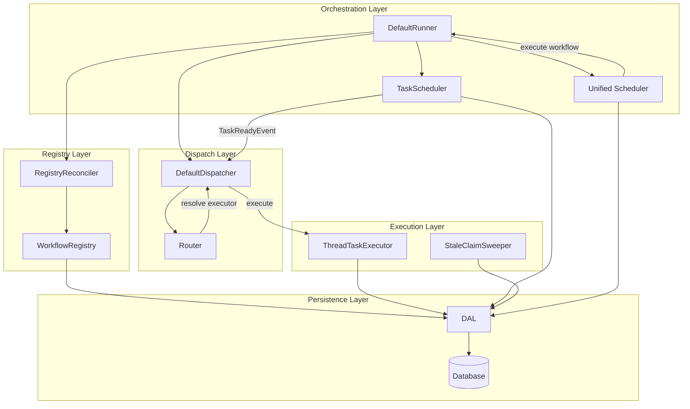
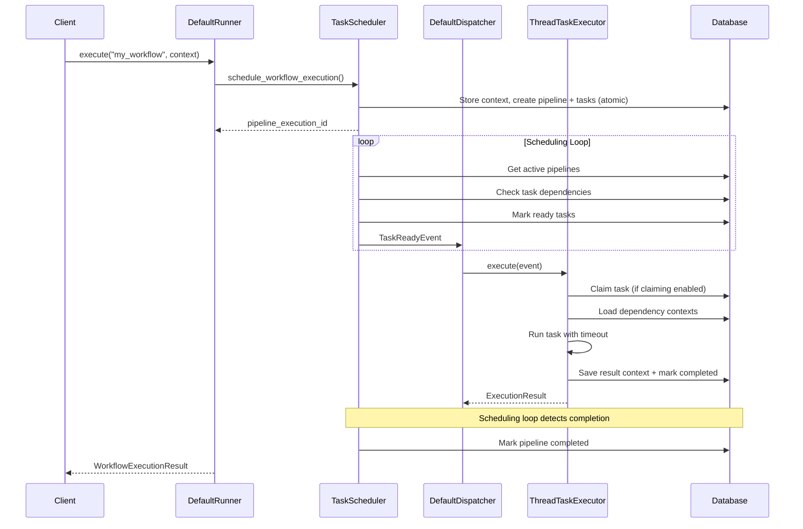
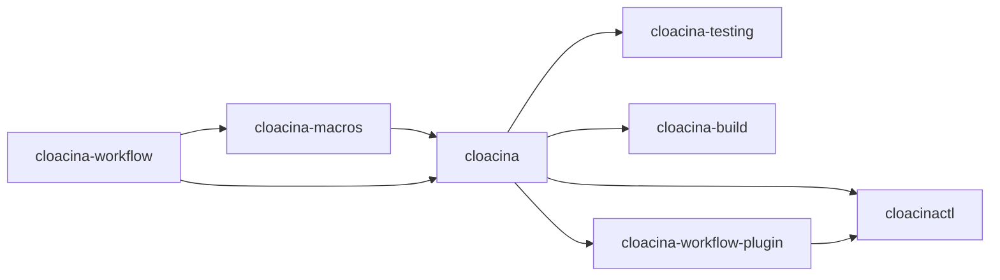

## Introduction

Cloacina is a workflow orchestration engine that can be deployed in three distinct modes, each targeting a different operational profile. This document explains the architectural decisions behind these modes, the core components that power them, and how data flows through the system from workflow definition to task completion.

## Three Deployment Modes

Cloacina is not a single-purpose tool. It is designed to serve as an embedded library for applications that need resilient task pipelines, as a lightweight local daemon for scheduled workloads, and as a multi-tenant API server for centralized orchestration. The choice of mode determines which components are active and which database backend is used.

### Embedded Library

The most fundamental deployment mode. You link the `cloacina` crate directly into your Rust or Python application and drive workflow execution programmatically.

```rust
use cloacina::prelude::*;

let runner = DefaultRunner::new("sqlite://./my_app.db").await?;
let context = Context::new();
let result = runner.execute("etl_pipeline", context).await?;
```

In this mode, the `DefaultRunner` manages everything in-process: scheduling, dispatch, execution, and context persistence. There is no separate server process. Your application owns the lifecycle of the runner, and you call `shutdown()` when you are done.

This mode supports both SQLite and PostgreSQL. SQLite is suitable for single-process applications where simplicity matters. PostgreSQL is required when you need multi-tenancy, horizontal scaling, or shared state across processes.

### Daemon (`cloacinactl daemon`)

A lightweight local scheduler that watches directories for `.cloacina` packages, loads them dynamically, and executes their cron schedules and triggers.

```bash
cloacinactl daemon --watch-dir /opt/workflows --poll-interval 500
```

The daemon initializes a `DefaultRunner` with an SQLite backend, creates a `FilesystemWorkflowRegistry` for the watched directories, and starts a `RegistryReconciler` to detect package changes. It responds to filesystem events (via `PackageWatcher`) and periodic polling to keep the set of loaded workflows in sync with what is on disk.

Key behaviors:
- **Automatic package discovery**: Drop a `.cloacina` package into a watched directory and it gets loaded on the next reconciliation tick
- **SIGHUP reload**: Send SIGHUP to reload configuration and add/remove watch directories without restarting
- **Graceful shutdown**: SIGINT/SIGTERM triggers a drain of in-flight pipelines with a configurable timeout
- **Dual logging**: Human-readable logs to stderr, structured JSON logs to `~/.cloacina/logs/`

### API Server (`cloacinactl serve`)

A multi-tenant HTTP API backed by PostgreSQL. This mode is for teams that need centralized workflow management with authentication, tenant isolation, and programmatic control.

```bash
cloacinactl serve --bind 0.0.0.0:8080 --database-url postgresql://user:pass@db/cloacina
```

The server starts an axum HTTP server with:
- **Bearer token authentication**: API keys are hashed and stored in the database; a bootstrap key is generated on first startup
- **Tenant management**: Create and remove tenants backed by PostgreSQL schema isolation
- **Workflow lifecycle**: Upload `.cloacina` packages, list and inspect workflows, delete versions
- **Execution control**: Trigger workflow executions, monitor progress, retrieve execution events
- **Operational endpoints**: `/health`, `/ready`, `/metrics`

PostgreSQL is required because the server relies on schema-based multi-tenancy for complete tenant isolation and `FOR UPDATE SKIP LOCKED` for safe concurrent task claiming.

## Core Component Map

The following diagram shows how the major components relate to each other within a running `DefaultRunner`:



### Component Responsibilities

**DefaultRunner** is the orchestration entry point. It owns the database connection, configuration, and all background service handles. When you call `DefaultRunner::new()`, it initializes the database, runs migrations, creates the `TaskScheduler`, `ThreadTaskExecutor`, and `DefaultDispatcher`, then starts background services. It also implements the `WorkflowExecutor` trait, which the `Scheduler` uses to hand off workflow executions.

**TaskScheduler** converts workflow definitions into database execution plans. When you call `schedule_workflow_execution()`, it validates the workflow, stores the input context, and atomically creates a pipeline execution record along with task execution records for every task in the workflow. Its scheduling loop continuously checks for active pipelines, evaluates task dependencies and trigger rules, marks tasks as `Ready`, and dispatches `TaskReadyEvent`s to the dispatcher.

**ThreadTaskExecutor** executes individual tasks with concurrency control. It uses a semaphore to limit the number of concurrent tasks, loads dependency contexts, runs the task with timeout protection, handles retries, and persists the result context. When claiming is enabled, it atomically claims tasks before execution and sends periodic heartbeats.

**Unified Scheduler** (`Scheduler`) drives both cron and trigger-based workflow execution from a single polling loop. It queries the database for due cron schedules, atomically claims them to prevent duplicate execution across instances, polls registered triggers respecting per-trigger intervals, and deduplicates trigger firings based on context hashes. It follows a saga pattern: create an audit record, hand off to the `WorkflowExecutor`, then link the result back.

**DefaultDispatcher** routes `TaskReadyEvent`s to the appropriate executor based on configurable glob patterns. The `Router` evaluates rules in order and returns the first matching executor key, falling back to the default executor if no rules match.

**RegistryReconciler** manages the lifecycle of packaged workflows. It periodically compares the set of packages known to the `WorkflowRegistry` against what is currently registered in the global task and workflow registries, loading new packages and unloading removed ones.

**DAL** (Data Access Layer) provides a typed interface over all database operations. It abstracts over PostgreSQL and SQLite through the unified schema, exposing sub-DALs for contexts, pipeline executions, task executions, schedules, and more.

**StaleClaimSweeper** is a background service that detects tasks with expired heartbeats from crashed runners and resets them to `Ready` for re-execution. See [Horizontal Scaling]() for details.

## Data Flow

The lifecycle of a workflow execution follows this path:



Key design decisions in this flow:

1. **Pipeline and tasks are created atomically** in a single database transaction. This prevents the scheduling loop from seeing a pipeline before its tasks exist.

2. **The scheduler pushes work to executors** via the dispatcher rather than having executors poll the database. This reduces database load and enables pluggable execution backends.

3. **Context persistence happens at each task boundary**. Every task's output context is saved to the database before the task is marked as completed, ensuring no data is lost if the runner crashes between tasks.

## Component Composition by Deployment Mode

Not every component is active in every mode. The following table shows which components participate in each deployment mode:

| Component | Embedded Library | Daemon | API Server |
|---|---|---|---|
| DefaultRunner | Yes | Yes | Yes |
| TaskScheduler | Yes | Yes | Yes |
| ThreadTaskExecutor | Yes | Yes | Yes |
| DefaultDispatcher | Yes | Yes | Yes |
| Unified Scheduler | Optional | Yes | Optional |
| CronRecoveryService | Optional | Yes | Optional |
| RegistryReconciler | Optional | Yes | Yes |
| WorkflowRegistry | Optional | Filesystem | Database |
| StaleClaimSweeper | When claiming enabled | When claiming enabled | When claiming enabled |
| HTTP Server (axum) | No | No | Yes |
| Auth Middleware | No | No | Yes |
| PackageWatcher | No | Yes | No |
| Database Backend | SQLite or PostgreSQL | SQLite (default) | PostgreSQL (required) |

The "Optional" entries are controlled by `DefaultRunnerConfig` flags like `enable_cron_scheduling`, `enable_trigger_scheduling`, and `enable_registry_reconciler`.

## Crate Structure

The project is organized into several crates, each with a focused responsibility:

| Crate | Purpose |
|---|---|
| `cloacina` | Core library: runner, scheduler, executor, dispatcher, DAL, context, models, registry, security, packaging, and Python bindings |
| `cloacina-macros` | Procedural macros: `#[task]`, `#[trigger]`, and `#[workflow]` for ergonomic workflow definition with automatic code fingerprinting |
| `cloacina-workflow` | The `Workflow` and `Task` traits as a standalone crate, used by macro-generated code to avoid circular dependencies |
| `cloacina-build` | Build tooling for compiling packaged workflows from source into `.cloacina` packages |
| `cloacina-testing` | Test utilities: database fixtures, test runners, and assertion helpers for workflow integration tests |
| `cloacina-workflow-plugin` | Fidius plugin integration: defines `CloacinaMetadata` for `package.toml` manifests and the plugin interface for packaged workflows |
| `cloacinactl` | CLI binary: `daemon`, `serve`, `config`, and `admin` subcommands |

### Dependency Relationships



The `cloacina-workflow` crate exists specifically to break a circular dependency: macro-generated task code needs access to the `Task` trait and `Workflow` builder, but those types live in the main `cloacina` crate which depends on the macros. By extracting the core traits into `cloacina-workflow`, macro output can reference `cloacina_workflow::*` without depending on the full `cloacina` crate.

## Background Services

When a `DefaultRunner` starts, it spawns several background Tokio tasks, each managed by a shutdown broadcast channel:

1. **Scheduler loop** (`TaskScheduler::run_scheduling_loop`): Continuously processes active pipelines, evaluating task readiness and dispatching events. Always running.

2. **Unified scheduler** (`Scheduler::run_polling_loop`): Drives cron and trigger schedules. Started when `enable_cron_scheduling` or `enable_trigger_scheduling` is `true`.

3. **Cron recovery service** (`CronRecoveryService::run_recovery_loop`): Detects lost cron executions and re-triggers them. Started when both cron scheduling and cron recovery are enabled.

4. **Registry reconciler** (`RegistryReconciler::start_reconciliation_loop`): Periodically syncs the workflow registry with the global task/workflow registries. Started when `enable_registry_reconciler` is `true`.

5. **Stale claim sweeper** (`StaleClaimSweeper::run`): Periodically scans for tasks with stale heartbeats. Started when `enable_claiming` is `true`.

All services respond to a shared broadcast shutdown signal. When `runner.shutdown()` is called, it sends the signal and waits for each service to complete, then closes the database connection pool.

## See Also

- [Horizontal Scaling]() -- Task claiming, heartbeats, and multi-runner deployments
- [Task Execution]() -- Detailed task lifecycle and state transitions
- [Context System]() -- How data flows between tasks
- [Dispatcher Architecture]() -- Pluggable executor backends and routing
- [Packaged Workflow Architecture]() -- How `.cloacina` packages work
