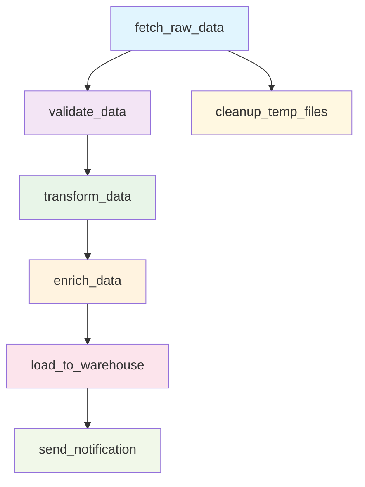

# Data Pipeline Example

This example demonstrates a realistic data processing pipeline using Cloacina, showcasing the framework's capabilities for building robust, recoverable workflows.

## Pipeline Overview

The example implements a daily data processing pipeline with the following stages:



## Features Demonstrated

### 🔄 **Retry Policies**
- **Exponential backoff** for external API calls (`fetch_raw_data`)
- **Fixed delays** for validation tasks (`validate_data`)
- **Linear backoff** for transformation tasks (`transform_data`)
- **Transient-only retries** for network operations

### 📊 **Conditional Execution**
- Data transformation only runs if validation passes
- Enrichment skips if transformation was skipped
- Cleanup always runs regardless of other task failures

### 🛡️ **Error Handling**
- Network timeout simulation with retries
- Data validation failures that affect downstream tasks
- Graceful degradation (pipeline continues with partial data)

### 📈 **Context Data Flow**
- Rich context data passed between tasks
- Metrics collection and reporting
- Status tracking throughout the pipeline

### 🔧 **Recovery Patterns**
- Automatic retry with different strategies
- Task state persistence
- Pipeline recovery after system restart

## Running the Example

### Prerequisites

1. **PostgreSQL** database running locally
2. **Rust** environment with Cargo

### Setup

1. **Clone and navigate to the example:**
   ```bash
   cd examples/data-pipeline
   ```

2. **Set up environment variables:**
   ```bash
   cp .env.example .env
   # Edit .env with your database connection details
   ```

3. **Create the database:**
   ```bash
   createdb cloacina_example
   ```

4. **Run the pipeline:**
   ```bash
   cargo run
   ```

### What You'll See

The pipeline will start and you'll see detailed logging output showing:

- Task execution with retry attempts
- Data validation results and quality scores
- Conditional task execution based on validation results
- Context data flow between tasks
- Cleanup operations
- Final notification with pipeline summary

Example output:
```
2024-01-15T10:30:00Z INFO  data_pipeline_example: Starting Data Pipeline Example
2024-01-15T10:30:01Z INFO  cloacina::scheduler: Scheduling workflow execution: data_pipeline
2024-01-15T10:30:02Z INFO  cloacina::executor::task_executor: Executing task: fetch_raw_data (attempt 1)
2024-01-15T10:30:02Z INFO  data_pipeline_example::tasks: Fetching raw data from external API
2024-01-15T10:30:03Z INFO  data_pipeline_example::tasks: Successfully fetched 1000 records
2024-01-15T10:30:03Z INFO  cloacina::executor::task_executor: Task completed successfully: fetch_raw_data
2024-01-15T10:30:04Z INFO  cloacina::executor::task_executor: Executing task: validate_data (attempt 1)
2024-01-15T10:30:04Z INFO  data_pipeline_example::tasks: Validating data quality
2024-01-15T10:30:04Z INFO  data_pipeline_example::tasks: Data validation passed with quality score: 0.89
...
```

## Key Ergonomics to Observe

### 🎯 **Task Definition**
Notice how tasks are defined with the `#[task]` macro:

```rust
#[task(
    id = "fetch_raw_data",
    dependencies = [],
    retry_attempts = 5,
    retry_backoff = "exponential",
    retry_delay_ms = 1000,
    retry_max_delay_ms = 30000,
    retry_condition = "transient",
    retry_jitter = true
)]
async fn fetch_raw_data(context: &mut Context<Value>) -> Result<(), TaskError> {
    // Task implementation
}
```

**Ergonomics Questions:**
- Is the attribute syntax intuitive?
- Are the retry configuration options clear?
- Would you prefer a different syntax for dependencies?

### 🔗 **Context Usage**
Observe how data flows between tasks:

```rust
// Producing data
context.insert("raw_data", response)?;
context.insert("record_count", json!(1000))?;

// Consuming data
let raw_data = context.get("raw_data")
    .ok_or_else(|| TaskError::ValidationFailed {
        message: "No raw data found".to_string()
    })?;
```

**Ergonomics Questions:**
- Is the context API easy to use?
- Would typed context access be better than JSON values?
- How could error handling be improved?

### 🏗️ **Workflow Definition**
See how workflows are assembled:

```rust
let workflow = workflow! {
    name: "data_pipeline",
    description: "Daily data processing pipeline",
    tasks: [
        fetch_raw_data,
        validate_data,
        transform_data,
        // ...
    ]
};
```

**Ergonomics Questions:**
- Is the workflow macro syntax clear?
- Would you prefer a builder pattern?
- How could complex dependencies be better expressed?

## Experiment and Explore

Try modifying the example to test different scenarios:

1. **Change retry policies** - Adjust retry attempts and backoff strategies
2. **Add conditional logic** - Create tasks that only run in certain conditions
3. **Simulate failures** - Increase failure rates to see retry behavior
4. **Add new tasks** - Extend the pipeline with additional processing steps
5. **Modify context data** - Change what data flows between tasks

## Providing Feedback

After running the example, consider:

- **What felt intuitive vs. confusing?**
- **Where did you need to look up documentation?**
- **What would you change about the API design?**
- **Which features seem missing for real-world use?**

This feedback will help improve Cloacina's ergonomics and developer experience.
