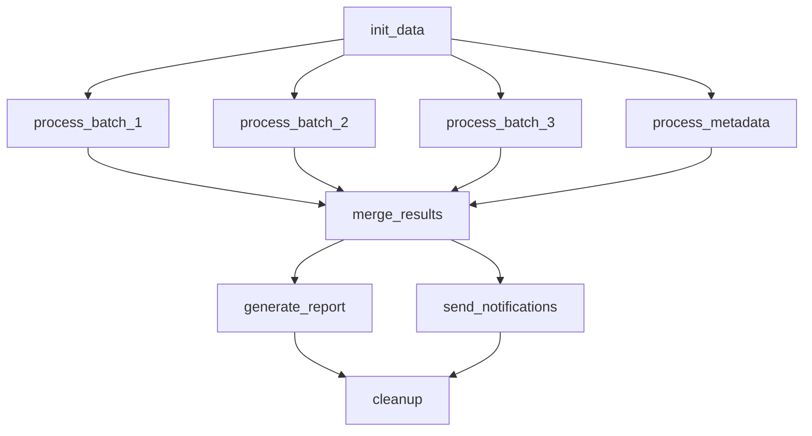

# Parallel Processing Example

This example demonstrates Cloacina's ability to execute tasks in parallel when they have no dependencies on each other, showcasing fan-out and fan-in patterns.

## Workflow Structure



## Key Concepts Demonstrated

### 1. **Fan-out Pattern**
- `init_data` splits work into multiple parallel tasks
- 4 tasks run simultaneously after initialization:
  - `process_batch_1` (processes records 0-3333)
  - `process_batch_2` (processes records 3334-6666)
  - `process_batch_3` (processes records 6667-10000)
  - `process_metadata` (validates schema in parallel)

### 2. **Parallel Execution**
- Multiple CPU-intensive tasks run concurrently
- Each batch has different simulated processing times
- Total wall-clock time is much less than sequential processing
- Executor configured for `max_concurrent_tasks: 4`

### 3. **Fan-in Pattern**
- `merge_results` waits for ALL parallel tasks to complete
- Consolidates results and calculates parallel efficiency
- Shows actual vs theoretical speedup

### 4. **Final Convergence**
- `generate_report` and `send_notifications` can run in parallel
- `cleanup` waits for both to complete before running

## Performance Metrics

The example tracks and reports:
- **Total Processing Time**: Sum of all individual batch times
- **Actual Parallel Time**: Time taken by the slowest batch
- **Parallel Efficiency**: (Total Time / Parallel Time) × 100%
- **Validation Scores**: Quality metrics from each batch

## Running the Example

```bash
# Start PostgreSQL (if using Docker)
docker run --name cloacina-postgres -e POSTGRES_USER=cloacina -e POSTGRES_PASSWORD=cloacina -e POSTGRES_DB=cloacina -p 5432:5432 -d postgres:15

# Run the example
cd examples/parallel-processing
cargo run
```

## Expected Output

You'll see:
1. **Sequential startup**: `init_data` runs first
2. **Parallel execution**: All 4 processing tasks start simultaneously
3. **Progress indicators**: Each task logs its progress and completion
4. **Efficiency metrics**: Final report shows parallel speedup achieved
5. **Resource cleanup**: Temporary files removed after completion

## Configuration

Key settings in `main.rs`:
- `max_concurrent_tasks: 4` - Allows 4 tasks to run simultaneously
- Variable processing times - Simulates realistic workloads
- Different retry policies - Some tasks more resilient than others

This example is perfect for understanding how Cloacina automatically schedules parallel work when dependencies allow it!
